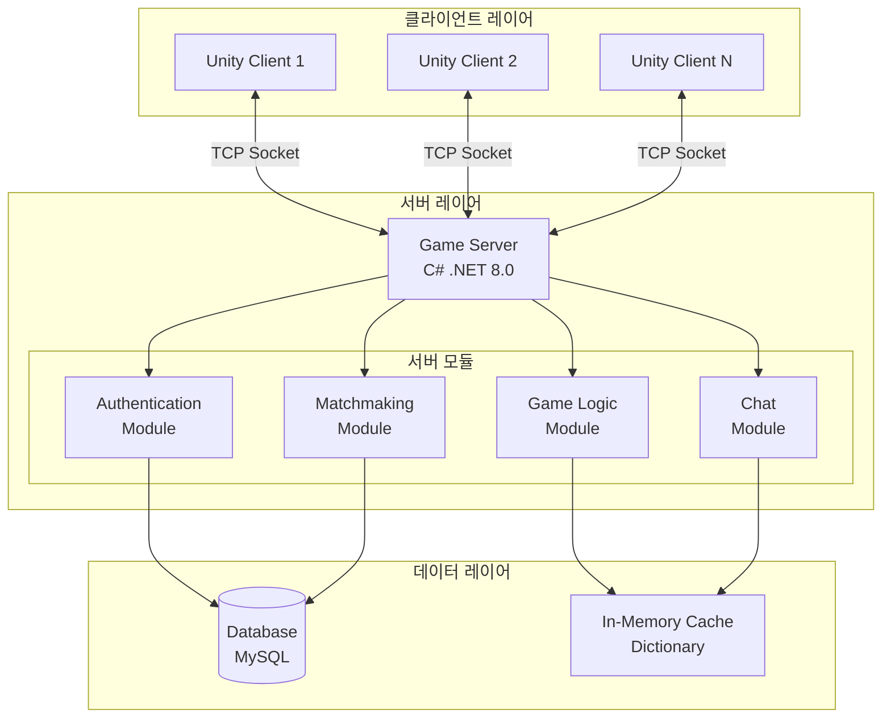
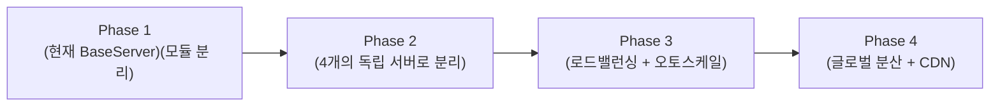
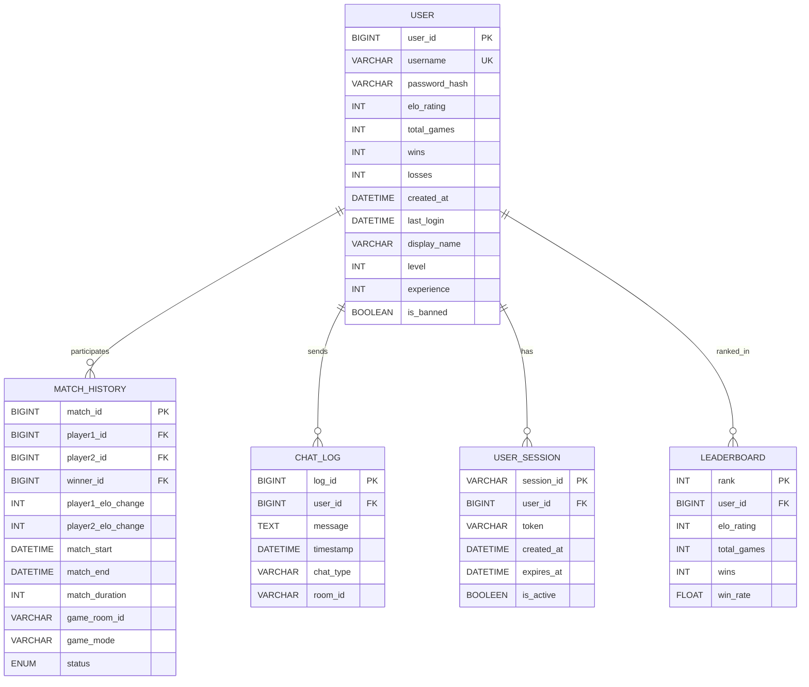
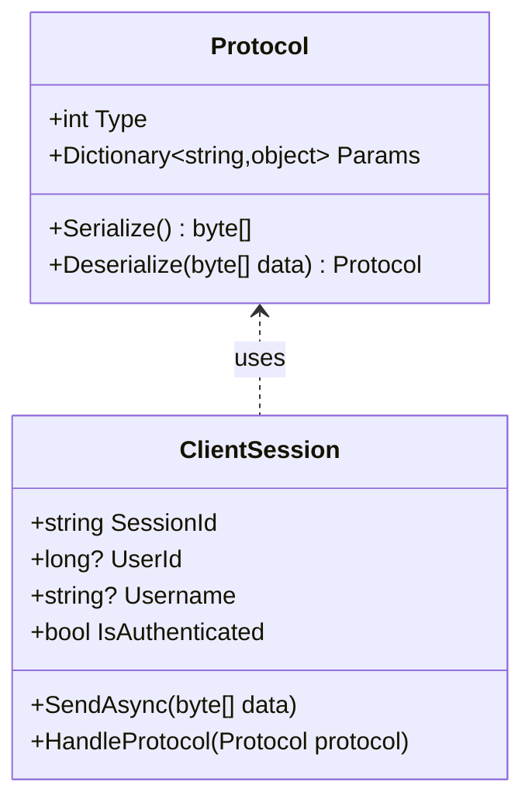
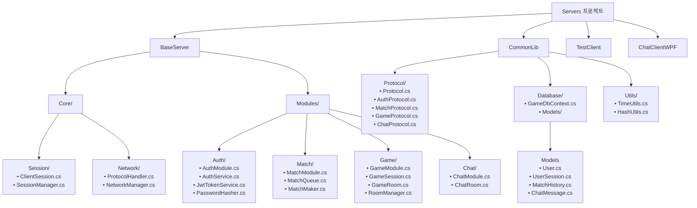
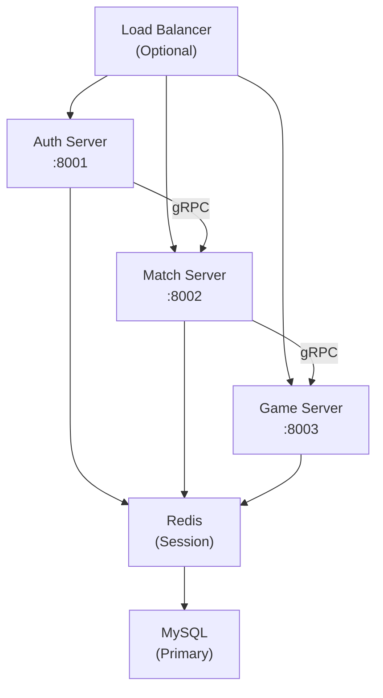
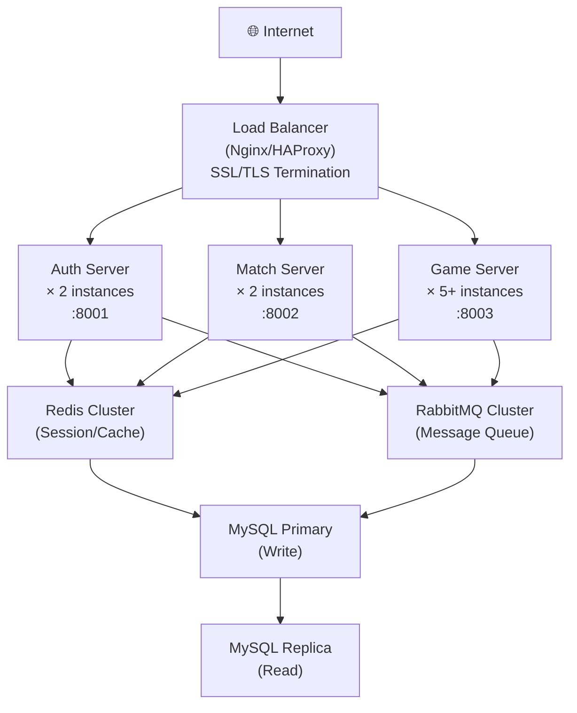

# InterplanetaryOnline 게임 서버 통합 설계 문서

## 1. 문서 정보
- **프로젝트명**: InterplanetaryOnline Game Server
- **작성일**: 2025-10-14
- **버전**: 1.0 (통합본)
- **목표**: `interplanetary_design_doc.md`를 주 기준으로 삼아 기존 설계 문서들의 내용을 통합하고, `BaseServer` 프로젝트를 기반으로 한 단계별 확장 로드맵을 제시합니다. 비밀번호 처리는 단방향 암호화(BCrypt)를 사용합니다.

---

## 2. 전체 시스템 아키텍처

### 2.1 개요
InterplanetaryOnline은 2인 대전 우주 전략 게임을 위한 확장 가능한 게임 서버를 목표로 합니다. 단일 서버에서 시작하여 마이크로서비스로 점진적으로 전환하며, 높은 동시 접속자 처리 능력(최종 목표: 100,000+ CCU)을 확보합니다.

### 2.2 초기 시스템 구조 (Phase 1: BaseServer)
현재 `BaseServer` 프로젝트는 단일 프로세스 내에서 모듈화된 형태로 구현됩니다.



### 2.3 아키텍처 진화 로드맵



## 3. 기술 스택

### 3.1 백엔드
- **언어**: C# (.NET 8.0)
- **통신**: TCP (커스텀 프로토콜), gRPC (서버 간 통신, Phase 2+)
- **데이터베이스**: MySQL 8.0 (주), Redis (캐시/세션, Phase 2+)
- **인증**: JWT (JSON Web Token)
- **ORM**: Entity Framework Core 8.0

### 3.2 인프라 (Phase 3+)
- **컨테이너**: Docker
- **오케스트레이션**: Kubernetes (선택적)
- **메시지 큐**: RabbitMQ 또는 Apache Kafka
- **모니터링**: Prometheus + Grafana
- **로깅**: Serilog + ELK Stack

---

## 4. 데이터베이스 설계

`interplanetary_design_doc.md`의 ERD를 주 기준으로 삼고, `FULL_ARCHITECTURE_DESIGN.md`의 상세 스키마를 통합하여 확장성을 고려합니다. `BaseServer`의 `BIGINT` 사용자 ID를 유지합니다.

### 4.1 ERD (Entity Relationship Diagram)



### 4.2 주요 테이블 상세 정의

#### 4.2.1 `users` 테이블 (통합)
`interplanetary_design_doc.md`의 `USER` 테이블을 기반으로 `FULL_ARCHITECTURE_DESIGN.md` 및 `PHASE1_DESIGN.md`의 필드를 추가합니다. `user_id`는 `BIGINT`를 사용합니다.

```sql
CREATE TABLE users (
    user_id BIGINT PRIMARY KEY AUTO_INCREMENT,
    username VARCHAR(50) UNIQUE NOT NULL,
    email VARCHAR(100) UNIQUE NOT NULL, -- FULL_ARCHITECTURE_DESIGN.md 추가
    password_hash VARCHAR(255) NOT NULL,
    display_name VARCHAR(100), -- FULL_ARCHITECTURE_DESIGN.md 추가
    elo_rating INT DEFAULT 1000,
    total_games INT DEFAULT 0,
    wins INT DEFAULT 0,
    losses INT DEFAULT 0,
    level INT DEFAULT 1, -- FULL_ARCHITECTURE_DESIGN.md 추가
    experience INT DEFAULT 0, -- FULL_ARCHITECTURE_DESIGN.md 추가
    created_at DATETIME DEFAULT CURRENT_TIMESTAMP,
    last_login DATETIME NULL,
    is_banned BOOLEAN DEFAULT FALSE, -- FULL_ARCHITECTURE_DESIGN.md 추가
    INDEX idx_username (username),
    INDEX idx_email (email),
    INDEX idx_elo_rating (elo_rating DESC)
) ENGINE=InnoDB DEFAULT CHARSET=utf8mb4;
```

#### 4.2.2 `user_sessions` 테이블 (PHASE1_DESIGN.md 및 FULL_ARCHITECTURE_DESIGN.md 기반)
`interplanetary_design_doc.md`에는 없지만, `PHASE1_DESIGN.md`와 `FULL_ARCHITECTURE_DESIGN.md`에 정의된 JWT 기반 세션 관리를 위해 필요합니다.

```sql
CREATE TABLE user_sessions (
    session_id VARCHAR(64) PRIMARY KEY,
    user_id BIGINT NOT NULL,
    token VARCHAR(512) NOT NULL,
    ip_address VARCHAR(45), -- FULL_ARCHITECTURE_DESIGN.md 추가
    created_at DATETIME DEFAULT CURRENT_TIMESTAMP,
    expires_at DATETIME NOT NULL,
    is_active BOOLEAN DEFAULT TRUE,
    FOREIGN KEY (user_id) REFERENCES users(user_id) ON DELETE CASCADE,
    INDEX idx_user_id (user_id),
    INDEX idx_token (token(255)),
    INDEX idx_expires (expires_at)
) ENGINE=InnoDB DEFAULT CHARSET=utf8mb4;
```

#### 4.2.3 `match_history` 테이블 (통합)
`interplanetary_design_doc.md`의 `MATCH_HISTORY` 테이블을 기반으로 `FULL_ARCHITECTURE_DESIGN.md` 및 `PHASE1_DESIGN.md`의 필드를 추가합니다.

```sql
CREATE TABLE match_history (
    match_id BIGINT PRIMARY KEY AUTO_INCREMENT,
    game_room_id VARCHAR(50) NOT NULL, -- FULL_ARCHITECTURE_DESIGN.md 추가
    game_mode VARCHAR(50) NOT NULL, -- FULL_ARCHITECTURE_DESIGN.md 추가
    player1_id BIGINT NOT NULL,
    player2_id BIGINT NULL, -- FULL_ARCHITECTURE_DESIGN.md에서 NULL 허용
    winner_id BIGINT,
    status ENUM('waiting', 'matched', 'playing', 'finished', 'cancelled', 'abandoned') DEFAULT 'waiting', -- FULL_ARCHITECTURE_DESIGN.md 추가
    player1_elo_change INT, -- interplanetary_design_doc.md
    player2_elo_change INT, -- interplanetary_design_doc.md
    match_start DATETIME DEFAULT CURRENT_TIMESTAMP,
    match_end DATETIME,
    match_duration INT,
    FOREIGN KEY (player1_id) REFERENCES users(user_id),
    FOREIGN KEY (player2_id) REFERENCES users(user_id),
    FOREIGN KEY (winner_id) REFERENCES users(user_id),
    INDEX idx_status (status),
    INDEX idx_match_start (match_start DESC)
) ENGINE=InnoDB DEFAULT CHARSET=utf8mb4;
```

#### 4.2.4 `chat_messages` 테이블 (통합)
`interplanetary_design_doc.md`의 `CHAT_LOG` 테이블을 기반으로 `FULL_ARCHITECTURE_DESIGN.md`의 필드를 추가합니다.

```sql
CREATE TABLE chat_messages (
    message_id BIGINT PRIMARY KEY AUTO_INCREMENT,
    room_id VARCHAR(50) NOT NULL, -- FULL_ARCHITECTURE_DESIGN.md 추가
    user_id BIGINT NOT NULL,
    message TEXT NOT NULL,
    message_type ENUM('text', 'system', 'emote') DEFAULT 'text', -- FULL_ARCHITECTURE_DESIGN.md 추가
    created_at DATETIME DEFAULT CURRENT_TIMESTAMP,
    is_deleted BOOLEAN DEFAULT FALSE, -- FULL_ARCHITECTURE_DESIGN.md 추가
    FOREIGN KEY (room_id) REFERENCES chat_rooms(room_id) ON DELETE CASCADE, -- chat_rooms 테이블은 Phase 2+에서 정의
    FOREIGN KEY (user_id) REFERENCES users(user_id),
    INDEX idx_room_time (room_id, created_at DESC),
    INDEX idx_user (user_id, created_at DESC)
) ENGINE=InnoDB DEFAULT CHARSET=utf8mb4;
```

#### 4.2.5 `leaderboards` 테이블 (interplanetary_design_doc.md 기반)
`interplanetary_design_doc.md`의 `LEADERBOARD` 테이블을 기반으로 합니다.

```sql
CREATE TABLE leaderboards (
    rank_position INT NOT NULL, -- rank 대신 rank_position으로 변경
    user_id BIGINT NOT NULL,
    elo_rating INT NOT NULL,
    total_games INT NOT NULL,
    wins INT NOT NULL,
    win_rate DECIMAL(5,2),
    season_id INT, -- FULL_ARCHITECTURE_DESIGN.md의 시즌 개념 추가
    updated_at DATETIME DEFAULT CURRENT_TIMESTAMP,
    PRIMARY KEY (season_id, rank_position), -- season_id와 함께 복합 PK
    FOREIGN KEY (user_id) REFERENCES users(user_id),
    FOREIGN KEY (season_id) REFERENCES seasons(season_id), -- seasons 테이블은 Phase 2+에서 정의
    INDEX idx_season_elo (season_id, elo_rating DESC)
) ENGINE=InnoDB DEFAULT CHARSET=utf8mb4;
```

---

## 5. 네트워크 프로토콜 설계

`interplanetary_design_doc.md`의 `PacketType` 개념을 유지하면서 `PHASE1_DESIGN.md`의 구체적인 프로토콜 타입 및 범위를 통합합니다. `BaseServer`의 `Protocol` 클래스를 사용합니다.

### 5.1 프로토콜 구조
클라이언트와 서버는 TCP 소켓을 통해 JSON 직렬화된 `Protocol` 객체를 교환합니다.



### 5.2 패킷 타입 정의 (통합)
`FULL_ARCHITECTURE_DESIGN.md`의 프로토콜 타입 범위와 `interplanetary_design_doc.md`의 `PacketType`을 결합합니다.

```csharp
public enum PacketType // interplanetary_design_doc.md의 PacketType을 기반으로 확장
{
    // 인증 (Auth) - 1000-1999
    LoginRequest = 1001,
    LoginResponse = 1002,
    RegisterRequest = 1003,
    RegisterResponse = 1004,
    LogoutRequest = 1005,
    LogoutResponse = 1006,
    TokenRefresh = 1007,
    TokenRefreshed = 1008,
    AuthError = 1999,

    // 매칭 (Match) - 2000-2999 (interplanetary_design_doc.md의 2000번대)
    MatchRequest = 2000, // interplanetary_design_doc.md
    MatchResponse = 2001, // interplanetary_design_doc.md
    MatchFound = 2002, // interplanetary_design_doc.md
    MatchCancel = 2003, // PHASE1_DESIGN.md
    MatchQueued = 2004, // PHASE1_DESIGN.md
    MatchCancelled = 2005, // PHASE1_DESIGN.md
    MatchFailed = 2006, // PHASE1_DESIGN.md
    MatchTimeout = 2007, // PHASE1_DESIGN.md

    // 게임 (Game) - 3000-3999 (interplanetary_design_doc.md의 3000번대)
    GameStart = 3000,
    GameAction = 3001,
    GameStateSync = 3002,
    GameEnd = 3003,
    GameReady = 3004, // PHASE1_DESIGN.md
    GameLeave = 3005, // PHASE1_DESIGN.md
    GameError = 3999, // PHASE1_DESIGN.md

    // 채팅 (Chat) - 4000-4999 (interplanetary_design_doc.md의 4000번대)
    ChatMessage = 4000,
    ChatBroadcast = 4001,

    // 기타 (Misc) - 5000-5999
    Heartbeat = 5000,
    Disconnect = 5001,
    ServerError = 5999 // 일반 서버 에러
}
```

---

## 6. Phase 1: 단일 서버 모듈화 (현재 BaseServer 기반)

**목표**: 기존 `TestServer`를 `BaseServer`로 리팩토링하고, 인증, 매칭, 게임, 채팅 기능을 모듈로 분리하여 단일 서버 내에서 구현합니다. `BaseServer` 프로젝트를 기반으로 하며, JWT 인증 및 BCrypt 비밀번호 해싱을 적용합니다.

### 6.1 아키텍처
`BaseServer`는 단일 프로세스 내에서 `Core` 시스템과 기능별 `Modules`로 구성됩니다.



### 6.2 주요 컴포넌트

#### 6.2.1 Core 시스템
-   **`SessionManager`**: 클라이언트 세션(TCP 연결)을 관리하고, 인증된 사용자 세션을 추적합니다.
-   **`NetworkManager`**: TCP 리스너를 관리하고 클라이언트 연결을 수락합니다.
-   **`ClientSession`**: 개별 클라이언트 연결을 나타내며, 데이터 송수신 및 프로토콜 핸들링을 담당합니다. 인증 후 `UserId`와 `Username`을 저장합니다.

#### 6.2.2 Auth Module
-   **`AuthService`**: 사용자 회원가입, 로그인, 로그아웃 등 비즈니스 로직을 처리합니다.
-   **`JwtTokenService`**: JWT 토큰 생성 및 검증을 담당합니다.
-   **`PasswordHasher`**: **BCrypt**를 사용하여 비밀번호를 단방향 암호화하고 검증합니다.
-   **`AuthModule`**: 인증 관련 프로토콜 요청을 `AuthService`로 라우팅합니다.

#### 6.2.3 Match Module
-   **`MatchQueue`**: 매칭을 기다리는 플레이어들의 요청을 관리합니다.
-   **`MatchMaker`**: `MatchQueue`에서 플레이어를 찾아 매칭시키고 `GameRoom`을 생성합니다.
-   **`MatchModule`**: 매칭 관련 프로토콜 요청을 처리합니다.

#### 6.2.4 Game Module (틀만)
-   **`GameSession`**: 개별 게임의 상태와 플레이어를 관리합니다.
-   **`GameRoom`**: 기존 `GameRoom` 클래스를 리팩토링하여 게임 세션 관리 기능만 유지하고 채팅 기능은 `ChatModule`로 이관합니다.
-   **`GameModule`**: 게임 관련 프로토콜 요청을 처리합니다 (Phase 1에서는 최소한의 틀만).

#### 6.2.5 Chat Module
-   **`ChatRoom`**: 채팅 룸을 관리하고 메시지 브로드캐스팅을 담당합니다.
-   **`ChatModule`**: 채팅 관련 프로토콜 요청을 처리하며, 기존 `GameRoom`의 채팅 기능을 이관합니다.

### 6.3 비밀번호 처리 (단방향 암호화)
-   **BCrypt** 알고리즘을 사용하여 사용자 비밀번호를 단방향 암호화하여 저장합니다.
-   `PasswordHasher.cs` 클래스에서 이 기능을 구현하며, 최소 Cost Factor 12 이상을 권장합니다.
-   평문 비밀번호는 절대 저장하지 않습니다.

### 6.4 NuGet 패키지
`BaseServer.csproj` 및 `CommonLib.csproj`에 다음 패키지를 추가합니다.
```xml
<!-- BaseServer.csproj에 추가 -->
<ItemGroup>
  <PackageReference Include="Pomelo.EntityFrameworkCore.MySql" Version="8.0.0" />
  <PackageReference Include="Microsoft.EntityFrameworkCore.Design" Version="8.0.0" />
  <PackageReference Include="System.IdentityModel.Tokens.Jwt" Version="7.0.3" />
  <PackageReference Include="BCrypt.Net-Next" Version="4.0.3" />
</ItemGroup>

<!-- CommonLib.csproj에 추가 -->
<ItemGroup>
  <PackageReference Include="Pomelo.EntityFrameworkCore.MySql" Version="8.0.0" />
  <PackageReference Include="Microsoft.EntityFrameworkCore" Version="8.0.0" />
</ItemGroup>
```

### 6.5 서버 시작 흐름 (`Program.cs`)
1.  **설정 로드**: `ServerConfig`에서 서버 설정을 로드합니다.
2.  **데이터베이스 초기화**: `GameDbContext`를 사용하여 데이터베이스를 초기화하고 필요한 경우 마이그레이션을 적용합니다.
3.  **모듈 초기화**: `AuthModule`, `MatchModule`, `GameModule`, `ChatModule` 인스턴스를 생성합니다.
4.  **매니저 초기화**: `SessionManager`, `RoomManager`를 초기화합니다.
5.  **TCP 서버 시작**: `TcpListener`를 시작하여 클라이언트 연결을 대기합니다.
6.  **클라이언트 연결 수락 루프**: 새로운 클라이언트가 연결되면 `ClientSession`을 생성하고, 각 모듈의 핸들러를 등록한 후 세션 관리에 추가하고 비동기적으로 통신을 시작합니다.

---

## 7. Phase 2: 서버 분리 및 통신

**목표**: 모놀리식 `BaseServer`를 4개의 독립적인 서버(Auth, Matchmaking, Game, Chat)로 분리하고, 서버 간 통신을 gRPC로 구현합니다. Redis를 도입하여 세션 공유 및 캐싱을 처리합니다.

### 7.1 아키텍처



### 7.2 서버별 책임
-   **AuthServer (Port 8001)**: 사용자 인증, JWT 토큰 발급/검증, 세션 관리 (Redis 기반), 사용자 프로필 관리.
-   **MatchMakingServer (Port 8002)**: 매칭 큐 관리, 매칭 알고리즘, MMR/ELO 레이팅 시스템, 게임 서버 풀 관리, 게임 서버에 룸 생성 요청.
-   **GameServer (Port 8003, 8004, ...)**: 게임 로직 실행, 게임 상태 동기화, 플레이어 입력 처리, 게임 결과 저장. 여러 인스턴스 실행 가능 (수평 확장).
-   **ChatServer (Port 8004)**: 채팅 룸 관리, 메시지 브로드캐스팅, 채팅 히스토리 저장, 욕설 필터링.

### 7.3 Redis 사용 계획
-   **세션 관리**: `session:{session_id}`, `user_session:{user_id}`
-   **매칭 큐**: `match_queue:ranked`, `match_queue:casual`, `match_status:{user_id}`
-   **게임 서버 상태**: `game_server:{server_id}`, `game_server_list`
-   **채팅 캐시**: `chat_room:{room_id}:messages`, `chat_room:{room_id}:users`

### 7.4 데이터베이스 확장 (Phase 2)
`FULL_ARCHITECTURE_DESIGN.md`의 상세 스키마를 기반으로 `player_ratings`, `game_results`, `chat_rooms`, `chat_messages`, `game_servers` 등의 테이블을 추가합니다.

---

## 8. Phase 3: 확장성 및 최적화

**목표**: 로드 밸런싱 및 오토 스케일링을 구현하고, 데이터베이스 읽기 복제, 메시지 큐 도입, 모니터링 및 로깅 시스템을 구축하여 시스템의 확장성과 안정성을 극대화합니다.

### 8.1 아키텍처


### 8.2 주요 컴포넌트
-   **Load Balancer**: Nginx 등을 사용하여 트래픽을 분산하고 SSL/TLS를 처리합니다.
-   **Redis Cluster**: Master-Slave 구성 및 Sentinel을 통한 고가용성을 확보합니다.
-   **MySQL Replication**: Primary-Replica 구성을 통해 읽기 부하를 분산합니다.
-   **Message Queue (RabbitMQ)**: 비동기 작업 처리, 게임 결과 저장, 통계 집계, 알림 전송 등에 활용합니다.
-   **Monitoring Stack (Prometheus + Grafana)**: 서버 및 게임 지표를 수집하고 시각화하며, 알림 기능을 제공합니다.
-   **Logging (Serilog + ELK Stack)**: 로그를 중앙 집중화하여 수집, 저장, 분석합니다.
-   **Auto Scaling**: `GameServer` 인스턴스의 CPU 사용률 및 룸 사용률에 따라 자동으로 확장/축소합니다.

---

## 9. Phase 4: 고급 기능

**목표**: 글로벌 서비스 지원, 고급 매칭 시스템, 리플레이, 안티 치팅, AI 봇 등 게임의 완성도를 높이는 고급 기능을 구현합니다.

### 9.1 글로벌 아키텍처
다중 리전 배포를 통해 전 세계 사용자에게 낮은 지연 시간을 제공합니다.

### 9.2 MMR (Matchmaking Rating) 시스템
-   **ELO 기반 레이팅**: `interplanetary_design_doc.md`의 ELO 계산 공식을 사용합니다.
-   **매칭 범위 확장**: 대기 시간에 따라 매칭 ELO 범위를 동적으로 확장합니다.
-   시즌 시스템 및 리더보드를 구현합니다.

### 9.3 리플레이 시스템
-   게임 이벤트를 기록하고 압축하여 저장합니다.
-   저장된 리플레이 데이터를 재생하는 기능을 제공합니다.

### 9.4 안티 치팅 시스템
-   **서버 권위 모델**: 모든 게임 로직은 서버에서 검증합니다.
-   **클라이언트 무결성 검증**: 클라이언트 변조 여부를 주기적으로 확인합니다.
-   **이상 행동 감지**: 비정상적인 플레이 패턴을 탐지합니다.

### 9.5 AI 봇 시스템
-   다양한 난이도와 성격을 가진 AI 봇을 구현합니다.
-   매칭 대기 시간이 길어질 경우 AI 봇을 매칭에 투입하는 로직을 구현합니다.

---

## 10. 보안 고려사항

### 10.1 비밀번호 해싱
-   **BCrypt**를 사용하여 사용자 비밀번호를 단방향 암호화합니다. (Cost Factor: 12 이상 권장)
-   평문 비밀번호는 절대 저장하지 않습니다.

### 10.2 인증/인가
-   JWT 토큰을 사용하여 인증하고, 토큰 만료 시간 및 Refresh Token을 관리합니다.
-   계정 잠금 정책, 2FA (Two-Factor Authentication) 등을 도입합니다.

### 10.3 네트워크 보안
-   SSL/TLS를 사용하여 통신을 암호화합니다.
-   Rate Limiting, IP 화이트리스트/블랙리스트, 방화벽 규칙을 설정하여 DDoS 공격 및 비정상 접근을 방지합니다.

### 10.4 데이터 보안
-   SQL Injection 방지를 위해 Parameterized Query를 사용합니다.
-   민감 정보는 암호화하여 저장하고, PII (개인 식별 정보) 데이터는 마스킹 처리합니다.

### 10.5 감사 및 모니터링
-   모든 인증 시도 및 관리자 액션을 로깅하고, 의심스러운 활동 발생 시 알림을 발생시킵니다.
-   정기적인 보안 감사를 수행합니다.

---

## 11. 배포 전략

### 11.1 CI/CD 파이프라인
-   GitHub Actions와 같은 CI/CD 도구를 사용하여 코드 빌드, 테스트, Docker 이미지 생성 및 레지스트리 푸시, Kubernetes 배포를 자동화합니다.

### 11.2 무중단 배포 (Rolling Update)
-   Kubernetes의 Rolling Update 전략을 활용하여 서비스 중단 없이 애플리케이션을 업데이트합니다.
-   Readiness Probe 및 Liveness Probe를 설정하여 서비스의 건강 상태를 지속적으로 확인합니다.

### 11.3 환경별 설정
-   개발, 스테이징, 운영 환경별로 다른 설정 파일(예: `appsettings.json`)을 관리하여 데이터베이스 연결 문자열, 로깅 레벨 등을 유연하게 변경합니다.

### 11.4 백업 및 재해 복구
-   데이터베이스의 정기적인 전체/증분 백업을 수행하고, S3와 같은 클라우드 스토리지에 저장합니다.
-   RTO (Recovery Time Objective) 및 RPO (Recovery Point Objective)를 정의하고, 이에 맞는 복구 절차를 수립합니다.

---

## 12. 모니터링 및 로깅

### 12.1 로깅 시스템
-   Serilog와 같은 구조화된 로깅 라이브러리를 사용하여 로그를 기록합니다.
-   로그 레벨(Debug, Info, Warning, Error, Critical)을 구분하여 중요도에 따라 로그를 필터링합니다.
-   ELK Stack (Elasticsearch, Logstash, Kibana)을 통해 로그를 중앙 집중화하고 시각화합니다.

### 12.2 모니터링 지표
-   **서버 지표**: 동시 접속자 수, 평균 응답 시간, 초당 패킷 처리량, CPU/메모리 사용률, 네트워크 I/O.
-   **게임 지표**: 진행 중인 게임 수, 매칭 대기 시간, 게임 평균 플레이 시간.
-   Prometheus를 통해 메트릭을 수집하고 Grafana 대시보드를 통해 시각화합니다.

### 12.3 에러 추적
-   반복적으로 발생하는 에러를 추적하고, 특정 임계값 초과 시 알림을 발생시킵니다.

---

## 13. 향후 확장 계획

### 13.1 단계별 확장 로드맵
-   **Phase 1 (9-11주차)**: 핵심 기능 완성 (로그인/회원가입, 매칭 시스템, 기본 게임 플레이)
-   **Phase 2 (12주차)**: 보조 기능 추가 (리더보드, 채팅, 전적 조회)
-   **Phase 3 (13주차)**: 최적화 및 안정화 (버그 수정, 성능 튜닝, 보안 강화)
-   **Phase 4 (향후)**: 추가 기능 (랭크 시즌, 친구 시스템, 길드/클랜, 아이템/스킨, 관전 모드, 리플레이)

### 13.2 확장 가능한 아키텍처 요소
-   친구 시스템, 길드 시스템, 시즌 시스템 등을 위한 데이터베이스 스키마 확장 및 관련 모듈 추가.

---

## 14. 트러블슈팅 가이드

### 14.1 일반적인 문제 및 해결방법
-   **서버 연결 불가**: 방화벽, 포트 개방, 서버 IP 주소 확인.
-   **매칭 시간 초과**: 대기 중인 플레이어 수, ELO 범위, 매칭 알고리즘 검토.
-   **게임 동기화 오류**: 네트워크 지연, 서버 틱 레이트, 패킷 손실 확인.
-   **데이터베이스 연결 실패**: 연결 문자열, DB 서버 상태, 연결 풀 설정 확인.
-   **메모리 누수**: 객체 풀링, 이벤트 핸들러 해제, 세션 정리 로직 검토.

### 14.2 디버깅 도구
-   서버 상태 덤프, 부하 시뮬레이션 등 디버깅 명령어를 활용하여 문제 진단.

---

## 부록

### A. 개발 환경 설정
-   .NET 프로젝트 생성, 필요한 NuGet 패키지 설치.
-   MySQL 데이터베이스 생성 및 테이블 스키마 초기화.

### B. 참고 자료
-   C# TCP Socket 프로그래밍, .NET 문서, Unity 네트워킹 가이드, MySQL 레퍼런스.
-   ELO Rating System, Game Server Architecture, Multiplayer Game Sync 관련 아티클.

### C. 용어 정의
-   ELO, RTS, TCP, Tick, Delta Compression, Object Pooling, Latency, Throughput, Session, Packet 등 주요 용어 정의.

### D. 팀 연락처 및 역할
-   팀원별 역할 및 담당 업무 명시.

### E. 버전 히스토리
-   문서 변경 사항 및 작성자 기록.

### F. FAQ (자주 묻는 질문)
-   기술 관련, 게임 로직, 개발 관련 질문 및 답변.

### G. 코드 스타일 가이드
-   C# 코딩 컨벤션, 주석 작성 가이드, Git 커밋 메시지 규칙.

### H. 성능 벤치마크 목표
-   서버, 네트워크, 데이터베이스 성능 목표 및 측정 방법.

### I. 보안 체크리스트
-   서버 및 클라이언트 보안 관련 상세 체크리스트.

### J. 프로젝트 관리
-   주간 회의 템플릿, 작업 브랜치 전략.

---

**문서 버전:** 1.0  
**최종 수정일:** 2025-10-14  
**작성자:** Gemini CLI Agent  
**문서 상태:** 통합 및 승인 대기
