> **⚠️ ARCHIVED — 폐기된 문서 (2인 채팅 프로토타입, `TestServer`/포트 7777/opcode 1001–2999)**
> 현재 `BaseServer`(포트 9000, opcode 10000–30100)와 무관합니다. 과거 참고용으로만 보존합니다.

# 서버 아키텍처 문서

## 📑 목차
1. [프로젝트 개요](#프로젝트-개요)
2. [전체 구조](#전체-구조)
3. [핵심 컴포넌트](#핵심-컴포넌트)
4. [프로토콜 정의](#프로토콜-정의)
5. [연결 관리 및 보안](#연결-관리-및-보안)
6. [데이터 흐름](#데이터-흐름)
7. [확장 가능성](#확장-가능성)

---

## 프로젝트 개요

**InterPlanetery Server**는 .NET 8.0 기반의 실시간 멀티플레이어 게임 서버입니다.

### 주요 기능

#### 기본 기능
- ✅ **룸 생성/입장 시스템** (2인 고정)
  - 사용자가 직접 룸 생성 가능
  - 룸 ID로 특정 룸 입장 가능
  - 대기 중인 룸 목록 조회 가능
- ✅ **룸 기반 세션 관리**
  - 2인 대전 전용 (1vs1)
  - 입장/퇴장 알림
  - 빈 룸 자동 회수 (5초마다)
- ✅ **실시간 채팅** (Protocol 기반)
- ✅ **연결 관리**
  - 하트비트 & 타임아웃 체크
  - 자동 재연결 지원

#### 선택적 기능 (구현 가능)
- 🔄 **자동 매칭 시스템**
  - 실력(ELO/MMR) 기반 매칭
  - 빈자리 있는 룸 자동 검색
  - 대기 시간 최소화

#### 인프라
- ✅ 공통 라이브러리 (CommonLib) 분리
- ✅ 스레드 세이프 구현

### 기술 스택
- **언어**: C# (.NET 8.0)
- **네트워크**: TCP/IP (비동기 처리)
- **직렬화**: 커스텀 바이너리 프로토콜 + JSON
- **빌드**: dotnet CLI

---

## 전체 구조

### 프로젝트 레이아웃

```
Server/
├── Docs/                           # 문서
│   └── ServerArchitecture.md
├── Servers/
│   ├── CommonLib/                  # 공통 라이브러리
│   │   ├── Protocol.cs             # 범용 프로토콜 클래스
│   │   └── ChatProtocol.cs         # 채팅 프로토콜 정의
│   │
│   └── TestServer/                 # 채팅 서버
│       ├── Program.cs              # 서버 메인 로직
│       ├── ClientSession.cs        # 클라이언트 세션 관리
│       ├── GameRoom.cs             # 2인 채팅 룸
│       └── RoomManager.cs          # 룸 관리자 (싱글톤)
│
├── .gitignore
└── README.md
```

### 아키텍처 다이어그램

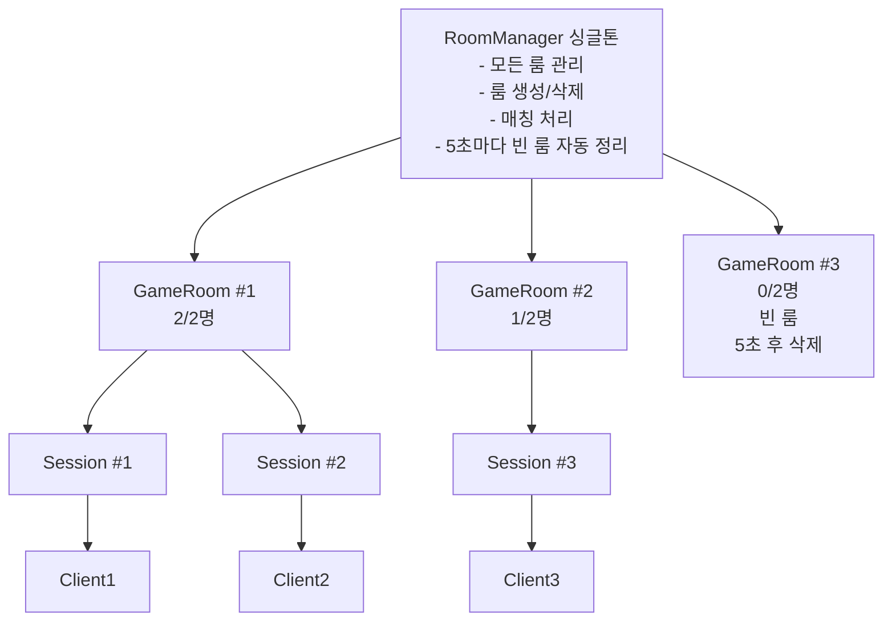

---

## 핵심 컴포넌트

### 컴포넌트 관계도

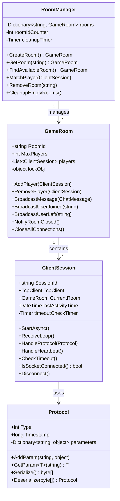

### 1. ClientSession (유저당 1개)

**위치**: `TestServer/ClientSession.cs`

**역할**:
- 클라이언트 연결 관리 (TCP)
- 메시지 송수신 및 직렬화/역직렬화
- 프로토콜 처리
- 타임아웃 및 연결 상태 감지

**주요 속성**:
```csharp
public string SessionId { get; private set; }           // 고유 ID (8자리 hex)
public TcpClient TcpClient { get; private set; }        // TCP 연결
public GameRoom? CurrentRoom { get; set; }              // 현재 속한 룸

private DateTime lastActivityTime;                      // 마지막 활동 시간
private Timer? timeoutCheckTimer;                       // 타임아웃 체크 타이머
private const int TIMEOUT_SECONDS = 30;                 // 타임아웃 시간 (초)
```

**주요 메서드**:
- `StartAsync()`: 세션 시작 및 메시지 수신 루프
- `ReceiveLoop()`: 비동기 메시지 수신
- `HandleProtocol()`: 프로토콜 타입별 처리
- `HandleHeartbeat()`: 하트비트 응답
- `CheckTimeout()`: 타임아웃 체크 (5초마다)
- `IsSocketConnected()`: 소켓 연결 상태 실시간 체크
- `Disconnect()`: 연결 종료 및 리소스 정리

---

### 2. GameRoom (공간, 여러 세션 포함)

**위치**: `TestServer/GameRoom.cs`

**역할**:
- 세션들을 묶는 컨테이너
- 채팅 메시지 브로드캐스트
- 입장/퇴장 관리
- 유저 입장/퇴장 알림

**주요 속성**:
```csharp
public string RoomId { get; private set; }              // 룸 ID ("ROOM_0001")
public const int MaxPlayers = 2;                        // 최대 인원 (고정)
private List<ClientSession> players;                    // 플레이어 리스트
private readonly object lockObj;                        // 스레드 동기화
```

**주요 메서드**:
- `AddPlayer()`: 플레이어 입장
- `RemovePlayer()`: 플레이어 퇴장
- `BroadcastMessage()`: 채팅 메시지 브로드캐스트
- `BroadcastUserJoined()`: 입장 알림
- `BroadcastUserLeft()`: 퇴장 알림
- `NotifyRoomClosed()`: 룸 종료 알림
- `CloseAllConnections()`: 모든 연결 종료

---

### 3. RoomManager (싱글톤)

**위치**: `TestServer/RoomManager.cs`

**역할**:
- 전체 룸 관리 (생성/삭제/조회)
- 플레이어 자동 매칭
- 빈 룸 자동 정리 (5초마다)

**주요 속성**:
```csharp
private static RoomManager instance;                    // 싱글톤 인스턴스
private ConcurrentDictionary<string, GameRoom> rooms;   // 스레드 세이프 룸 딕셔너리
private int roomIdCounter = 0;                          // 룸 ID 카운터
private Timer cleanupTimer;                             // 정리 타이머
```

**주요 메서드**:
- `CreateRoom()`: 새 룸 생성
- `GetRoom()`: 룸 ID로 조회
- `FindAvailableRoom()`: 빈자리 있는 룸 찾기
- `MatchPlayer()`: 플레이어 자동 매칭
- `RemoveRoom()`: 룸 제거
- `CleanupEmptyRooms()`: 빈 룸 자동 정리 (타이머 콜백)

---

### 4. Protocol (CommonLib)

**위치**: `CommonLib/Protocol.cs`

**역할**:
- 범용 네트워크 프로토콜
- 바이너리 직렬화/역직렬화
- 다양한 데이터 타입 지원
- JSON 기반 복합 객체 지원

**지원 타입**:
```
기본 타입: byte, short, int, long, float, double, bool, string, byte[]
복합 타입: struct (JSON), class (JSON)
```

**직렬화 포맷**:
```
[4바이트 크기][4바이트 타입][8바이트 타임스탬프][2바이트 데이터개수][데이터...]
```

**사용 예시**:
```csharp
// 프로토콜 생성
Protocol protocol = new Protocol(ChatProtocolType.CHAT_MESSAGE)
    .AddParam("message", "Hello World")
    .AddParam("timestamp", DateTime.UtcNow.Ticks);

// 직렬화
byte[] data = protocol.Serialize();

// 역직렬화
Protocol received = Protocol.Deserialize(data);
string msg = received.GetParam<string>("message");
```

---

## 프로토콜 정의

**위치**: `CommonLib/ChatProtocol.cs`

### 클라이언트 → 서버

| 코드 | 이름 | 설명 | 파라미터 |
|------|------|------|----------|
| 1001 | JOIN_ROOM | 룸 입장 요청 | - |
| 1002 | LEAVE_ROOM | 룸 퇴장 요청 | - |
| 1003 | CHAT_MESSAGE | 채팅 메시지 전송 | message: string |
| 1004 | HEARTBEAT | 하트비트 (연결 유지) | - |

### 서버 → 클라이언트

| 코드 | 이름 | 설명 | 파라미터 |
|------|------|------|----------|
| 2001 | JOIN_SUCCESS | 입장 성공 | sessionId: string, roomInfo: RoomInfo, message: string |
| 2002 | JOIN_FAILED | 입장 실패 | message: string |
| 2003 | LEAVE_SUCCESS | 퇴장 성공 | message: string |
| 2004 | USER_JOINED | 다른 유저 입장 알림 | userId: string, playerCount: int |
| 2005 | USER_LEFT | 다른 유저 퇴장 알림 | userId: string, playerCount: int |
| 2006 | CHAT_BROADCAST | 채팅 메시지 브로드캐스트 | chatMessage: ChatMessage |
| 2007 | ROOM_CLOSED | 룸 종료 알림 | roomId: string, reason: string |
| 2008 | HEARTBEAT_ACK | 하트비트 응답 | serverTime: long |
| 2999 | ERROR | 에러 메시지 | message: string |

### 데이터 구조체

```csharp
// 채팅 메시지
public struct ChatMessage
{
    public string SenderId { get; set; }
    public string Message { get; set; }
    public long Timestamp { get; set; }
}

// 룸 정보
public struct RoomInfo
{
    public string RoomId { get; set; }
    public int PlayerCount { get; set; }
    public int MaxPlayers { get; set; }
}
```

---

## 연결 관리 및 보안

### 연결 상태 관리

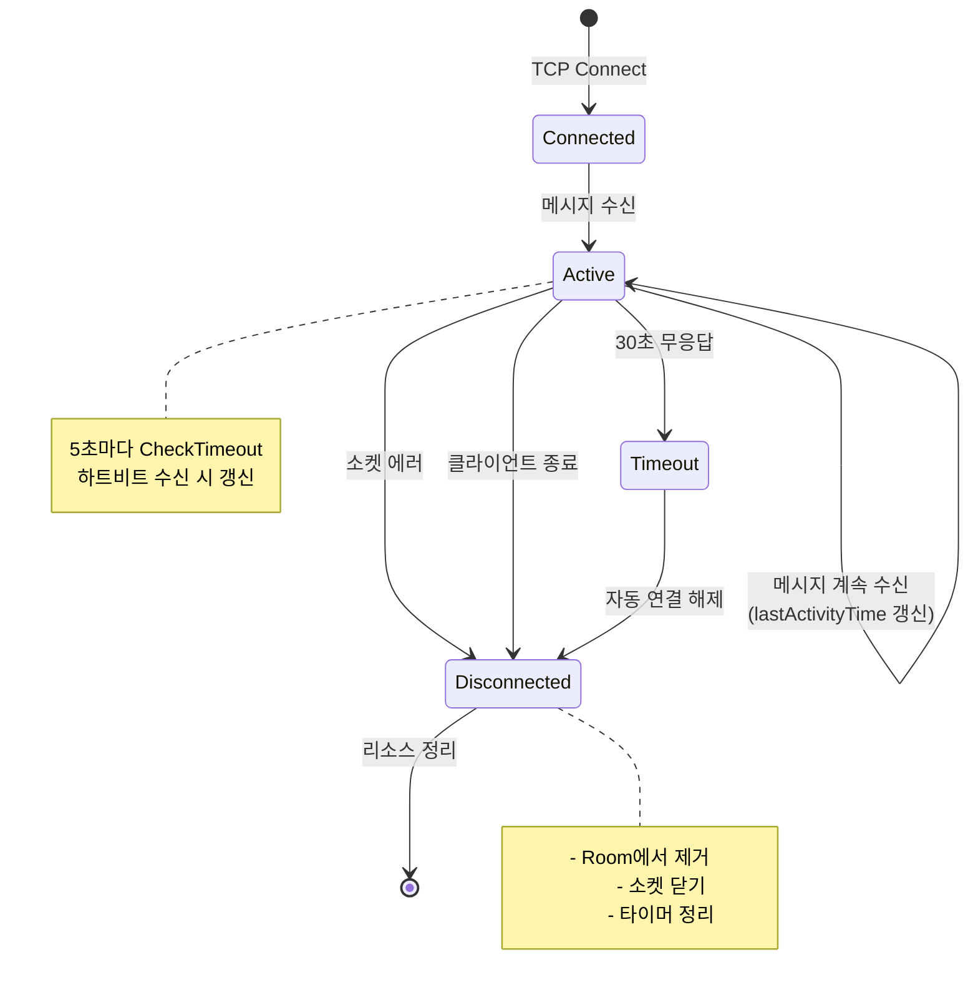

### 1. 하트비트 시스템

**목적**: 클라이언트 연결 상태 확인

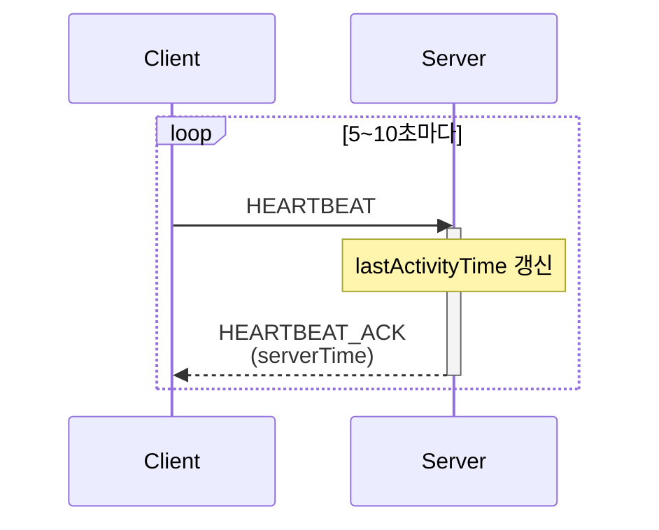

**권장 주기**: 5~10초마다 클라이언트가 전송

---

### 2. 타임아웃 체크

**설정**:
```csharp
const int TIMEOUT_SECONDS = 30;           // 30초 무응답 시 타임아웃
const int TIMEOUT_CHECK_INTERVAL = 5000;  // 5초마다 체크
```

**동작 흐름**:
1. 클라이언트 연결 시 `lastActivityTime` 기록
2. 모든 메시지 수신 시 `lastActivityTime` 갱신
3. 5초마다 타이머가 `lastActivityTime` 체크
4. 30초 이상 활동 없으면 자동 연결 해제

---

### 3. 연결 끊김 감지

**방법 1: Socket.Poll()**
```csharp
bool IsSocketConnected()
{
    bool part1 = socket.Poll(1000, SelectMode.SelectRead);
    bool part2 = (socket.Available == 0);

    if (part1 && part2)
        return false; // 연결 끊김
    else
        return true;
}
```

**방법 2: 예외 처리**
- `IOException`: 네트워크 I/O 에러
- `SocketException`: 소켓 레벨 에러
- 모든 예외 발생 시 안전한 정리 보장

---

### 4. 메시지 크기 검증

**설정**:
```csharp
if (messageLength <= 0 || messageLength > 1024 * 1024) // 1MB 제한
{
    Console.WriteLine($"Invalid message length: {messageLength}");
    Disconnect();
}
```

**목적**: DoS 공격 방어, 메모리 폭주 방지

---

### 5. 좀비 세션 방지 시나리오

| 시나리오 | 감지 방법 | 처리 |
|----------|-----------|------|
| 정상 종료 | `-1` 명령어 입력 | 정상 종료 프로세스 |
| 프로그램 강제 종료 | `IsSocketConnected()` | 즉시 정리 |
| 네트워크 끊김 | `IOException` / `SocketException` | catch 블록에서 정리 |
| 무응답 (프리징) | 타임아웃 체크 (30초) | 자동 연결 해제 |
| 악의적 대용량 메시지 | 메시지 크기 검증 | 연결 차단 |

---

## 데이터 흐름

### 프로토콜 처리 흐름

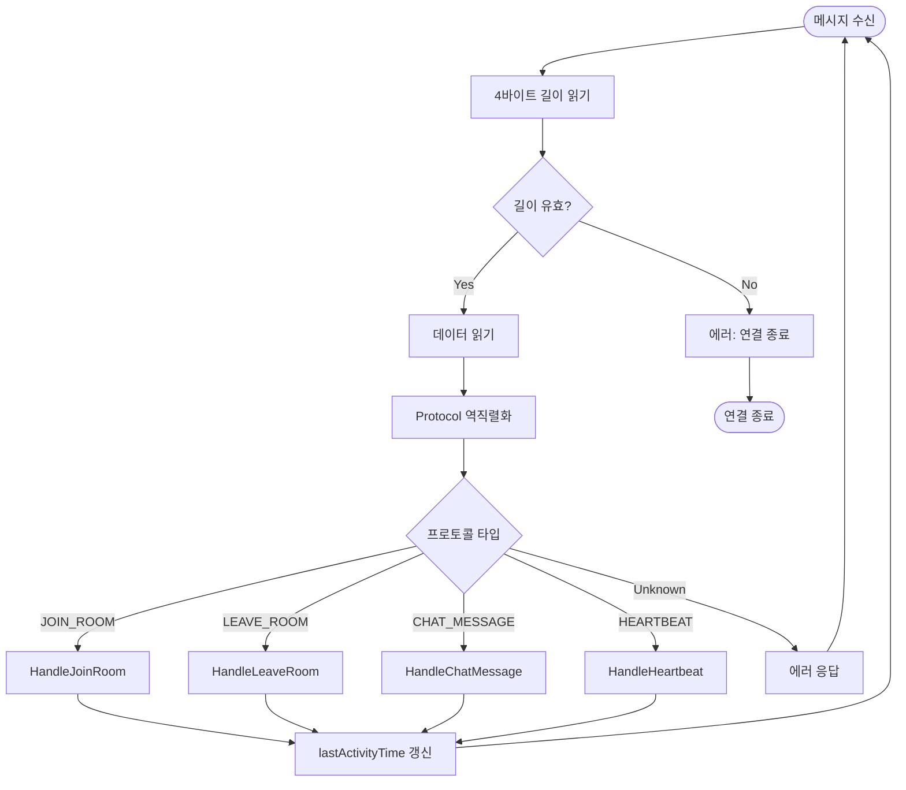

### 1. 클라이언트 접속 및 매칭

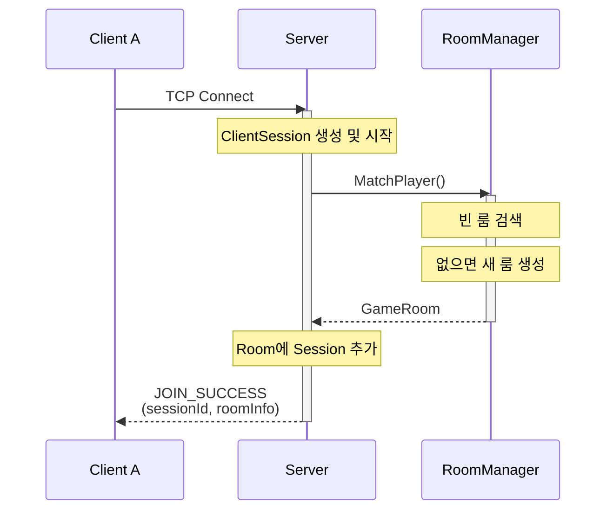

### 매칭 알고리즘

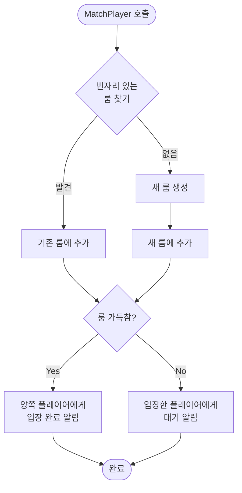

---

### 2. 채팅 메시지 전송

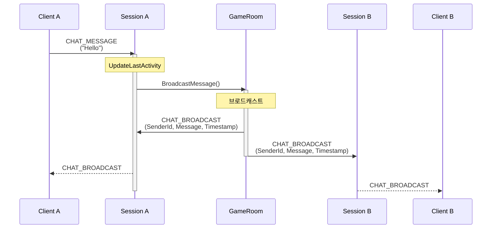

---

### 3. 룸 나가기 (Command: -1)

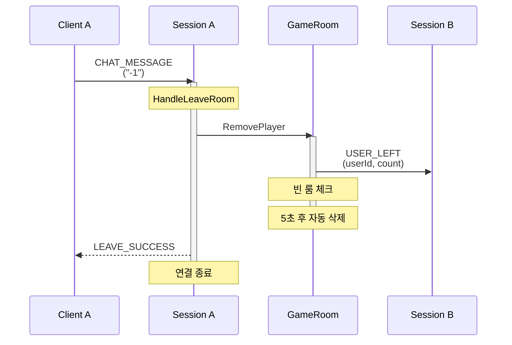

### 룸 생명주기

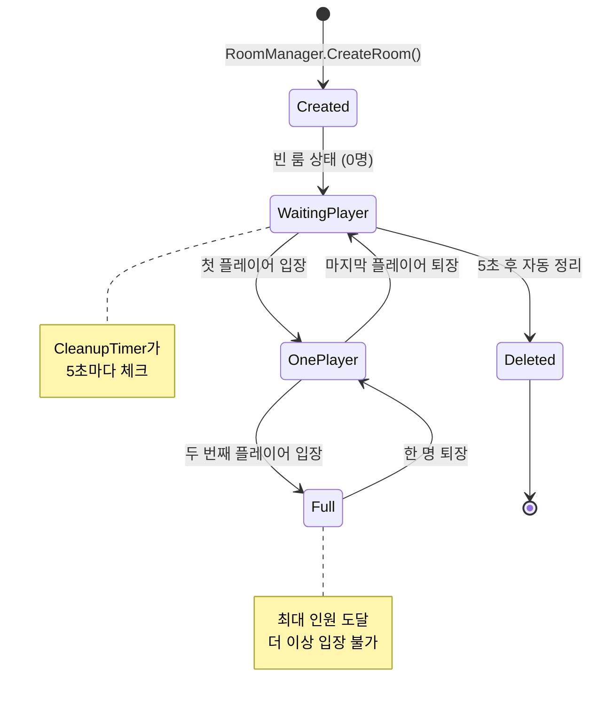

---

### 4. 타임아웃 시나리오

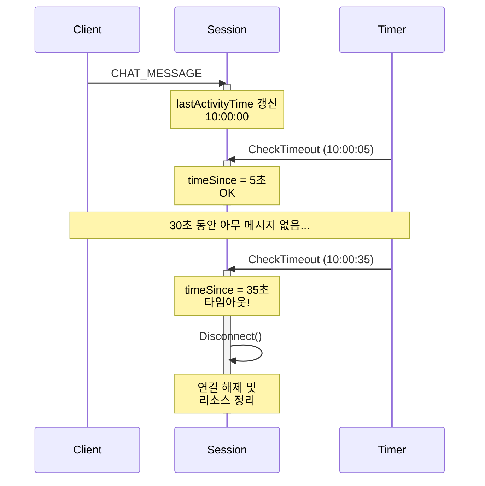

---

## 확장 가능성

### 1. 게임 로직 추가

현재 구조에서 쉽게 확장 가능:

```csharp
// PlayerSession.cs (ClientSession 상속)
public class PlayerSession : ClientSession
{
    public PlayerState State { get; set; }
    public Vector3 Position { get; set; }
    public int Health { get; set; }

    protected override async Task HandleProtocol(Protocol protocol)
    {
        switch (protocol.Type)
        {
            case GameProtocolType.MOVE:
                await HandleMove(protocol);
                break;
            case GameProtocolType.ATTACK:
                await HandleAttack(protocol);
                break;
            default:
                await base.HandleProtocol(protocol);
                break;
        }
    }
}
```

---

### 2. 룸 타입 확장 (미래 계획)

현재는 2인 고정이지만, 향후 다음과 같은 확장이 가능합니다:

```csharp
// RoomType 열거형 추가 (향후)
public enum RoomType
{
    PvP1v1,      // 1vs1 대전 (현재)
    PvP2v2,      // 2vs2 팀전 (미래)
    FFA,         // Free For All (미래)
    Coop,        // 협동 모드 (미래)
    Spectator    // 관전 모드 (미래)
}

// 현재 구현
public GameRoom CreateRoom()
{
    return new GameRoom(); // 2인 고정
}
```

---

### 3. 데이터베이스 연동

```csharp
// UserService.cs
public class UserService
{
    public async Task<User> AuthenticateAsync(string username, string password)
    {
        // DB 조회
    }

    public async Task SaveGameResultAsync(string userId, GameResult result)
    {
        // 전적 저장
    }
}

// ClientSession에서 사용
public async Task HandleLogin(Protocol protocol)
{
    string username = protocol.GetParam<string>("username");
    string password = protocol.GetParam<string>("password");

    User user = await UserService.AuthenticateAsync(username, password);

    if (user != null)
    {
        this.UserId = user.Id;
        await SendLoginSuccess(user);
    }
}
```

---

### 4. 로비 시스템

```csharp
// LobbyManager.cs
public class LobbyManager
{
    private List<ClientSession> lobbyPlayers;

    public void AddToLobby(ClientSession session)
    {
        lobbyPlayers.Add(session);
        BroadcastLobbyUpdate();
    }

    public void CreateCustomRoom(ClientSession host, RoomSettings settings)
    {
        // 커스텀 룸 생성
    }

    public List<RoomInfo> GetRoomList()
    {
        // 현재 활성 룸 목록 반환
    }
}
```

---

### 5. 추가 프로토콜 정의

```csharp
// GameProtocolType.cs
public static class GameProtocolType
{
    // 게임 관련
    public const int GAME_START = 3001;
    public const int GAME_END = 3002;
    public const int PLAYER_MOVE = 3003;
    public const int PLAYER_ATTACK = 3004;
    public const int USE_ITEM = 3005;

    // 로비 관련
    public const int GET_ROOM_LIST = 4001;
    public const int CREATE_CUSTOM_ROOM = 4002;
    public const int JOIN_CUSTOM_ROOM = 4003;

    // 친구 시스템
    public const int FRIEND_REQUEST = 5001;
    public const int FRIEND_ACCEPT = 5002;
    public const int FRIEND_LIST = 5003;
}
```

---

## 빌드 및 실행

### 빌드

```bash
cd Servers
dotnet build
```

### 실행

```bash
cd Servers/TestServer
dotnet run
```

### 서버 실행 예시

```
========================================
    Chat Server Starting...
========================================

[Server] Listening on port 7777
[Server] Waiting for clients to connect...

[Session a1b2c3d4] Created
[RoomManager] Room created: ROOM_0001
[Room ROOM_0001] Player a1b2c3d4 joined. (1/2)
[Session a1b2c3d4] Chat: Hello!

[Session e5f6g7h8] Created
[Room ROOM_0001] Player e5f6g7h8 joined. (2/2)
[Session e5f6g7h8] Chat: Hi there!

[Session a1b2c3d4] Leaving room ROOM_0001
[Room ROOM_0001] Player a1b2c3d4 left. (1/2)
[Session a1b2c3d4] Disconnecting...
[Session a1b2c3d4] Cleaned up

[RoomManager] Cleaned up empty room: ROOM_0001
[RoomManager] Total rooms: 0
```

---

## 성능 고려사항

### 현재 구현
- **동시 접속**: 수백 ~ 수천 명 (비동기 I/O)
- **룸 수**: 제한 없음 (메모리 허용 범위)
- **메시지 처리**: 비동기, 논블로킹
- **스레드 안전성**: lock, ConcurrentDictionary 사용

### 최적화 포인트
1. **연결 풀링**: TcpClient 재사용
2. **메모리 풀**: 버퍼 재사용 (ArrayPool)
3. **데이터베이스 연결**: 커넥션 풀 사용
4. **로드 밸런싱**: 여러 서버 인스턴스 분산
5. **캐싱**: Redis 등 인메모리 캐시 도입

---

## 문제 해결

### Q: 클라이언트가 강제 종료되면 어떻게 되나요?
**A**: 다음 순서로 자동 정리됩니다:
1. `IsSocketConnected()` 체크로 즉시 감지
2. 또는 30초 타임아웃 후 자동 해제
3. `Cleanup()` 메서드가 룸에서 제거 및 리소스 정리

### Q: 메시지 전송 중 예외가 발생하면?
**A**: `SendAsync()` 메서드의 try-catch에서 처리하고 `Disconnect()` 호출

### Q: 빈 룸은 언제 삭제되나요?
**A**: RoomManager의 타이머가 5초마다 체크하여 빈 룸 자동 삭제

### Q: 동시에 여러 클라이언트가 룸을 생성하면?
**A**: `ConcurrentDictionary`와 `Interlocked.Increment`로 스레드 세이프 보장

---

## 라이선스

이 프로젝트는 교육 목적으로 작성되었습니다.

---

## 기여자

- **InterPlanetery Team**

---

**문서 작성일**: 2025-09-30  
**버전**: 1.0.0