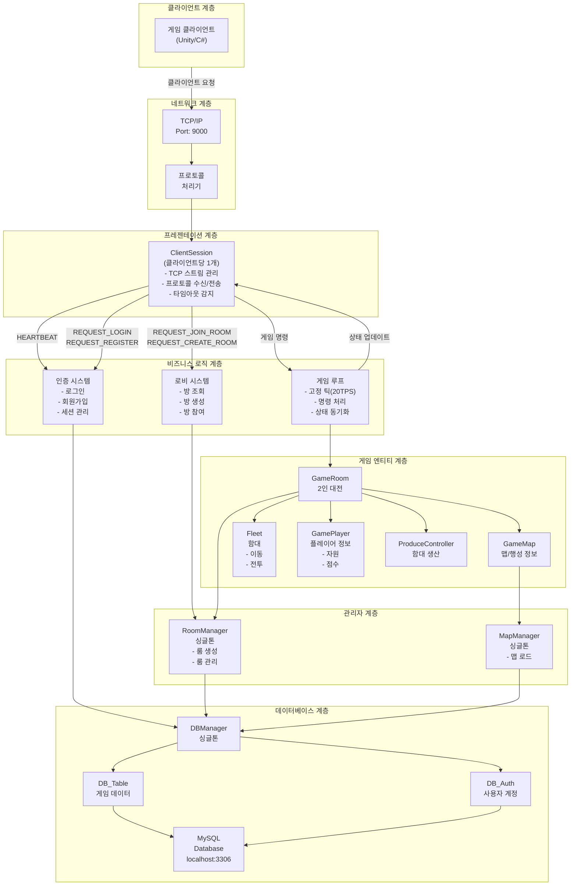
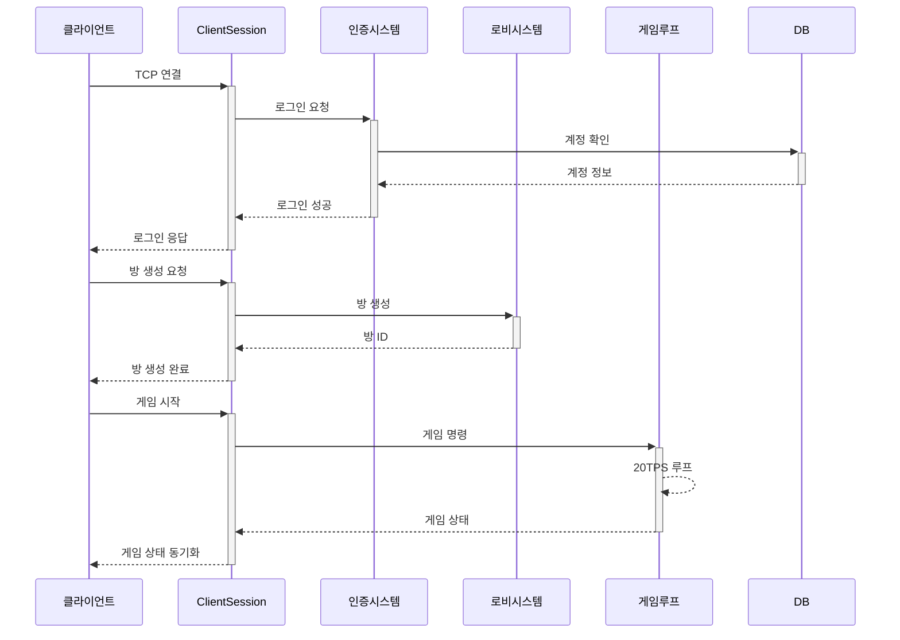

# InterPlanetery BaseServer - 시스템 아키텍처

## 시스템 전체 아키텍처

---

## 계층별 세부 설명

### 1. **클라이언트 계층**
- 게임 클라이언트 (Unity 또는 C#)
- TCP를 통해 서버와 통신

### 2. **네트워크 계층**
- **TCP/IP**: 포트 9000에서 클라이언트 연결 수락
- **ProtocolHandler**: 프로토콜 타입별 핸들러 매핑

### 3. **프레젠테이션 계층**
- **ClientSession**:
  - 개별 클라이언트 연결 관리
  - TCP 스트림 읽기/쓰기
  - 프로토콜 수신 및 위임
  - 타임아웃 감지 (30초)

### 4. **비즈니스 로직 계층**
- **인증 시스템**: 로그인, 회원가입, 세션 관리
- **로비 시스템**: 방 조회, 생성, 참여
- **게임 루프**: 고정 틱 레이트(20 TPS) 시뮬레이션

### 5. **게임 엔티티 계층**
- **GameRoom**: 2인 플레이어가 경쟁하는 게임 방
- **GameMap**: 게임 맵, 행성, 경로 정보
- **Fleet**: 우주 함대 (이동, 전투, 점령)
- **GamePlayer**: 플레이어 정보 (자원, 점수)
- **ProduceController**: 함대 생산 시스템

### 6. **관리자 계층**
- **RoomManager** (싱글톤): 모든 게임 룸 관리
- **MapManager** (싱글톤): 맵 데이터 로드 및 관리

### 7. **데이터베이스 계층**
- **DBManager** (싱글톤): 모든 DB 접근 중앙 관리
- **DB_Table**: 게임 데이터 (맵, 행성, 함대)
- **DB_Auth**: 사용자 계정 (로그인/등록)
- **MySQL**: 실제 데이터 저장소

---

## 실행 흐름

---

## 주요 특징

### 비동기 처리
- `async/await` 기반의 비블로킹 I/O
- 클라이언트당 별도 태스크에서 실행

### 스레드 안전성
- `ConcurrentDictionary` 사용 (RoomManager)
- `SemaphoreSlim`을 통한 동시성 제어

### 결정론적 시뮬레이션
- 고정 틱 레이트 (20 TPS = 50ms)
- 명령 큐 기반 결정론적 게임 상태
- 네트워크 지연 보상 (3틱 명령 버퍼)

### 싱글톤 패턴
- RoomManager, MapManager, DBManager
- 더블 체크 락킹을 통한 스레드 안전한 구현

---

## 포트 및 연결

| 구성 | 값 |
|------|-----|
| **TCP 서버 주소** | 127.0.0.1:9000 |
| **MySQL 주소** | localhost:3306 |
| **게임 틱 레이트** | 20 TPS (50ms) |
| **클라이언트 타임아웃** | 30초 |

