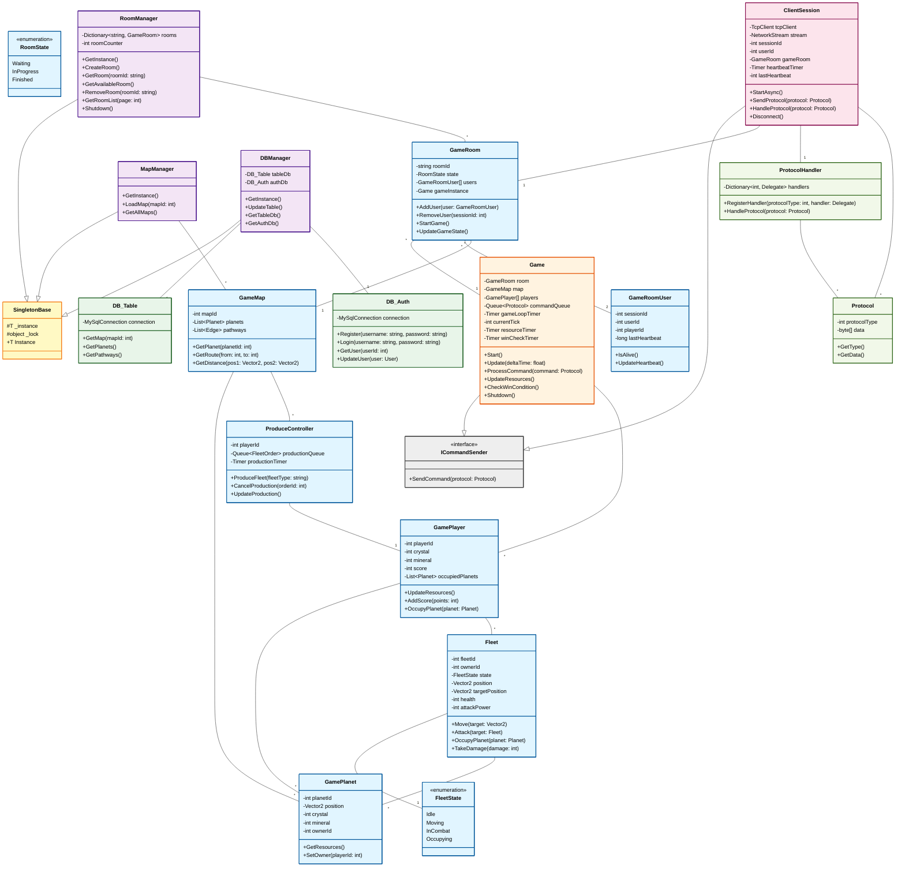

# InterPlanetery BaseServer - 클래스 다이어그램

## 전체 클래스 구조



---

## 주요 클래스 상세 설명

### 게임 엔티티 (Entity)

#### **GamePlayer**
- **역할**: 게임 플레이어 정보 관리
- **필드**: 크리스탈, 광물, 점수, 점령한 행성 목록
- **메서드**: 자원 업데이트, 점수 추가, 행성 점령

#### **Fleet**
- **역할**: 우주 함대 관리
- **상태**: `FleetState` (Idle, Moving, InCombat, Occupying)
- **기능**: 이동, 전투, 행성 점령, 피해 처리

#### **GamePlanet**
- **역할**: 게임 월드의 행성
- **정보**: 위치, 자원, 소유자

#### **GameMap**
- **역할**: 게임 맵 정보
- **구성**: 행성 목록, 경로 정보, 거리 계산

#### **ProduceController**
- **역할**: 함대 생산 관리
- **기능**: 생산 큐, 타이머 관리

#### **GameRoom**
- **역할**: 2인 대전 게임 방
- **상태**: `RoomState` (Waiting, InProgress, Finished)
- **기능**: 사용자 추가/제거, 게임 시작, 상태 동기화

#### **GameRoomUser**
- **역할**: 게임 방 내 플레이어 정보
- **필드**: 세션 ID, 사용자 ID, 플레이어 ID, 마지막 하트비트

---

### 게임 로직 (Logic)

#### **Game**
- **역할**: 게임 루프 및 상태 관리
- **특징**:
  - 고정 틱 레이트 (20 TPS = 50ms)
  - 명령 큐 기반 결정론적 시뮬레이션
  - 네트워크 지연 보상 (3틱 버퍼)
- **메서드**:
  - `Start()`: 게임 시작
  - `Update()`: 게임 상태 업데이트
  - `ProcessCommand()`: 명령 처리
  - `UpdateResources()`: 자원 생산 (200ms마다)
  - `CheckWinCondition()`: 승리 조건 확인 (500ms마다)

---

### 관리자 (Manager)

#### **RoomManager** (싱글톤)
- **역할**: 모든 게임 룸 관리
- **기능**:
  - 룸 생성 (ROOM_0001, ROOM_0002, ...)
  - 룸 조회 및 획득
  - 빈 자리가 있는 룸 검색
  - 빈 룸 자동 정리 (60초마다)
  - 페이지네이션된 룸 리스트

#### **MapManager** (싱글톤)
- **역할**: 게임 맵 데이터 관리
- **기능**: 맵 ID로 맵 로드

#### **DBManager** (싱글톤)
- **역할**: 모든 데이터베이스 접근 중앙 관리
- **구성**: DB_Table, DB_Auth

---

### 데이터베이스 (Database)

#### **DB_Table**
- **역할**: 게임 데이터 관리
- **기능**: 맵, 행성, 경로 정보 조회

#### **DB_Auth**
- **역할**: 사용자 인증 관리
- **기능**: 회원가입, 로그인, 사용자 정보 관리

---

### 세션 및 네트워크 (Session/Network)

#### **ClientSession**
- **역할**: 개별 클라이언트 연결 관리
- **기능**:
  - TCP 스트림 읽기/쓰기
  - 프로토콜 수신 및 처리
  - 타임아웃 감지 (30초)
  - 로그인/로그아웃
  - 룸 생성/참여
  - 게임 명령 송수신

#### **ProtocolHandler**
- **역할**: 프로토콜 타입별 핸들러 관리
- **패턴**: 전략 패턴 (Dictionary 기반 이벤트 처리)

#### **Protocol**
- **역할**: 네트워크 프로토콜 데이터 구조

---

### 구현된 인터페이스

#### **ICommandSender**
- **역할**: 게임 명령 송신 인터페이스
- **구현**: `Game`, `ClientSession`

#### **SingletonBase<T>**
- **역할**: 스레드 안전한 싱글톤 패턴
- **구현**: `RoomManager`, `MapManager`, `DBManager`

---

## 상속 관계 요약

```
SingletonBase<T>
├─ RoomManager
├─ MapManager
└─ DBManager

ICommandSender
├─ Game
└─ ClientSession
```

---

## 집합 관계 요약

| 포함자 | 포함 개수 | 포함물 |
|--------|---------|--------|
| GameRoom | 2 | GameRoomUser |
| GameRoom | 1 | Game |
| Game | 2 | GamePlayer |
| GamePlayer | N | Fleet |
| GamePlayer | N | GamePlanet |
| GameMap | N | GamePlanet |
| RoomManager | N | GameRoom |
| DBManager | 1 | DB_Table |
| DBManager | 1 | DB_Auth |

