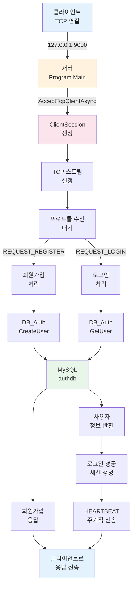
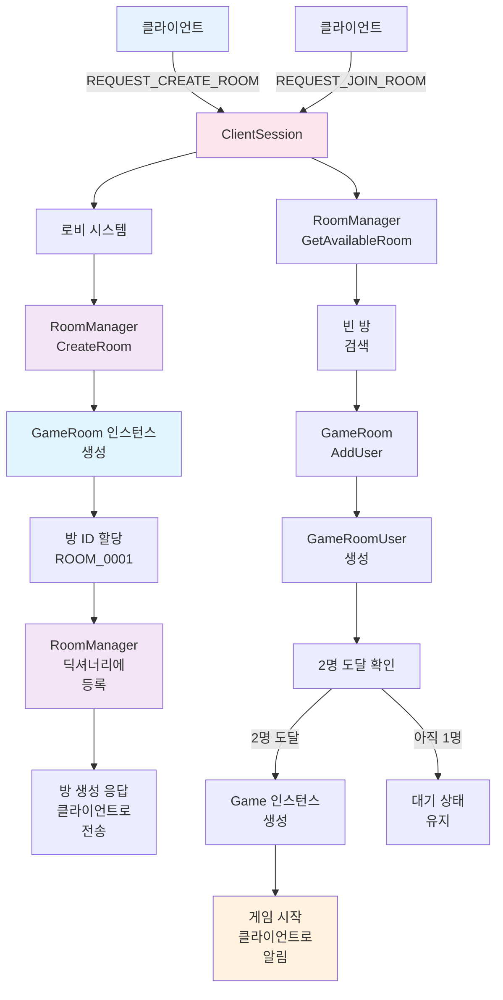
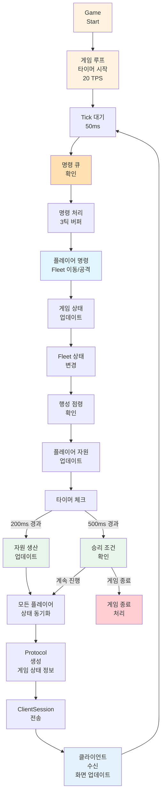
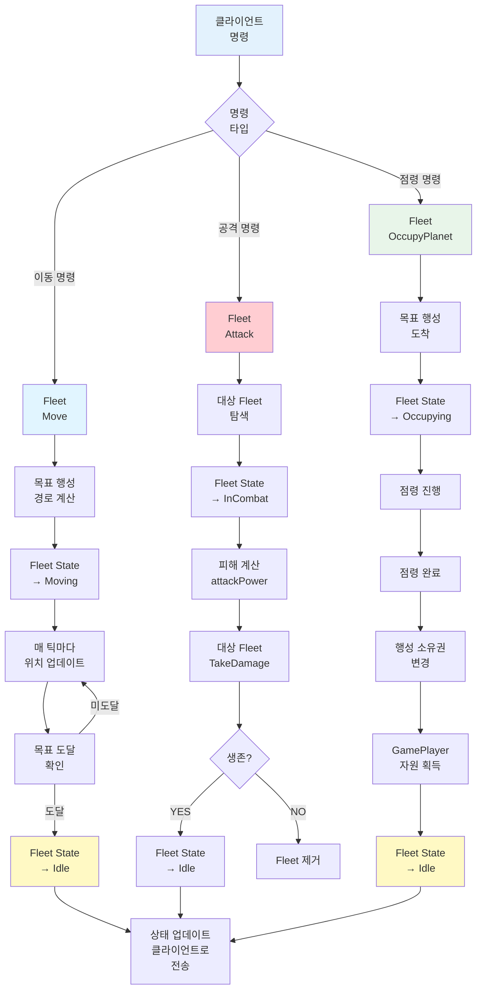
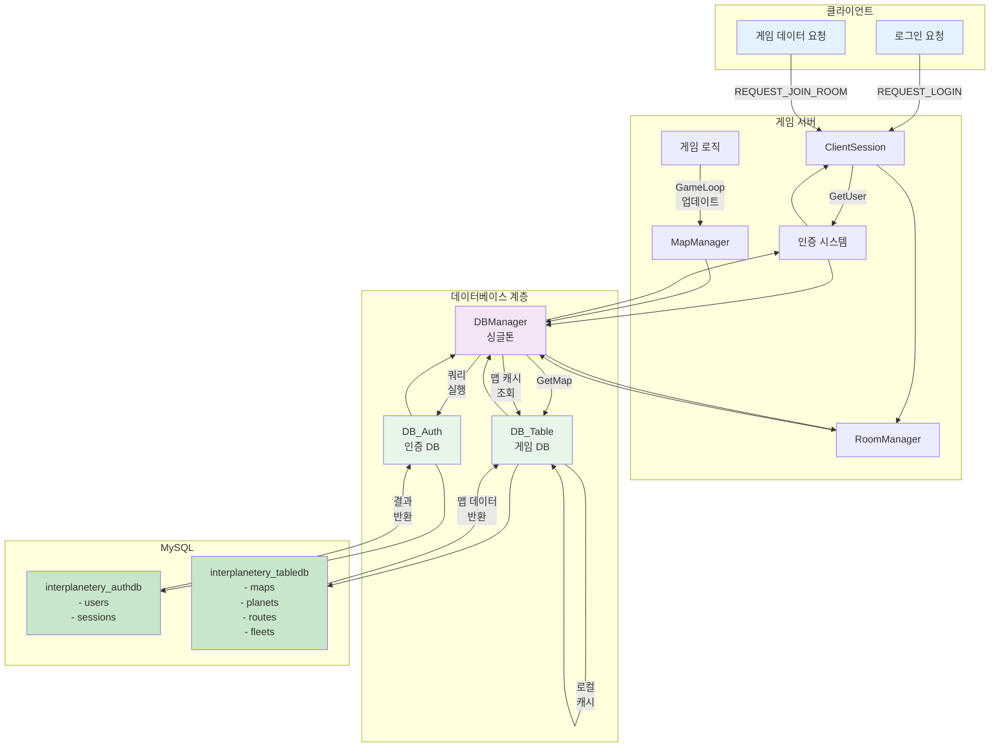
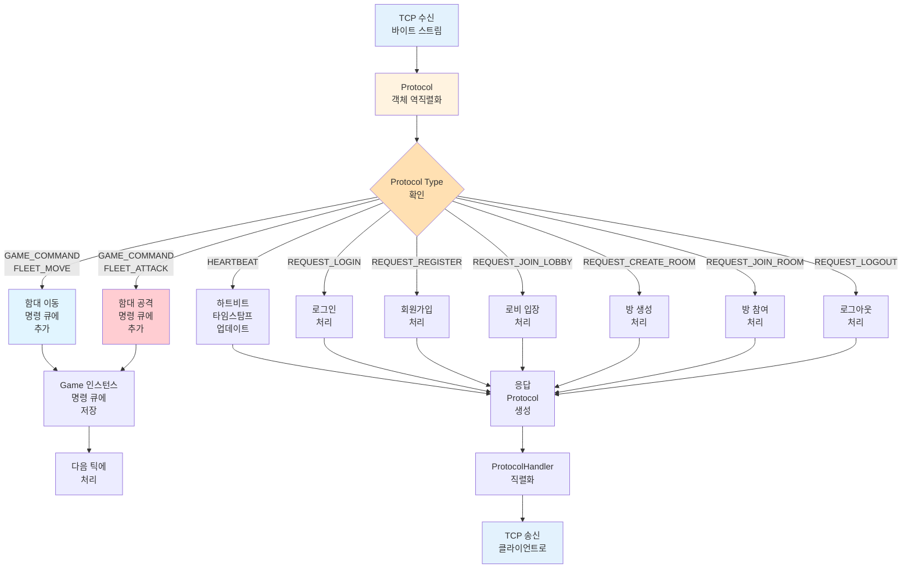
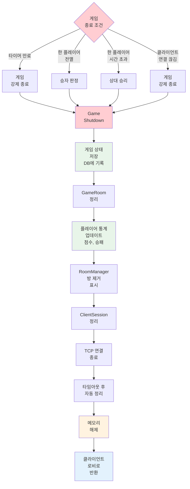
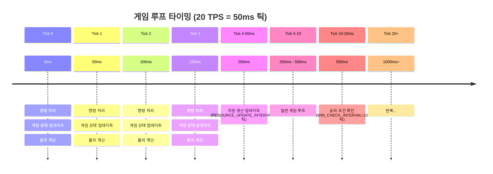
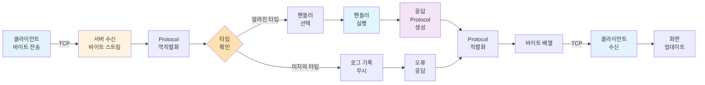

# InterPlanetery BaseServer - 데이터 흐름도

## 1. 클라이언트 연결 및 로그인 흐름

---

## 2. 게임 방 생성 및 참여 흐름

---

## 3. 게임 루프 및 상태 동기화 흐름

---

## 4. 함대 이동 및 전투 흐름

---

## 5. 데이터베이스 상호작용 흐름

---

## 6. 프로토콜 처리 흐름

---

## 7. 게임 종료 및 정리 흐름

---

## 데이터 흐름 요약표

| 단계 | 발신자 | 수신자 | 데이터 | 목적 |
|------|--------|--------|--------|------|
| 1 | 클라이언트 | ClientSession | TCP Stream | 연결 설정 |
| 2 | ClientSession | ProtocolHandler | Protocol | 프로토콜 해석 |
| 3 | ProtocolHandler | 핸들러 함수 | Protocol 타입 | 적절한 처리기 선택 |
| 4 | 핸들러 | DBManager | 쿼리 | 데이터 조회 |
| 5 | DBManager | DB_Auth/Table | SQL | 데이터베이스 접근 |
| 6 | DB | MySQL | SQL | 데이터 조회/저장 |
| 7 | Game | ClientSession | 게임 상태 | 상태 동기화 |
| 8 | ClientSession | 클라이언트 | Protocol | 화면 업데이트 |

---

## 타이밍 다이어그램

---

## 네트워크 패킷 흐름

