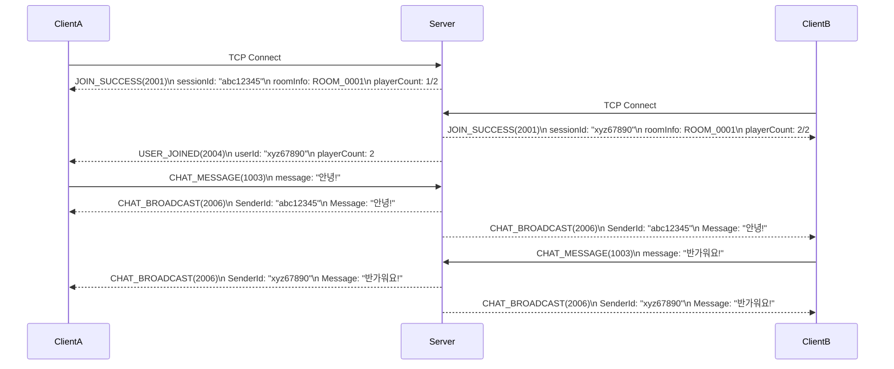
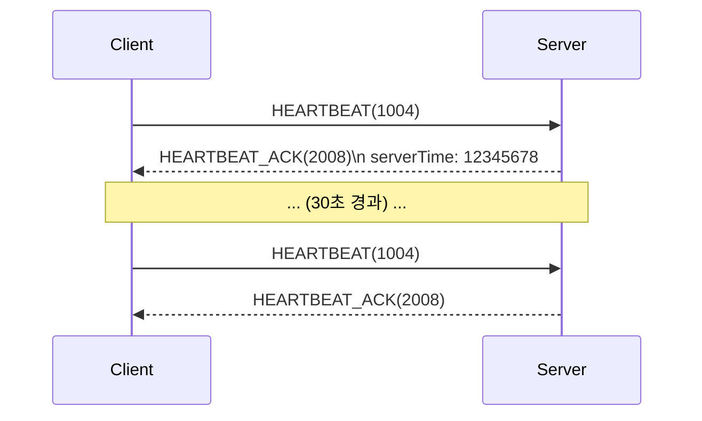
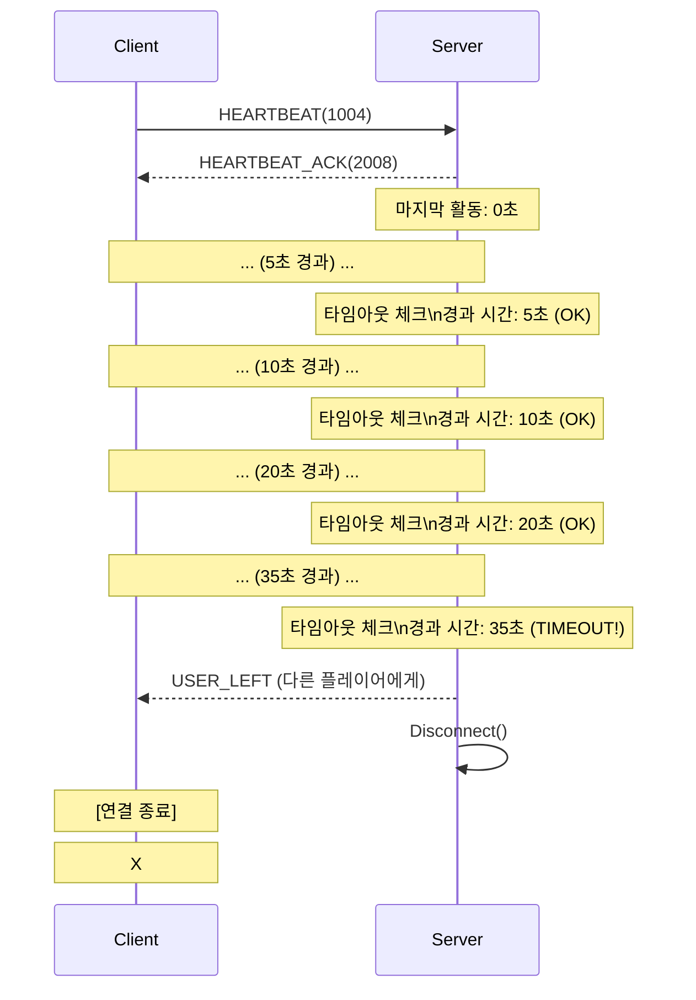
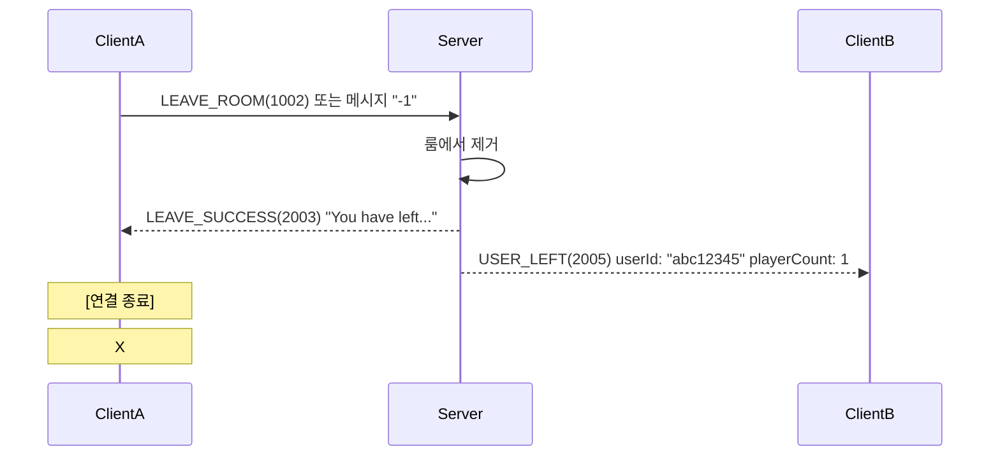

# 프로토콜 사용 가이드 (Protocol Usage Guide)

## 목차
1. [프로토콜 상세 명세](#프로토콜-상세-명세)
2. [시퀀스 다이어그램](#시퀀스-다이어그램)
3. [에러 처리](#에러-처리)
4. [클라이언트 구현 예시](#클라이언트-구현-예시)

---

## 프로토콜 상세 명세

### 1. JOIN_ROOM (1001)
> ⚠️ **현재 버전**: 클라이언트가 직접 전송하지 않음. 서버가 연결 시 자동으로 매칭 수행.

**방향**: Client → Server
**설명**: 룸 입장 요청 (자동 매칭)
**파라미터**: 없음

---

### 2. LEAVE_ROOM (1002)

**방향**: Client → Server
**설명**: 현재 룸에서 퇴장 요청
**파라미터**: 없음

**사용 예시 (C#)**:
```csharp
Protocol leaveProtocol = new Protocol(ChatProtocolType.LEAVE_ROOM);
byte[] data = leaveProtocol.Serialize();
```

---

### 3. CHAT_MESSAGE (1003)

**방향**: Client → Server
**설명**: 채팅 메시지 전송

**파라미터**:
| 키 | 타입 | 필수 | 설명 |
|----|------|------|------|
| message | string | Y | 전송할 채팅 메시지 (최대 1MB) |

**사용 예시 (C#)**:
```csharp
Protocol chatProtocol = new Protocol(ChatProtocolType.CHAT_MESSAGE)
    .AddParam("message", "안녕하세요!");
byte[] data = chatProtocol.Serialize();
```

**특수 명령어**:
- `"-1"`: 룸 퇴장 (LEAVE_ROOM과 동일한 효과)

---

### 4. HEARTBEAT (1004)

**방향**: Client → Server
**설명**: 연결 유지 확인 (30초마다 권장)
**파라미터**: 없음 (선택적으로 clientTime 추가 가능)

**사용 예시 (C#)**:
```csharp
Protocol heartbeatProtocol = new Protocol(ChatProtocolType.HEARTBEAT);
byte[] data = heartbeatProtocol.Serialize();
```

**서버 동작**:
- 마지막 활동 시간 갱신
- HEARTBEAT_ACK 응답 전송

---

### 5. JOIN_SUCCESS (2001)

**방향**: Server → Client
**설명**: 룸 입장 성공 알림

**파라미터**:
| 키 | 타입 | 필수 | 설명 |
|----|------|------|------|
| sessionId | string | Y | 클라이언트의 세션 ID (8자리) |
| roomInfo | RoomInfo | Y | 입장한 룸 정보 |
| message | string | Y | 환영 메시지 |

**수신 예시 (C#)**:
```csharp
string sessionId = protocol.GetParam<string>("sessionId");
RoomInfo roomInfo = protocol.GetStruct<RoomInfo>("roomInfo");
string message = protocol.GetParam<string>("message");

Console.WriteLine($"Session: {sessionId}");
Console.WriteLine($"Room: {roomInfo.RoomId} ({roomInfo.PlayerCount}/{roomInfo.MaxPlayers})");
Console.WriteLine(message);
```

**응답 예시**:
```
Session: abc12345
Room: ROOM_0001 (1/2)
Welcome to ROOM_0001! Type '-1' to leave.
```

---

### 6. JOIN_FAILED (2002)

**방향**: Server → Client
**설명**: 룸 입장 실패

**파라미터**:
| 키 | 타입 | 필수 | 설명 |
|----|------|------|------|
| message | string | Y | 실패 이유 |

**수신 예시 (C#)**:
```csharp
string errorMessage = protocol.GetParam<string>("message");
Console.WriteLine($"입장 실패: {errorMessage}");
```

---

### 7. LEAVE_SUCCESS (2003)

**방향**: Server → Client
**설명**: 룸 퇴장 성공

**파라미터**:
| 키 | 타입 | 필수 | 설명 |
|----|------|------|------|
| message | string | Y | 퇴장 확인 메시지 |

**수신 예시 (C#)**:
```csharp
string message = protocol.GetParam<string>("message");
Console.WriteLine(message); // "You have left the room"
```

**서버 동작**:
- 룸에서 플레이어 제거
- 다른 플레이어에게 USER_LEFT 브로드캐스트
- 클라이언트 연결 종료

---

### 8. USER_JOINED (2004)

**방향**: Server → Client
**설명**: 다른 유저가 룸에 입장함

**파라미터**:
| 키 | 타입 | 필수 | 설명 |
|----|------|------|------|
| userId | string | Y | 입장한 유저의 세션 ID |
| playerCount | int | Y | 현재 룸의 플레이어 수 |

**수신 예시 (C#)**:
```csharp
string userId = protocol.GetParam<string>("userId");
int playerCount = protocol.GetParam<int>("playerCount");
Console.WriteLine($"[알림] {userId}님이 입장했습니다. ({playerCount}/2)");
```

**브로드캐스트 대상**:
- 입장한 유저를 **제외한** 룸의 모든 플레이어

---

### 9. USER_LEFT (2005)

**방향**: Server → Client
**설명**: 다른 유저가 룸에서 퇴장함

**파라미터**:
| 키 | 타입 | 필수 | 설명 |
|----|------|------|------|
| userId | string | Y | 퇴장한 유저의 세션 ID |
| playerCount | int | Y | 현재 룸의 플레이어 수 |

**수신 예시 (C#)**:
```csharp
string userId = protocol.GetParam<string>("userId");
int playerCount = protocol.GetParam<int>("playerCount");
Console.WriteLine($"[알림] {userId}님이 퇴장했습니다. ({playerCount}/2)");
```

**브로드캐스트 대상**:
- 퇴장한 유저를 **포함한** 룸의 모든 플레이어

---

### 10. CHAT_BROADCAST (2006)

**방향**: Server → Client
**설명**: 채팅 메시지 브로드캐스트

**파라미터**:
| 키 | 타입 | 필수 | 설명 |
|----|------|------|------|
| chatMessage | ChatMessage | Y | 채팅 메시지 구조체 |

**수신 예시 (C#)**:
```csharp
ChatMessage chatMsg = protocol.GetStruct<ChatMessage>("chatMessage");
DateTime timestamp = DateTimeOffset.FromUnixTimeMilliseconds(chatMsg.Timestamp).LocalDateTime;
Console.WriteLine($"[{timestamp:HH:mm:ss}] {chatMsg.SenderId}: {chatMsg.Message}");
```

**브로드캐스트 대상**:
- 발신자를 **포함한** 룸의 모든 플레이어

---

### 11. ROOM_CLOSED (2007)

**방향**: Server → Client
**설명**: 룸이 종료됨

**파라미터**:
| 키 | 타입 | 필수 | 설명 |
|----|------|------|------|
| roomId | string | Y | 종료된 룸 ID |
| reason | string | Y | 종료 사유 |

**수신 예시 (C#)**:
```csharp
string roomId = protocol.GetParam<string>("roomId");
string reason = protocol.GetParam<string>("reason");
Console.WriteLine($"[알림] {roomId} - {reason}");
```

**발생 상황**:
- 서버 강제 종료
- 관리자에 의한 룸 폐쇄

---

### 12. HEARTBEAT_ACK (2008)

**방향**: Server → Client
**설명**: 하트비트 응답

**파라미터**:
| 키 | 타입 | 필수 | 설명 |
|----|------|------|------|
| serverTime | long | Y | 서버의 현재 시간 (밀리초) |

**수신 예시 (C#)**:
```csharp
long serverTime = protocol.GetParam<long>("serverTime");
DateTime serverDateTime = DateTimeOffset.FromUnixTimeMilliseconds(serverTime).LocalDateTime;
Console.WriteLine($"[Heartbeat] 서버 시간: {serverDateTime}");
```

**용도**:
- 연결 유지 확인
- 네트워크 지연 측정 (RTT 계산)
- 서버 시간 동기화

---

### 13. ERROR (2999)

**방향**: Server → Client
**설명**: 에러 메시지

**파라미터**:
| 키 | 타입 | 필수 | 설명 |
|----|------|------|------|
| message | string | Y | 에러 메시지 내용 |

**수신 예시 (C#)**:
```csharp
string errorMessage = protocol.GetParam<string>("message");
Console.WriteLine($"[에러] {errorMessage}");
```

**에러 예시**:
- `"Failed to join room"` - 룸 입장 실패
- `"Invalid message format"` - 잘못된 메시지 형식
- `"Room is full"` - 룸이 가득 찼을 때

---

## 시퀀스 다이어그램

### 정상 연결 및 채팅 시퀀스



### 하트비트 시퀀스



### 타임아웃 시퀀스



### 퇴장 시퀀스



---

## 에러 처리

### 클라이언트 에러 처리 가이드

#### 1. 연결 에러
- **상황**: TCP 연결 실패
- **대응**: 재연결 시도 (최대 3회)
- **예외**: `SocketException`, `IOException`

#### 2. 프로토콜 파싱 에러
- **상황**: 잘못된 형식의 데이터 수신
- **대응**: 해당 패킷 무시, 로그 기록
- **예외**: `Protocol.Deserialize()` null 반환

#### 3. 타임아웃
- **상황**: 30초 동안 응답 없음
- **대응**: 서버가 자동으로 연결 종료
- **클라이언트 권장**: 25초마다 HEARTBEAT 전송

#### 4. 룸 입장 실패
- **상황**: JOIN_FAILED(2002) 수신
- **대응**: 에러 메시지 표시, 재시도 여부 확인

### 서버 에러 처리

#### 1. 메시지 크기 검증
```csharp
if (messageLength <= 0 || messageLength > 1024 * 1024) // 1MB 제한
{
    Console.WriteLine($"[Session {SessionId}] Invalid message length: {messageLength}");
    break;
}
```

#### 2. 소켓 상태 검증
```csharp
bool IsSocketConnected()
{
    Socket socket = TcpClient.Client;
    bool part1 = socket.Poll(1000, SelectMode.SelectRead);
    bool part2 = (socket.Available == 0);

    if (part1 && part2)
        return false; // 연결 끊김
    else
        return true;
}
```

#### 3. 핸들러 예외 처리
```csharp
try
{
    await handler(_protocol);
}
catch (Exception e)
{
    Console.WriteLine($"[ProtocolHandler] Error handling protocol {_protocol.Type}: {e.Message}");
}
```

---

## 클라이언트 구현 예시

### 전체 예시 (C#)

```csharp
using System;
using System.Net.Sockets;
using System.Threading.Tasks;
using CommonLib;

public class ChatClient
{
    private TcpClient m_client;
    private NetworkStream m_stream;
    private bool m_isConnected;

    public async Task ConnectAsync(string _host, int _port)
    {
        m_client = new TcpClient(_host, _port);
        m_stream = m_client.GetStream();
        m_isConnected = true;

        // 수신 루프 시작
        _ = Task.Run(ReceiveLoop);

        // 하트비트 시작
        _ = Task.Run(HeartbeatLoop);
    }

    private async Task ReceiveLoop()
    {
        byte[] lengthBuffer = new byte[4];

        while (m_isConnected)
        {
            try
            {
                // 메시지 길이 읽기
                int bytesRead = await m_stream.ReadAsync(lengthBuffer, 0, 4);
                if (bytesRead == 0) break;

                int messageLength = BitConverter.ToInt32(lengthBuffer, 0);

                // 전체 메시지 읽기
                byte[] messageBuffer = new byte[messageLength + 4];
                Array.Copy(lengthBuffer, messageBuffer, 4);

                int totalRead = 0;
                while (totalRead < messageLength)
                {
                    bytesRead = await m_stream.ReadAsync(messageBuffer, 4 + totalRead, messageLength - totalRead);
                    if (bytesRead == 0) return;
                    totalRead += bytesRead;
                }

                // 프로토콜 처리
                Protocol protocol = Protocol.Deserialize(messageBuffer);
                if (protocol != null)
                {
                    HandleProtocol(protocol);
                }
            }
            catch (Exception e)
            {
                Console.WriteLine($"[Client] Error: {e.Message}");
                break;
            }
        }
    }

    private void HandleProtocol(Protocol _protocol)
    {
        switch (_protocol.Type)
        {
            case ChatProtocolType.JOIN_SUCCESS:
                string sessionId = _protocol.GetParam<string>("sessionId");
                RoomInfo roomInfo = _protocol.GetStruct<RoomInfo>("roomInfo");
                Console.WriteLine($"입장 성공! Session: {sessionId}, Room: {roomInfo.RoomId}");
                break;

            case ChatProtocolType.CHAT_BROADCAST:
                ChatMessage chatMsg = _protocol.GetStruct<ChatMessage>("chatMessage");
                Console.WriteLine($"[{chatMsg.SenderId}]: {chatMsg.Message}");
                break;

            case ChatProtocolType.USER_JOINED:
                string userId = _protocol.GetParam<string>("userId");
                Console.WriteLine($"[알림] {userId}님이 입장했습니다.");
                break;

            case ChatProtocolType.USER_LEFT:
                string leftUserId = _protocol.GetParam<string>("userId");
                Console.WriteLine($"[알림] {leftUserId}님이 퇴장했습니다.");
                break;

            case ChatProtocolType.HEARTBEAT_ACK:
                // 하트비트 응답 수신
                break;

            case ChatProtocolType.ERROR:
                string errorMsg = _protocol.GetParam<string>("message");
                Console.WriteLine($"[에러] {errorMsg}");
                break;
        }
    }

    private async Task HeartbeatLoop()
    {
        while (m_isConnected)
        {
            await Task.Delay(25000); // 25초마다

            try
            {
                Protocol heartbeat = new Protocol(ChatProtocolType.HEARTBEAT);
                await SendAsync(heartbeat.Serialize());
            }
            catch
            {
                break;
            }
        }
    }

    public async Task SendMessageAsync(string _message)
    {
        Protocol chatProtocol = new Protocol(ChatProtocolType.CHAT_MESSAGE)
            .AddParam("message", _message);
        await SendAsync(chatProtocol.Serialize());
    }

    public async Task LeaveAsync()
    {
        Protocol leaveProtocol = new Protocol(ChatProtocolType.LEAVE_ROOM);
        await SendAsync(leaveProtocol.Serialize());
        m_isConnected = false;
    }

    private async Task SendAsync(byte[] _data)
    {
        if (!m_isConnected || m_stream == null)
            return;

        await m_stream.WriteAsync(_data, 0, _data.Length);
        await m_stream.FlushAsync();
    }
}
```

### 사용 예시

```csharp
class Program
{
    static async Task Main(string[] args)
    {
        ChatClient client = new ChatClient();
        await client.ConnectAsync("127.0.0.1", 7777);

        Console.WriteLine("채팅 시작! (종료하려면 '-1' 입력)");

        while (true)
        {
            string input = Console.ReadLine();

            if (input == "-1")
            {
                await client.LeaveAsync();
                break;
            }

            await client.SendMessageAsync(input);
        }
    }
}
```

---

## 참고 문서

- [프로토콜 명세서](ProtocolSpecification.md)
- [서버 아키텍처 문서](ServerArchitecture.md)
- [코딩 스타일 가이드](CodingStyle.md)

---

[⬅️ 서버 README로 돌아가기](../README.md)