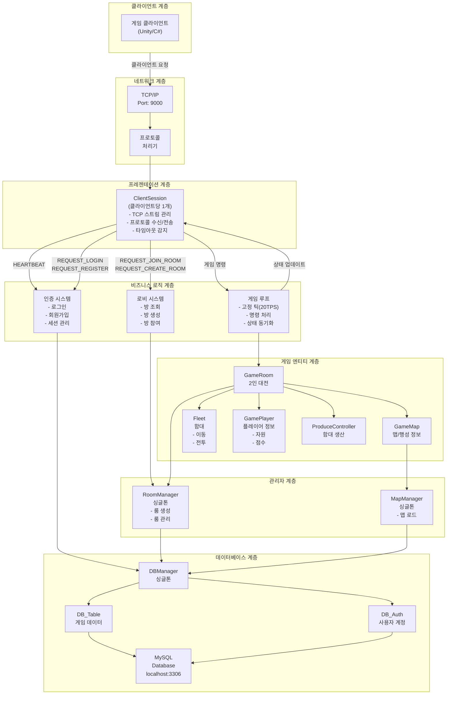
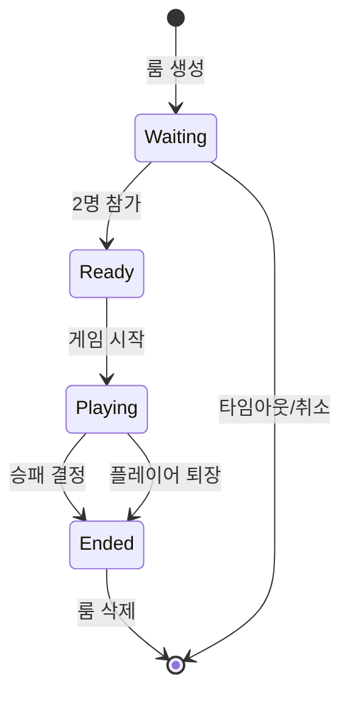
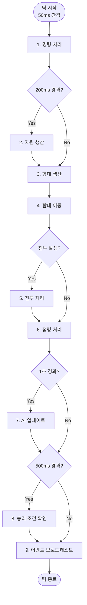

# Interplanetary 서버 시스템 기획서

> **최종 업데이트**: 2025-11-23  
> **프로젝트**: InterPlanetery Server - 2인 대전 RTS 게임 서버  
> **관련 문서**: [프로젝트 개요](./PROJECT_OVERVIEW.md) | [WPF 클라이언트 명세](./interplanetary_test_client_spec.md)

## 📑 목차
1. [문서 개요](#1-문서-개요)
2. [시스템 아키텍처](#2-시스템-아키텍처)
3. [데이터 구조 설계](#3-데이터-구조-설계)
4. [핵심 시스템 명세](#4-핵심-시스템-명세)
5. [WPF 테스트 클라이언트](#5-wpf-테스트-클라이언트)
6. [네트워크 프로토콜](#6-네트워크-프로토콜)
7. [기술적 고려사항](#7-기술적-고려사항)
8. [참고 자료](#8-참고-자료)
9. [용어 정의](#9-용어-정의)

---

## 1. 문서 개요

### 1.1 프로젝트 목표

**InterPlanetery**는 행성 점령 및 함대 전투를 핵심으로 하는 2인 대전 RTS 게임 서버입니다.

**핵심 목표**:
- Unity 게임 로직을 서버로 분리하여 **권위 있는 서버(Authoritative Server)** 구현
- **결정론적 시뮬레이션**과 **락스텝 동기화**를 통한 공정한 멀티플레이어 환경
- 확장 가능하고 유지보수 용이한 아키텍처 설계
- WPF 테스트 클라이언트를 통한 빠른 검증 및 개발

> **참고**: 전체 시스템 아키텍처는 [시스템 아키텍처 다이어그램](./Diagrams/01_SystemArchitecture.md) 참조

### 1.2 개발 단계

| 단계 | 목표 | 산출물 | 상태 |
|------|------|--------|------|
| **Sprint 1** | 1v1 핵심 시스템 프로토타입 | 기본 게임 로직 | ✅ 완료 |
| **Sprint 2** | 멀티플레이 기반 구축 | 룸 관리, 락스텝 동기화 | 🔄 진행중 |
| **Sprint 3** | 안정화 및 MVP 완성 | 버그 수정, 최적화 | 📋 예정 |
| **Post-MVP** | 확장 기능 개발 | AI, 리플레이, 랭킹 | 📋 예정 |

### 1.3 기술 스택

**서버**:
- **언어**: C# (.NET 8.0)
- **네트워크**: TCP 소켓 (Port 9000)
- **데이터베이스**: MySQL (localhost:3306)
- **동기화**: 락스텝(Lockstep), 20 TPS (50ms/틱)

**클라이언트**:
- **테스트**: WPF (MVP 패턴)
- **최종**: Unity (Phase 3 예정)

**공통 라이브러리**:
- **CommonLib**: 프로토콜, 데이터 모델, 그래프 자료구조
- **직렬화**: 바이너리(기본 타입) + JSON(복합 객체)

> **참고**: 클래스 구조는 [클래스 다이어그램](./Diagrams/02_ClassDiagram.md) 참조

---

## 2. 시스템 아키텍처

> **참고 다이어그램**:  
> - [시스템 아키텍처 상세](./Diagrams/01_SystemArchitecture.md) - 계층별 구조 및 상호작용  
> - [클래스 다이어그램](./Diagrams/02_ClassDiagram.md) - 주요 클래스 관계  
> - [데이터 흐름도](./Diagrams/03_DataFlow.md) - 프로토콜 처리 및 게임 루프

### 2.1 전체 구조도

아래 다이어그램은 7개 계층으로 구성된 전체 시스템 아키텍처를 보여줍니다.



### 2.2 계층별 세부 설명

#### 1. 클라이언트 계층
- 게임 클라이언트 (Unity 또는 C#)
- TCP를 통해 서버와 통신

#### 2. 네트워크 계층
- **TCP/IP**: 포트 9000에서 클라이언트 연결 수락
- **ProtocolHandler**: 프로토콜 타입별 핸들러 매핑

#### 3. 프레젠테이션 계층
- **ClientSession**:
  - 개별 클라이언트 연결 관리
  - TCP 스트림 읽기/쓰기
  - 프로토콜 수신 및 위임
  - 타임아웃 감지 (30초)

#### 4. 비즈니스 로직 계층
- **인증 시스템**: 로그인, 회원가입, 세션 관리
- **로비 시스템**: 방 조회, 생성, 참여
- **게임 루프**: 고정 틱 레이트(20 TPS) 시뮬레이션

#### 5. 게임 엔티티 계층
- **GameRoom**: 2인 플레이어가 경쟁하는 게임 방
- **GameMap**: 게임 맵, 행성, 경로 정보
- **Fleet**: 우주 함대 (이동, 전투, 점령)
- **GamePlayer**: 플레이어 정보 (자원, 점수)
- **ProduceController**: 함대 생산 시스템

#### 6. 관리자 계층
- **RoomManager** (싱글톤): 모든 게임 룸 관리
- **MapManager** (싱글톤): 맵 데이터 로드 및 관리

#### 7. 데이터베이스 계층
- **DBManager** (싱글톤): 모든 DB 접근 중앙 관리
- **DB_Table**: 게임 데이터 (맵, 행성, 함대)
- **DB_Auth**: 사용자 계정 (로그인/등록)
- **MySQL**: 실제 데이터 저장소


### 2.3 Room Management 시스템

#### 2.3.1 개요
- 여러 사용자가 동시에 접속하여 각자 게임 룸을 생성/참가
- 각 게임 룸은 독립적인 2인 대전 RTS 게임 인스턴스
- BaseServer의 기존 RoomManager 인프라 확장 활용

#### 2.3.2 Room 생명주기



#### 2.3.3 Room 구조

**GameRoom 클래스**:
- RoomId: string (고유 식별자)
- MapId: int (사용할 맵)
- Players: List<PlayerSession> (최대 2명)
- GameState: GameState (게임 상태 인스턴스)
- Status: RoomStatus (Waiting/Ready/Playing/Ended)
- CreatedAt: DateTime (생성 시간)

**동시 처리**:
- 서버는 여러 GameRoom을 동시에 관리
- 각 GameRoom은 독립적인 게임 루프 실행
- 룸 간 간섭 없음 (완전 격리)

### 2.4 설계 원칙

#### 2.4.1 권위 있는 서버 (Authoritative Server)
- 모든 게임 상태는 서버가 관리하고 결정
- 클라이언트는 입력만 전송하고 결과만 수신
- 치트 방지 및 공정한 게임 진행 보장

#### 2.4.2 결정론적 시뮬레이션 (Deterministic Simulation)
- 동일한 초기 상태 + 동일한 입력 = 동일한 결과
- 리플레이 기능 구현 가능
- 디버깅 용이
- **락스텝(Lockstep) 동기화 사용**: 모든 클라이언트가 동일한 틱에서 동일한 명령 실행

#### 2.4.3 명령 패턴 (Command Pattern)
- 모든 플레이어의 행동을 `Command` 객체로 캡슐화하여 요청과 실행을 분리
- `Command` 객체는 명령 큐를 통해 순차적으로 처리
- 락스텝 동기화와 리플레이 기능 구현의 핵심 기반

#### 2.4.4 이벤트 기반 (Event-Driven)
- 상태 변화는 Event로 브로드캐스트
- 느슨한 결합(Loose Coupling)
- 클라이언트 동기화 용이

#### 2.4.5 틱 기반 업데이트 (Tick-Based Update)
- 고정된 시간 간격으로 게임 상태 업데이트 (50ms = 20 TPS)
- 네트워크 지연에 강건한 구조
- 예측 가능한 동작

---

## 3. 데이터 구조 설계

### 3.1 핵심 엔티티 정의

#### 3.1.1 Planet (행성)

**DB 테이블**: `planet_info`, `map_planet_info`, `map_route_info`

| 속성 | 타입 | 설명 | DB 매핑 |
|------|------|------|---------|
| Id | int | 행성 ID | planet_info.id |
| Name | string | 행성 이름 | planet_info.name |
| Position | Vector2 | 맵 좌표 (x, y) | map_planet_info.position_x, position_y |
| Mineral | int | 광물 생산량/초 | planet_info.mineral |
| Gas | int | 가스 생산량/초 | planet_info.gas |
| Supply | int | 보급품 증가량 | planet_info.supply |
| AdjacentPlanetIds | List<int> | 인접 행성 ID 목록 | map_route_info |

**런타임 데이터** (DB 미저장, 메모리만):
- OwnerId: int? (소유 플레이어 ID, null = 중립)
- ConquestProgress: float (점령도 0~100)
- GarrisonFleetId: int? (주둔 함대 ID)

**모성(Homeworld) 판정**:
- `map_info` 테이블의 `player1_homeworld_id`, `player2_homeworld_id`로 판정
- 맵별로 다른 행성을 모성으로 지정 가능

**모성의 특수 기능**:
- **함대 생산**: 모든 함대는 오직 모성에서만 생산 가능
- **승패 조건**: 상대 모성을 점령하면 승리
- **초기 자원**: 게임 시작 시 안정적인 자원 제공

#### 3.1.2 Fleet (함대)

함대 엔티티는 `fleet_info` 테이블에 정의된 함대 종류별 기본 능력치와, 게임 런타임에 동적으로 관리되는 인스턴스 데이터를 조합하여 구성됩니다.

**DB 테이블**: `fleet_info` (함대 종류별 기본 능력치)
- `fleet_info`: 각 함대 종류(Scout, Fighter 등)의 `max_health`, `attack_power`, `move_speed`
- `production_info`: 각 함대 종류의 생산 비용 및 시간

**런타임 데이터** (DB 미저장, 게임 메모리에서만 관리):

| 속성 | 타입 | 설명 |
|------|------|------|
| Id | int | 함대 인스턴스 ID (게임 내 자동 증가) |
| FleetTypeId | int | `fleet_info` 테이블의 `fleet_type_id` 참조 |
| OwnerId | int | 소유 플레이어 ID (1 또는 2) |
| CurrentHealth | int | 현재 체력 |
| Location | FleetLocation | 위치 정보 |
| State | FleetState | 상태 (Idle/Garrison/Moving/InCombat/Constructing) |

**FleetLocation 구조**:
- Type: LocationType (OnPlanet / InTransit)
- PlanetId: int (행성에 있을 때)
- Route: RouteInfo (이동 중일 때)
  - FromPlanetId: int
  - ToPlanetId: int
  - Progress: float (0~1)
  - StartTime: float

#### 3.1.3 Player (플레이어)

**런타임 데이터** (DB 미저장, 게임 메모리에서만 관리):

| 속성 | 타입 | 설명 |
|------|------|------|
| Id | int | 플레이어 ID (1 또는 2) |
| Name | string | 플레이어 이름 |
| Type | PlayerType | Human / AI |
| Resources | ResourcePool | 보유 자원 |
| OwnedPlanetIds | List<int> | 소유 행성 ID 목록 |
| HomeworldId | int | 모성 ID (맵에서 가져옴) |
| FleetIds | List<int> | 소유 함대 ID 목록 |
| ProductionQueue | Queue<ProductionOrder> | 생산 대기열 |
| IsDefeated | bool | 패배 여부 |

**ResourcePool 구조**:
- Minerals: float (현재 광물)
- Gas: float (현재 가스)
- CurrentSupply: int (현재 보급품 사용량)
- MaxSupply: int (최대 보급품)
- MineralRate: float (광물 생산량/초)
- GasRate: float (가스 생산량/초)

#### 3.1.4 GameState (게임 상태)

**런타임 데이터** (DB 미저장, 게임 메모리에서만 관리):

| 속성 | 타입 | 설명 |
|------|------|------|
| GameId | int | 게임 세션 ID |
| Phase | GamePhase | 게임 단계 (Lobby/Loading/Playing/Ended) |
| GameTime | float | 경과 시간 (초) |
| TickCount | long | 틱 카운터 |
| MapId | int | 맵 ID (map_info.id) |
| Players | Dictionary<int, Player> | 플레이어 목록 (Key: 1, 2) |
| Planets | Dictionary<int, Planet> | 행성 목록 (Key: planet_id) |
| Fleets | Dictionary<int, Fleet> | 함대 목록 (Key: fleet_id) |
| WinnerId | int? | 승자 ID (1 또는 2) |

### 3.2 데이터베이스 구조

게임에 필요한 맵 데이터는 MySQL DB에 저장하며, 게임 상태는 메모리에서만 관리합니다.

#### 3.2.1 DB 테이블 구조

**참고 문서**: [#DB DDL 모음.sql](../#DB%20DDL%20모음.sql)

**현재 사용 중인 테이블**:
- `map_info` - 맵 정보 (player1_homeworld_id, player2_homeworld_id 포함)
- `planet_info` - 행성 정보 (name, mineral, gas, supply)
- `map_planet_info` - 맵별 행성 배치 (position_x, position_y)
- `map_route_info` - 행성 간 연결 정보
- `fleet_info` - 함대 기본 스탯 정보
- `production_info` - 생산 정보

#### 3.2.2 게임 시작 시 맵 로드 절차

1. `map_info` 테이블에서 선택한 맵 정보 로드
2. `map_planet_info`에서 해당 맵의 행성 배치 로드
3. `planet_info`에서 각 행성의 자원 정보 로드
4. `map_route_info`에서 행성 간 연결 정보 로드
5. `player1_homeworld_id`, `player2_homeworld_id`로 각 플레이어의 모성 설정

### 3.3 게임 설정 (Config)

| 설정 항목 | 값 | 설명 |
|----------|-----|------|
| TickRate | 20 TPS | 초당 틱 횟수 (50ms) |
| ResourceTickRate | 1.0초 | 자원 생산 주기 |
| ConquestRatePerSecond | 10% | 점령 속도 (%/초) |
| CombatTickRate | 1.0초 | 전투 판정 주기 |

---

## 4. 핵심 시스템 명세

### 4.1 Game Loop System

#### 4.1.1 개요
- 고정된 시간 간격(50ms)으로 게임 상태 업데이트
- 모든 시스템을 순차적으로 실행

#### 4.1.2 업데이트 순서



### 4.2 Resource Management System

#### 4.2.1 자원 생산
- **주기**: 1초마다
- **계산식**: `현재 자원 += 생산률 × deltaTime`
- 생산률 = 소유한 모든 행성의 자원 보너스 합계

#### 4.2.2 자원 소비
- **함대 생산 시**: 즉시 차감
- **자원 부족 시**: 명령 거부
- **보급품**: 함대 생산 시 증가, 파괴 시 감소

#### 4.2.3 자원 수급 상세

**1. 자원 획득 주기**
- 자원(광물, 가스)은 1초에 한 번씩 생산
- 게임 루프는 매 틱(50ms)마다 돌지만, 자원 생산은 1초 경과 시점에만 발생

**2. 최대 보급품 (Max Supply) 확장**
- 플레이어의 최대 보급품은 기본값 + 소유한 모든 행성의 `Supply` 값 합산
- 행성 점령/상실 시 자동으로 증감

**3. 자원별 획득 전략**
- **광물 (Minerals)**: 모성에서 기본 수급, 확장으로 증가
- **가스 (Gas)**: 중립 행성 점령 필요, 고급 함대 생산에 필수
- **보급품 (Supply)**: 행성 점령으로 최대치 증가

### 4.3 Fleet Production System

**중요**: 모든 함대는 **오직 모성에서만** 생산 가능

#### 4.3.1 생산 요청 처리

**검증 단계**:
1. 자원 충분 여부 확인
2. 보급품 여유 확인
3. **모성에 함대 주둔 여부 확인** (모성에 이미 함대가 있으면 생산 불가)
4. 이미 생산 중인지 확인

**생산 시작**:
1. 자원 즉시 차감
2. ProductionQueue에 추가
3. 완료 시간 계산 (현재시간 + 생산시간)

#### 4.3.2 생산 완료 처리

**완료 조건**: `현재시간 >= 완료시간`

**완료 시**:
1. Queue에서 제거
2. **모성에** 함대 생성
3. 함대 ID를 플레이어에게 추가
4. 모성의 GarrisonFleetId 설정
5. 이벤트 발생

### 4.4 Fleet Movement System

#### 4.4.1 이동 명령 검증

**실패 조건**:
1. 이미 이동 중인 함대
2. **직행 경로가 존재하지 않음** (`map_route_info`에 출발-도착 경로 없음)
3. **목적지에 아군 함대가 이미 주둔 중**
4. 타인 소유 함대

**성공 조건**:
- 출발지와 목적지 사이에 직행 경로 존재
- 목적지에 아군 함대 없음 (적군 함대는 OK - 전투 발생)

#### 4.4.2 이동 진행

**진행도 계산**:
```
거리 = Distance(출발행성, 도착행성)
이동시간 = 거리 / 함대속도
진행도 = 경과시간 / 이동시간
```

**매 틱마다**:
- 진행도 업데이트
- 충돌 감지 (경로상 다른 함대)
- 도착 확인 (진행도 >= 1.0)

#### 4.4.3 도착 처리

**경우의 수**:
1. **행성에 적 함대 있음** → 전투 시작
2. **행성에 아군 함대 있음** → 이동 불가 (검증 단계에서 차단)
3. **행성이 비어있음** → 주둔 시작 (점령 진행)

### 4.5 Combat System

#### 4.5.1 전투 시작 조건

**전투는 두 가지 장소에서 발생**:

1. **행성에서의 전투**
   - 함대가 행성에 도착했을 때 적 함대가 주둔 중

2. **경로에서의 전투**
   - 같은 경로에서 양측 함대가 반대 방향으로 이동 중
   - 진행도가 비슷할 때 (±10%) 중간 지점에서 충돌

#### 4.5.2 전투 진행

**전투 주기**: 1초마다

**데미지 계산**:
```
함대A.현재체력 -= 함대B.공격력
함대B.현재체력 -= 함대A.공격력
```

**전투 종료 조건**:
1. **한쪽만 파괴**: 생존자 승리
2. **동시 파괴**: 상호 파괴

#### 4.5.3 전투 결과 처리

**함대 파괴**:
1. Fleets에서 제거
2. Player.FleetIds에서 제거
3. 보급품 반환
4. 행성 GarrisonFleetId 제거 (행성 전투인 경우)
5. 이벤트 발생

**승리 함대 처리**:
1. **행성에서의 전투**: 승리 함대가 해당 행성에 주둔, 점령 진행 시작
2. **경로에서의 전투**: 승리 함대는 원래 목적지로 계속 이동

### 4.6 Conquest System

#### 4.6.1 점령 진행

**조건**:
- 행성에 함대 주둔 중
- 모성이 아니거나 이미 점령된 모성

**점령도 변화**:
```
변화량 = ConquestRatePerSecond × deltaTime (10%/초)
```

**경우의 수**:
1. **중립 행성**: 점령도 증가 → 100% 도달 시 점령
2. **적 행성**: 점령도 감소 → 0% 도달 시 중립화 → 다시 증가 시작
3. **아군 행성**: 변화 없음

#### 4.6.2 점령 완료

**처리 절차**:
1. 소유권 변경
2. 플레이어 OwnedPlanetIds 업데이트
3. 자원 생산률 재계산
4. 이벤트 발생

#### 4.6.3 모성 점령

**특수 처리**:
- 원래 소유자 패배 처리
- IsDefeated = true
- 플레이어 패배 이벤트 발생

### 4.7 Victory System

#### 4.7.1 승리 조건
- 상대 플레이어의 모성 점령

#### 4.7.2 패배 조건
- 자신의 모성이 점령됨
- IsDefeated = true

#### 4.7.3 게임 종료 처리
1. GamePhase를 Ended로 변경
2. WinnerId 설정
3. 게임 종료 이벤트 발생
4. 통계 기록

---

## 5. WPF 테스트 클라이언트

WPF 테스트 클라이언트는 서버 기능을 빠르게 검증하고 개발하기 위한 도구입니다.

> **상세 명세**: [Interplanetary - WPF 테스트 클라이언트 명세](./interplanetary_test_client_spec.md)  
> **UI 요구사항**: [UI 데이터 요구사항](./ui_data_requirements.md)

**주요 기능**:
- 로비 시스템 (룸 생성/참가/목록 조회)
- 게임 플레이 (함대 생산/이동, 자원 관리)
- 실시간 상태 동기화 및 시각화
- 채팅 시스템 (로비 및 인게임)

---

## 6. 네트워크 프로토콜

> **참고**: 
> - 프로토콜 처리 흐름은 [데이터 흐름도](./Diagrams/03_DataFlow.md) 참조
> - 전체 프로토콜 명세는 [Protocol관리.md](./Protocol관리.md) 참조

### 6.1 통신 구조

#### 6.1.1 기본 정보

**통신 방식**: TCP/UDP  
**인코딩**: JSON  
**프로토콜 버전**: 1.0.0

**프로토콜 구조 (CommonLib.Protocol)**:
- **헤더**: `[Length(4)][Type(4)][Timestamp(8)][DataCount(2)]`
- **데이터**: Key-Value 형식의 바이너리 직렬화
- **직렬화**: 기본 타입은 바이너리, 복합 객체는 JSON

#### 6.1.2 메시지 전송 방식

**CommonLib.Protocol 사용**:
- Protocol 객체 생성 → 데이터 추가 → 바이너리로 직렬화 → TCP 전송
- 수신: TCP 스트림 → 바이너리 역직렬화 → Protocol 객체 복원

### 6.2 프로토콜 타입 정의

#### 6.2.1 클라이언트 → 서버

| ID | 이름 | 설명 | 주요 파라미터 |
|----|------|------|---------------|
| 10000 | REQUEST_LOGIN | 로그인 요청 | username, password |
| 10001 | REQUEST_LOGOUT | 로그아웃 요청 | - |
| 10002 | CHAT_MESSAGE | 메시지 전송 | type, channelId, chatMessage |
| 10003 | HEARTBEAT | 하트비트 (연결 유지 확인) | timestamp |
| 10004 | REQUEST_TABLEDATA | 테이블 데이터 요청 | table_name |
| 10010 | REQUEST_JOIN_LOBBY | 로비 접속 요청 | Page |
| 10011 | REFRESH_LOBBY | 로비 새로고침 요청 | - |
| 10012 | REQUEST_CREATE_ROOM | 방 생성 요청 | room_name, mapId, is_private |
| 10013 | REQUEST_JOIN_ROOM | 방 입장 요청 | roomId, slot |
| 10014 | REQUEST_READY | 게임 레디 | isReady |
| 10015 | REQUEST_LEFT_ROOM | 방 퇴장 요청 | - |

#### 6.2.2 게임 명령 (Game Commands)

**30100 - SUBMIT_COMMAND** (게임 명령 제출)
> 실제 opcode는 30100입니다 (과거 3010으로 잘못 기재되어 있었음 — `Docs/Protocol_Comparison.md`,
> `클라이언트_구현_가이드.md` 참고).

> ⚠️ **누락된 게임 S→C opcode**: `GAME_SET`, `GAME_STARTED`, `GAME_STATE`(20202, 매 틱 브로드캐스트),
> `GAME_ENDED`(20026)는 이 문서의 프로토콜 표에 없습니다. 최신 opcode 표는
> `Docs/클라이언트_구현_가이드.md` §3을 참고하세요.
- **파라미터**:
  - command_type: int (명령 타입 식별자)
  - command_data: object (직렬화된 Command 객체)

**Command 클래스 설계**:
```csharp
[Serializable]
public abstract class Command
{
    public int PlayerId { get; set; }
    public long TickNumber { get; set; }
    public abstract CommandType Type { get; }
}

[Serializable]
public class ProduceFleetCommand : Command
{
    public override CommandType Type => CommandType.PRODUCE_FLEET;
    public FleetType FleetToProduce { get; set; }
}

[Serializable]
public class MoveFleetCommand : Command
{
    public override CommandType Type => CommandType.MOVE_FLEET;
    public int FleetId { get; set; }
    public int TargetPlanetId { get; set; }
}
```

#### 6.2.3 서버 → 클라이언트

| ID | 이름 | 설명 | 주요 파라미터 |
|----|------|------|---------------|
| 20000 | RESPONSE | 전체 공통 응답처리 | protoId, status, message, data |
| 20001 | BRODCAST_SYSTEM | 시스템 공통 알림 | message, type |
| 20002 | BRODCAST_CHAT_MESSAGE | 메시지 브로드캐스트 | chatMessage |
| 20003 | HEARTBEAT_ACK | 하트비트 응답 | timestamp, server_time |
| 20010 | USER_JOINED | 유저 접속 알림 | userinfo |
| 20011 | USER_LEFT | 유저 이탈 알림 | userind, reason |
| 20012 | ROOM_INFO_CHANGED | 방 정보 변경 알림 | roomId, roomInfo |
| 20013 | ROOM_CLOSED | 방 삭제 알림 | roomId, reason |

### 6.3 데이터 구조체

#### UserData
```csharp
public class UserData
{
    public int userId { get; set; }
    public string username { get; set; }
}
```

#### RoomInfo
```csharp
public class RoomInfo
{
    public string RoomId { get; set; }
    public int playerCount { get; set; }
    public int MaxPlayers { get; set; }
    public string roomName { get; set; }
    public RoomState roomState { get; set; }
    public int mapId { get; set; }
}
```

#### ChatMessage
```csharp
public class ChatMessage
{
    public string SenderId { get; set; }
    public string Message { get; set; }
    public long Timestamp { get; set; }
    public int MessageType { get; set; } // 0: 로비/대기방, 1: 인게임
}
```

### 6.4 열거형 정의

#### FleetType
```csharp
public enum FleetType
{
    Scout,
    Fighter,
    Cruiser,
    BattleShip
}
```

#### RoomState
```csharp
public enum RoomState
{
    open,
    full,
    ingame,
    disabled,
    closed,
    error
}
```

### 6.5 상태 코드

| 코드 | 설명 |
|------|------|
| 0 | 성공 |
| 1 | 일반 오류 |
| 2 | 인증 실패 |
| 3 | 권한 부족 |
| 4 | 리소스 없음 |
| 5 | 서버 오류 |

### 6.6 동기화 전략: 락스텝 (Lockstep)

**락스텝 동기화 방식**:
- 모든 클라이언트가 동일한 틱에서 동일한 명령을 실행
- 서버는 각 틱마다 모든 클라이언트의 명령을 수집하고 브로드캐스트
- 결정론적 시뮬레이션 보장

**장점**:
- 완벽한 동기화 보장
- 대역폭 효율적 (명령만 전송)
- 리플레이 시스템 구현 용이
- 치트 방지에 유리

**단점 및 해결책**:
- 지연 시간에 민감 → 입력 버퍼링 (2~3 틱 지연 허용)
- 한 클라이언트 지연 시 전체 대기 → 타임아웃 설정 (200ms)

---

## 7. 기술적 고려사항

### 8.1 성능 목표
- **틱 레이트**: 20 TPS 안정적 유지
- **동시 접속**: 최소 100 게임 (200 플레이어)
- **응답 시간**: 명령 → 결과 100ms 이내
- **메모리**: 게임당 50MB 이하

### 8.2 확장성
- **수평 확장**: 게임 세션별 분산 가능
- **상태 관리**: Redis 등 외부 저장소 활용 가능
- **로드 밸런싱**: 게임 서버 간 부하 분산

### 8.3 보안
- **인증**: JWT 기반 토큰 인증
- **권한**: 자신 소유 함대만 조작 가능
- **검증**: 모든 명령 서버에서 재검증
- **치트 방지**: 클라이언트 예측과 서버 상태 비교

---

## 8. 참고 자료

### 9.1 관련 문서
- [프로젝트 개요](./PROJECT_OVERVIEW.md)
- [시스템 아키텍처 다이어그램](./Diagrams/01_SystemArchitecture.md)
- [클래스 다이어그램](./Diagrams/02_ClassDiagram.md)
- [데이터 흐름도](./Diagrams/03_DataFlow.md)
- [WPF 테스트 클라이언트 명세](./interplanetary_test_client_spec.md)
- [프로토콜 명세서](./Guides/ProtocolSpecification.md)

### 9.2 기술 스택 문서
- .NET 8.0 Documentation
- TCP/IP Socket Programming
- JSON Serialization Best Practices
- Game Server Architecture Patterns

---

## 9. 용어 정의

| 용어 | 정의 |
|------|------|
| **Tick** | 게임 상태 업데이트 한 주기 (50ms) |
| **TPS** | Ticks Per Second (초당 틱 수) |
| **Command** | 플레이어가 서버에 보내는 명령 |
| **Event** | 서버가 클라이언트에게 보내는 상태 변화 |
| **Garrison** | 행성에 주둔 중인 상태 |
| **Conquest** | 행성 점령 과정 |
| **Homeworld** | 모성 (시작 행성) |
| **Deterministic** | 결정론적 (같은 입력 = 같은 결과) |
| **Authoritative** | 권위 있는 (서버가 진실의 원천) |
| **Lockstep** | 모든 클라이언트가 동일한 틱에서 동일한 명령 실행 |

---

**문서 버전**: 1.0  
**마지막 업데이트**: 2025-11-23
