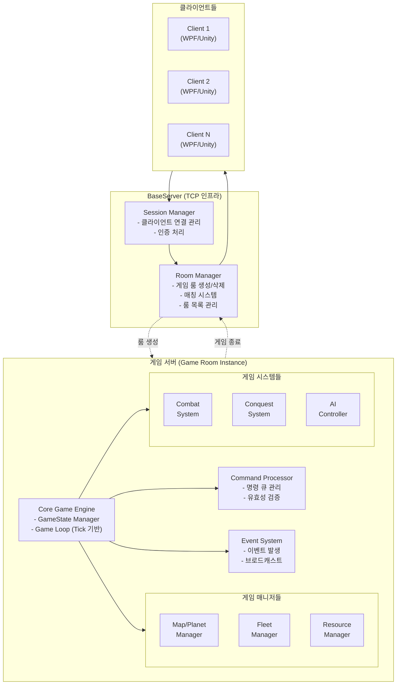
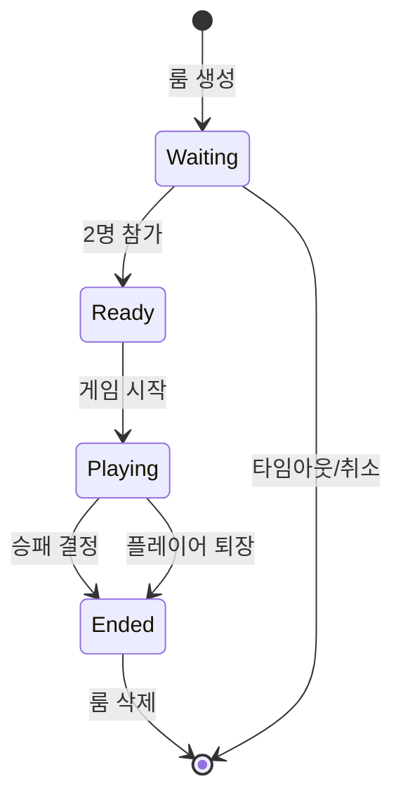
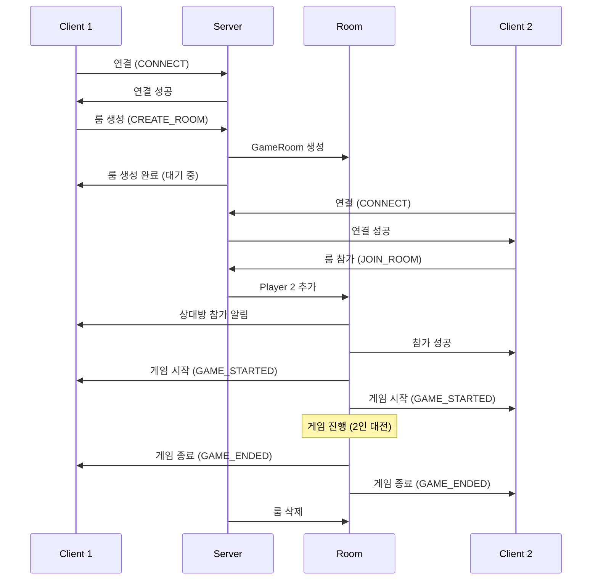
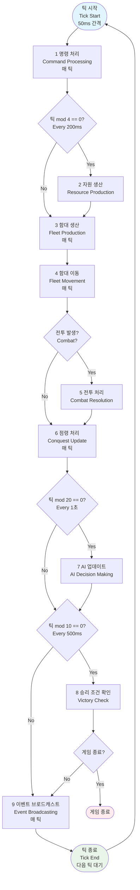
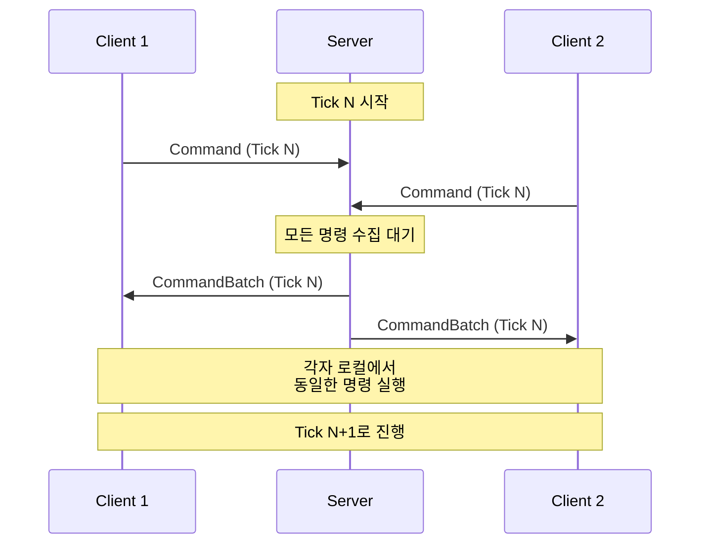

# Interplanetary 서버 시스템 기획서

## 📑 목차
1. [문서 개요](#1-문서-개요)
2. [시스템 아키텍처](#2-시스템-아키텍처)
3. [데이터 구조 설계](#3-데이터-구조-설계)
4. [핵심 시스템 명세](#4-핵심-시스템-명세)
5. [WPF 테스트 클라이언트](#5-wpf-테스트-클라이언트)
6. [네트워크 프로토콜](#6-네트워크-프로토콜)
7. [구현 로드맵](#7-구현-로드맵)
8. [기술적 고려사항](#8-기술적-고려사항)
9. [참고 자료](#9-참고-자료)
10. [용어 정의](#10-용어-정의)

---

## 1. 문서 개요

### 1.1 프로젝트 목표
- Unity 게임의 핵심 로직을 서버로 분리하여 멀티플레이어 지원
- CLI 환경에서 게임 로직 테스트 및 검증
- 확장 가능하고 유지보수 용이한 구조 설계

### 1.2 개발 단계

| 단계 | 목표 | 산출물 |
|------|------|--------|
| **Phase 1** | CLI 단일 게임 로직 구현 | 로컬 게임 서버 |
| **Phase 2** | 네트워크 레이어 추가 | 로컬 멀티 서버 |
| **Phase 3** | Unity 클라이언트 연동 | 통합 프로토타입 |
| **Phase 4** | 멀티플레이어 확장 | 정식 서비스 |

### 1.3 기술 스택
- **언어**: C# (.NET 8.0)
- **서버**: TCP 소켓 기반 게임 서버
- **통신 프로토콜**: TCP
- **직렬화**: 커스텀 바이너리 프로토콜 + JSON (CommonLib.Protocol)
- **동기화 방식**: 락스텝(Lockstep)
- **테스트 클라이언트**: WPF (MVP 패턴)
- **공유 라이브러리**: **CommonLib** - 서버와 모든 클라이언트(WPF, Unity 등)에서 공통으로 사용하는 핵심 라이브러리입니다. 프로토콜, 데이터 모델 등 공유가 필요한 모든 코드를 포함합니다.
- **최종 클라이언트**: Unity (Phase 3)

---

## 2. 시스템 아키텍처

### 2.1 전체 구조도



### 2.2 Room Management 시스템

#### 2.2.1 개요
- 여러 사용자가 동시에 접속하여 각자 게임 룸을 생성/참가
- 각 게임 룸은 독립적인 2인 대전 RTS 게임 인스턴스
- BaseServer의 기존 RoomManager 인프라 확장 활용

#### 2.2.2 Room 생명주기



#### 2.2.3 Room 구조

**GameRoom 클래스**
- RoomId: string (고유 식별자)
- MapId: int (사용할 맵)
- Players: List\<PlayerSession\> (최대 2명)
- GameState: GameState (게임 상태 인스턴스)
- Status: RoomStatus (Waiting/Ready/Playing/Ended)
- CreatedAt: DateTime (생성 시간)

**동시 처리**
- 서버는 여러 GameRoom을 동시에 관리
- 각 GameRoom은 독립적인 게임 루프 실행
- 룸 간 간섭 없음 (완전 격리)

#### 2.2.4 사용자 흐름



### 2.3 설계 원칙

#### 2.3.1 권위 있는 서버 (Authoritative Server)
- 모든 게임 상태는 서버가 관리하고 결정
- 클라이언트는 입력만 전송하고 결과만 수신
- 치트 방지 및 공정한 게임 진행 보장

#### 2.3.2 결정론적 시뮬레이션 (Deterministic Simulation)
- 동일한 초기 상태 + 동일한 입력 = 동일한 결과
- 리플레이 기능 구현 가능
- 디버깅 용이
- **락스텝(Lockstep) 동기화 사용**: 모든 클라이언트가 동일한 틱에서 동일한 명령 실행

#### 2.3.3 명령 패턴 (Command Pattern)
- 모든 플레이어의 행동을 `Command` 객체로 캡슐화하여 요청과 실행을 분리합니다.
- `Command` 객체는 명령 큐를 통해 순차적으로 처리되며, 이는 락스텝 동기화와 리플레이 기능 구현의 핵심 기반이 됩니다.
- (상세한 클래스 구조 및 프로토콜은 6.2.2 항목 참조)

#### 2.3.4 이벤트 기반 (Event-Driven)
- 상태 변화는 Event로 브로드캐스트
- 느슨한 결합(Loose Coupling)
- 클라이언트 동기화 용이

#### 2.3.5 틱 기반 업데이트 (Tick-Based Update)
- 고정된 시간 간격으로 게임 상태 업데이트 (예: 50ms = 20 TPS)
- 네트워크 지연에 강건한 구조
- 예측 가능한 동작

---

## 3. 데이터 구조 설계

### 3.1 핵심 엔티티 정의

#### 3.1.1 Planet (행성)

**DB 테이블: `planet_info`, `map_planets`, `planet_routes`**

| 속성 | 타입 | 설명 | DB 매핑 |
|------|------|------|---------|
| Id | int | 행성 ID | planet_info.id |
| Name | string | 행성 이름 | planet_info.name |
| Position | Vector2 | 맵 좌표 (x, y) | map_planets.position_x, position_y |
| Mineral | int | 광물 생산량/초 | planet_info.mineral |
| Gas | int | 가스 생산량/초 | planet_info.gas |
| Supply | int | 보급품 증가량 | planet_info.supply |
| AdjacentPlanetIds | List\<int\> | 인접 행성 ID 목록 | planet_routes |

**런타임 데이터 (DB 미저장, 메모리만)**
- OwnerId: int? (소유 플레이어 ID, null = 중립)
- ConquestProgress: float (점령도 0~100)
- GarrisonFleetId: int? (주둔 함대 ID)

**모성(Homeworld) 판정**
- `maps` 테이블의 `player1_homeworld_id`, `player2_homeworld_id`로 판정
- 맵별로 다른 행성을 모성으로 지정 가능

**모성의 특수 기능**
- **함대 생산**: 모든 함대는 오직 모성에서만 생산 가능
- **승패 조건**: 상대 모성을 점령하면 승리
- **초기 자원**: 게임 시작 시 안정적인 자원 제공

#### 3.1.2 Fleet (함대)

함대 엔티티는 `fleet_info` 테이블에 정의된 함대 종류별 기본 능력치와, 게임 런타임에 동적으로 관리되는 인스턴스 데이터를 조합하여 구성됩니다.

**DB 테이블: `fleet_info` (함대 종류별 기본 능력치)**
- `fleet_info` 테이블은 각 함대 종류(Scout, Fighter 등)의 `max_health`, `attack_power`, `move_speed`와 같은 고정된 능력치를 제공합니다.
- `production_data` 테이블은 각 함대 종류의 생산 비용 및 시간을 제공합니다.

**런타임 데이터 (DB 미저장, 게임 메모리에서만 관리)**

| 속성 | 타입 | 설명 |
|------|------|------|
| Id | int | 함대 인스턴스 ID (게임 내 자동 증가) |
| FleetTypeId | int | `fleet_info` 테이블의 `fleet_type_id` 참조 |
| OwnerId | int | 소유 플레이어 ID (1 또는 2) |
| CurrentHealth | int | 현재 체력 |
| Location | FleetLocation | 위치 정보 |
| State | FleetState | 상태 (Idle/Garrison/Moving/InCombat/Constructing) |

**FleetLocation 구조**
- Type: LocationType (OnPlanet / InTransit)
- PlanetId: int (행성에 있을 때)
- Route: RouteInfo (이동 중일 때)
  - FromPlanetId: int
  - ToPlanetId: int
  - Progress: float (0~1)
  - StartTime: float

#### 3.1.3 Player (플레이어)

**런타임 데이터 (DB 미저장, 게임 메모리에서만 관리)**

| 속성 | 타입 | 설명 |
|------|------|------|
| Id | int | 플레이어 ID (1 또는 2) |
| Name | string | 플레이어 이름 |
| Type | PlayerType | Human / AI |
| Resources | ResourcePool | 보유 자원 |
| OwnedPlanetIds | List\<int\> | 소유 행성 ID 목록 |
| HomeworldId | int | 모성 ID (맵에서 가져옴) |
| FleetIds | List\<int\> | 소유 함대 ID 목록 |
| ProductionQueue | Queue\<ProductionOrder\> | 생산 대기열 |
| IsDefeated | bool | 패배 여부 |

**ResourcePool 구조**
- Minerals: float (현재 광물)
- Gas: float (현재 가스)
- CurrentSupply: int (현재 보급품 사용량)
- MaxSupply: int (최대 보급품)
- MineralRate: float (광물 생산량/초)
- GasRate: float (가스 생산량/초)

#### 3.1.4 GameState (게임 상태)

**런타임 데이터 (DB 미저장, 게임 메모리에서만 관리)**

| 속성 | 타입 | 설명 |
|------|------|------|
| GameId | int | 게임 세션 ID |
| Phase | GamePhase | 게임 단계 (Lobby/Loading/Playing/Ended) |
| GameTime | float | 경과 시간 (초) |
| TickCount | long | 틱 카운터 |
| MapId | int | 맵 ID (maps.id) |
| Players | Dictionary\<int, Player\> | 플레이어 목록 (Key: 1, 2) |
| Planets | Dictionary\<int, Planet\> | 행성 목록 (Key: planet_id) |
| Fleets | Dictionary\<int, Fleet\> | 함대 목록 (Key: fleet_id) |
| WinnerId | int? | 승자 ID (1 또는 2) |

**맵 데이터 로드**
- 게임 시작 시 `maps`, `map_planets`, `planet_routes` 테이블에서 로드
- `player1_homeworld_id`, `player2_homeworld_id`를 통해 각 플레이어의 모성 설정

### 3.2 데이터베이스 구조

게임에 필요한 맵 데이터는 MySQL DB에 저장하며, 게임 상태는 메모리에서만 관리합니다.

#### 3.2.1 DB 테이블 구조

**참고 문서**: [#DB DDL 모음.sql](../#DB%20DDL%20모음.sql)

**현재 사용 중인 테이블**:
- `maps` - 맵 정보 (player1_homeworld_id, player2_homeworld_id 포함)
- `planet_info` - 행성 정보 (name, mineral, gas, supply)
- `map_planets` - 맵별 행성 배치 (position_x, position_y)
- `planet_routes` - 행성 간 연결 정보
- `fleet_info` - 함대 기본 스탯 정보
- `production_data` - 생산 정보
#### 3.2.2 DB 테이블화 예정 항목

다음 요소들은 현재 메모리/하드코딩으로 관리되지만, Phase 4 이전에 DB 테이블로 마이그레이션 예정입니다.

**1. 사용자 계정 관리 (`users`)**
- 필요 이유: 룸 기반 멀티플레이어를 위한 사용자 식별
- 예정 컬럼:
  - user_id (PK, AUTO_INCREMENT)
  - username (UNIQUE, 로그인 ID)
  - password_hash
  - display_name (게임 내 표시 이름)
  - created_at
  - last_login_at

**2. 게임 전적 기록 (`game_records`)**
- 필요 이유: Phase 4 랭킹/리더보드 기능, 통계 분석
- 예정 컬럼:
  - game_id (PK, AUTO_INCREMENT)
  - room_id (VARCHAR)
  - map_id (FK → maps)
  - player1_id (FK → users)
  - player2_id (FK → users)
  - winner_id (FK → users, NULL 가능)
  - game_duration (INT, 초 단위)
  - started_at (DATETIME)
  - ended_at (DATETIME)
  - replay_data (LONGTEXT, JSON - 리플레이 시스템용)

**3. 게임 통계 (`player_statistics`)**
- 필요 이유: 플레이어별 상세 전적 기록 및 분석
- 예정 컬럼:
  - stat_id (PK, AUTO_INCREMENT)
  - game_id (FK → game_records)
  - player_id (FK → users)
  - fleets_produced (INT, 생산한 함대 수)
  - planets_captured (INT, 점령한 행성 수)
  - combats_won (INT, 승리한 전투 수)
  - total_damage_dealt (INT, 누적 데미지)
  - final_resource_count (JSON, 게임 종료 시 자원)

**4. 플레이어 랭킹 (`player_rankings`)**
- 필요 이유: 경쟁 요소 제공, 리더보드 기능
- 예정 컬럼:
  - player_id (PK, FK → users)
  - total_games (INT, 총 게임 수)
  - wins (INT, 승리 수)
  - losses (INT, 패배 수)
  - win_rate (DECIMAL, 승률 %)
  - elo_rating (INT, ELO 점수)
  - current_rank (INT, 현재 순위)
  - updated_at (DATETIME)

**5. 게임 설정 (`game_config`)**
- 필요 이유: 서버 재시작 없이 게임 밸런스 조정
- 예정 컬럼:
  - config_key (PK, VARCHAR) - 예: "tick_rate", "starting_minerals", "starting_gas"
  - config_value (TEXT, JSON)
  - description (VARCHAR)
  - updated_at (DATETIME)

**6. AI 난이도 설정 (`ai_difficulty_levels`)**
- 필요 이유: 유연한 난이도 밸런싱
- 예정 컬럼:
  - difficulty_id (PK, AUTO_INCREMENT)
  - difficulty_name (VARCHAR, Easy/Normal/Hard)
  - production_interval (FLOAT, 초)
  - command_interval (FLOAT, 초)
  - resource_bonus_percent (INT, %)

**7. 리플레이 메타데이터 (`replays`)**
- 필요 이유: 리플레이 파일 관리 및 검색 (Phase 2 Week 9)
- 예정 컬럼:
  - replay_id (PK, AUTO_INCREMENT)
  - game_id (FK → game_records)
  - file_path (VARCHAR, 리플레이 파일 저장 경로)
  - file_size (BIGINT, 바이트)
  - duration (INT, 초)
  - view_count (INT, 조회수)
  - created_at (DATETIME)

#### 3.2.3 게임 시작 시 맵 로드 절차

1. `maps` 테이블에서 선택한 맵 정보 로드
2. `map_planets`에서 해당 맵의 행성 배치 로드
3. `planet_info`에서 각 행성의 자원 정보 로드
4. `planet_routes`에서 행성 간 연결 정보 로드
5. `player1_homeworld_id`, `player2_homeworld_id`로 각 플레이어의 모성 설정

### 3.3 게임 설정 (Config)

#### 3.3.1 GameConfig (전역 설정)

| 설정 항목 | 값 | 설명 |
|----------|-----|------|
| TickRate | 20 TPS | 초당 틱 횟수 (50ms) |
| ResourceTickRate | 1.0초 | 자원 생산 주기 |
| ConquestRatePerSecond | 10% | 점령 속도 (%/초) |
| CombatTickRate | 1.0초 | 전투 판정 주기 |

**참고**: 시작 자원, AI 행동 주기 등 세부 밸런스 데이터는 `game_config`, `ai_difficulty_levels` DB 테이블에서 관리하여 유연성을 확보합니다.

---

## 4. 핵심 시스템 명세

### 4.1 Game Loop System

#### 4.1.1 개요
- 고정된 시간 간격(50ms)으로 게임 상태 업데이트
- 모든 시스템을 순차적으로 실행

#### 4.1.2 업데이트 순서



#### 4.1.3 틱 관리
- **고정 틱 레이트**: 20 TPS (50ms/틱)
- **deltaTime**: 항상 0.05초로 고정
- **틱 카운터**: 게임 시작부터 누적

### 4.2 Resource Management System

#### 4.2.1 자원 생산
- **주기**: 1초마다
- **계산식**: 
  - `현재 자원 += 생산률 × deltaTime`
  - 생산률 = 소유한 모든 행성의 자원 보너스 합계

#### 4.2.2 자원 소비
- **함대 생산 시**: 즉시 차감
- **자원 부족 시**: 명령 거부
- **보급품**: 함대 생산 시 증가, 파괴 시 감소

#### 4.2.3 자원 재계산 트리거
- 행성 점령/상실
- 게임 시작 시

#### 4.2.4 자원 수급 상세

**1. 자원 획득 주기**
- 자원(광물, 가스)은 `GameConfig`에 정의된 `ResourceTickRate`(1.0초)에 따라 1초에 한 번씩 생산됩니다.
- 게임 루프는 매 틱(50ms)마다 돌지만, 자원 생산은 1초가 경과하는 시점에만 이루어집니다.
- `생산량 = 초당_생산률 × 1.0`의 공식이 적용됩니다.

**2. 최대 보급품 (Max Supply) 확장**
- 플레이어의 최대 보급품(`MaxSupply`)은 기본값(예: 10)에, 소유한 모든 행성의 `Supply` 값을 합산하여 결정됩니다.
- 예를 들어, 기본 보급품이 10이고 `Supply`가 +5인 행성을 점령하면, `MaxSupply`는 15가 됩니다. 행성을 잃으면 다시 감소합니다.
- 이를 통해 플레이어는 함대 규모를 확장하기 위해 반드시 행성 점령을 통한 영역 확장을 해야 합니다.

**3. 자원별 획득 전략**
- **광물 (Minerals):** 게임 시작 시 모성(Homeworld)에서 안정적으로 수급됩니다. 확장을 통해 더 많은 광물 행성을 확보하여 생산량을 늘릴 수 있습니다.
- **가스 (Gas):** 모성에서는 생산되지 않는 고급 자원입니다. 고급 함대(Cruiser, Battleship 등) 생산에 필수적이므로, 가스를 제공하는 중립 행성을 빠르게 탐색하고 점령하는 것이 중반기 전략의 핵심이 됩니다.
- **보급품 (Supply):** 현재 사용량(`CurrentSupply`)은 함대 생산 시 소모되며, 파괴 시 회복됩니다. 최대 보급품(`MaxSupply`)을 늘리기 위해서는 지속적인 행성 점령이 필수적입니다.

### 4.3 Fleet Production System

**중요**: 모든 함대는 **오직 모성에서만** 생산 가능

#### 4.3.1 생산 요청 처리

**검증 단계**
1. 자원 충분 여부 확인
2. 보급품 여유 확인
3. **모성에 함대 주둔 여부 확인** (모성에 이미 함대가 있으면 생산 불가)
4. 이미 생산 중인지 확인

**생산 시작**
1. 자원 즉시 차감
2. ProductionQueue에 추가
3. 완료 시간 계산 (현재시간 + 생산시간)

#### 4.3.2 생산 완료 처리

**완료 조건**
- `현재시간 >= 완료시간`

**완료 시**
1. Queue에서 제거
2. **모성에** 함대 생성 (다른 행성에서는 생성 불가)
3. 함대 ID를 플레이어에게 추가
4. 모성의 GarrisonFleetId 설정
5. 이벤트 발생

#### 4.3.3 생산 취소
- CLI 버전: 지원 안 함
- 멀티 버전: 자원 일부 환불 (50%)

### 4.4 Fleet Movement System

#### 4.4.1 이동 명령 검증

**실패 조건**
1. 이미 이동 중인 함대
2. **직행 경로가 존재하지 않음** (`planet_routes`에 출발-도착 경로 없음)
3. **목적지에 아군 함대가 이미 주둔 중** (같은 플레이어 소유 함대 있음)
4. 타인 소유 함대

**성공 조건**
- 출발지와 목적지 사이에 직행 경로 존재 (`planet_routes` 확인)
- 목적지에 아군 함대 없음 (적군 함대는 OK - 전투 발생)
- 목적지가 비어있음 (OK - 주둔 시작)

**성공 시**
1. 상태를 Moving으로 변경
2. Route 정보 설정
3. 현재 행성에서 함대 제거

#### 4.4.2 이동 진행

**진행도 계산**
```
거리 = Distance(출발행성, 도착행성)
이동시간 = 거리 / 함대속도
진행도 = 경과시간 / 이동시간
```

**매 틱마다**
- 진행도 업데이트
- 충돌 감지 (경로상 다른 함대)
- 도착 확인 (진행도 >= 1.0)

#### 4.4.3 도착 처리

**경우의 수**
1. **행성에 적 함대 있음** → 전투 시작
2. **행성에 아군 함대 있음** → 이동 불가 (이미 검증 단계에서 차단됨)
3. **행성이 비어있음** → 주둔 시작 (점령 진행)

#### 4.4.4 이동 중 충돌 (경로 상 교전)

**감지 조건**
- 같은 경로를 사용 중 (같은 두 행성 연결)
- 반대 방향 이동
- 진행도가 비슷함 (±10%)

**충돌 처리**
- **아군 함대**: 발생하지 않음 (검증 단계에서 차단)
- **적군 함대**: 경로 중간 지점에서 전투 시작

### 4.5 Combat System

#### 4.5.1 전투 시작 조건

**전투는 두 가지 장소에서 발생**:

1. **행성에서의 전투**
   - 함대가 행성에 도착했을 때 적 함대가 주둔 중
   - 예: Player 1 함대가 Planet A에 도착 → Planet A에 Player 2 함대 존재 → 전투

2. **경로에서의 전투**
   - 같은 경로에서 양측 함대가 반대 방향으로 이동 중
   - 진행도가 비슷할 때 (±10%) 중간 지점에서 충돌
   - 예: Fleet A (Planet 1 → 2) vs Fleet B (Planet 2 → 1)

#### 4.5.2 전투 진행

**전투 주기**: 1초마다

**데미지 계산**
```
함대A.현재체력 -= 함대B.공격력
함대B.현재체력 -= 함대A.공격력
```

**전투 종료 조건**
1. **한쪽만 파괴**: 생존자 승리
2. **동시 파괴**: 상호 파괴
3. **도주**: 미지원 (CLI 버전)

#### 4.5.3 전투 결과 처리

**함대 파괴**
1. Fleets에서 제거
2. Player.FleetIds에서 제거
3. 보급품 반환
4. 행성 GarrisonFleetId 제거 (행성 전투인 경우)
5. 이벤트 발생

**승리 함대 처리**
1. **행성에서의 전투**
   - 승리 함대가 해당 행성에 주둔
   - 점령 진행 시작

2. **경로에서의 전투**
   - 승리 함대는 원래 목적지로 계속 이동
   - 이동 완료 후 도착 행성 처리 (주둔 또는 추가 전투)

### 4.6 Conquest System

#### 4.6.1 점령 진행

**조건**
- 행성에 함대 주둔 중
- 모성이 아니거나 이미 점령된 모성

**점령도 변화**
```
변화량 = ConquestRatePerSecond × deltaTime (10%/초)
```

**경우의 수**
1. **중립 행성**: 점령도 증가 → 100% 도달 시 점령
2. **적 행성**: 점령도 감소 → 0% 도달 시 중립화 → 다시 증가 시작
3. **아군 행성**: 변화 없음

#### 4.6.2 점령 완료

**처리 절차**
1. 소유권 변경
2. 플레이어 OwnedPlanetIds 업데이트
3. 자원 생산률 재계산
4. 이벤트 발생

#### 4.6.3 모성 점령

**특수 처리**
- 원래 소유자 패배 처리
- IsDefeated = true
- 플레이어 패배 이벤트 발생

### 4.7 AI System

#### 4.7.1 AI 동작 방식 및 난이도
- AI의 모든 행동 파라미터(생산 주기, 명령 주기, 자원 보너스 등)는 게임 시작 시 `ai_difficulty_levels` DB 테이블에서 선택된 난이도에 맞는 값을 읽어와 적용합니다. 이를 통해 유연한 난이도 조절이 가능합니다.

#### 4.7.2 함대 생산 로직

**판단 순서**
1. 이미 생산 중? → 중단
2. **모성에 함대 있음?** → 중단 (모성이 비어야 생산 가능)
3. 생산 가능한 함대 목록 조회 (강력한 순)
4. 자원 충족하는 가장 강력한 함대 생산

**우선순위**
1. Battleship
2. Cruiser
3. Fighter
4. Scout

**참고**: 함대는 오직 모성에서만 생산되므로, 모성에 함대가 주둔 중이면 새로운 함대를 생산할 수 없음

#### 4.7.3 함대 명령 로직

**각 함대마다**
1. 명령 가능 상태 확인 (Garrison 상태)
2. 인접 행성 분석
3. 목표 행성 선택
4. 이동 명령 실행

**목표 선택 우선순위**
1. 적 소유 행성 (공격)
2. 중립 행성 (확장)
3. 함대 없는 아군 행성 (재배치)
4. 정해진 순찰 경로

### 4.8 Victory System

#### 4.8.1 승리 조건
- 상대 플레이어의 모성 점령

#### 4.8.2 패배 조건
- 자신의 모성이 점령됨
- IsDefeated = true

#### 4.8.3 게임 종료 처리
1. GamePhase를 Ended로 변경
2. WinnerId 설정
3. 게임 종료 이벤트 발생
4. 통계 기록 (게임 시간, 생산한 함대 수 등)

---

## 5. WPF 테스트 클라이언트

WPF 테스트 클라이언트에 대한 상세 명세 및 사용 예시는 별도 문서로 분리되었습니다.

**참고 문서**: [Interplanetary - WPF 테스트 클라이언트 명세](./interplanetary_test_client_spec.md)

---

## 6. 네트워크 프로토콜

### 6.1 통신 구조

#### 6.1.1 프로토콜 선택

**TCP 기반 통신**
- BaseServer 프로젝트의 기존 TCP 인프라 활용
- CommonLib.Protocol 클래스 사용 (바이너리 + JSON)
- 낮은 지연시간 및 안정적인 연결
- 모바일/Unity 클라이언트 호환

**프로토콜 구조 (CommonLib.Protocol 참조)**
- **헤더**: `[Length(4)][Type(4)][Timestamp(8)][DataCount(2)]`
- **데이터**: Key-Value 형식의 바이너리 직렬화
- **직렬화**: 기본 타입은 바이너리, 복합 객체는 JSON

#### 6.1.2 메시지 전송 방식

**CommonLib.Protocol 사용**
- Protocol 객체 생성 → 데이터 추가 → 바이너리로 직렬화 → TCP 전송
- 수신: TCP 스트림 → 바이너리 역직렬화 → Protocol 객체 복원

**예시 코드 (게임 명령 전송)**
```csharp
// 송신 (클라이언트 → 서버)
// 1. 구체적인 Command 객체 생성
var command = new ProduceFleetCommand
{
    PlayerId = 1,
    TickNumber = 12345, // 실제로는 동기화된 미래의 틱 번호
    FleetToProduce = FleetType.Fighter
};

// 2. SUBMIT_COMMAND 프로토콜에 담아 전송
Protocol protocol = new Protocol(3010); // SUBMIT_COMMAND
protocol.AddData("commandType", (int)command.Type); // 타입 식별자
protocol.AddData("commandData", JsonSerializer.Serialize(command)); // 직렬화된 데이터
await SendProtocolAsync(protocol);


// 수신 및 처리 (서버)
// (자세한 내용은 6.2.2 항목 참조)
Protocol receivedProtocol = await ReceiveProtocolAsync();
if (receivedProtocol.Type == 3010) // SUBMIT_COMMAND
{
    // CommandFactory 등을 통해 역직렬화하여 커맨드 큐에 추가
}
```

### 6.2 프로토콜 타입 정의

게임 서버용 프로토콜 타입은 BaseServer의 채팅 프로토콜(1000~2999번)과 구분하기 위해 **3000번대(클라이언트→서버), 4000번대(서버→클라이언트)**를 사용합니다.

#### 6.2.1 클라이언트 → 서버 (Session & Room Management)

**3001 - CONNECT (서버 연결)**
- 방향: 클라이언트 → 서버
- 파라미터:
  - playerName : String
  - version : String

**3100 - CREATE_ROOM (룸 생성)**
- 방향: 클라이언트 → 서버
- 파라미터:
  - mapId : int
  - roomName : String
  - isPrivate : bool

**3101 - JOIN_ROOM (룸 참가)**
- 방향: 클라이언트 → 서버
- 파라미터:
  - roomId : String

**3102 - LEAVE_ROOM (룸 퇴장)**
- 방향: 클라이언트 → 서버
- 파라미터:
  - (파라미터 없음)

**3103 - GET_ROOM_LIST (룸 목록 조회)**
- 방향: 클라이언트 → 서버
- 파라미터:
  - (파라미터 없음)

**3104 - READY (준비 완료)**
- 방향: 클라이언트 → 서버
- 파라미터:
  - isReady : bool

#### 6.2.2 클라이언트 → 서버 (Game Commands)

명령 패턴(2.3.3 참조) 도입에 따라, 개별 행동마다 프로토콜을 정의하는 대신 모든 게임 내 행동은 단일 프로토콜 `SUBMIT_COMMAND`를 통해 전송됩니다. 이를 통해 새로운 게임 기능을 추가할 때 프로토콜 수정 없이 `Command` 클래스만 추가하면 되므로 확장성이 극대화됩니다.

**3010 - SUBMIT_COMMAND (게임 명령 제출)**
- 방향: 클라이언트 → 서버
- 설명: 플레이어의 모든 게임 내 행동(함대 생산, 이동 등)을 서버에 제출합니다.
- 파라미터:
  - **commandType**: `int` (어떤 종류의 커맨드인지 알려주는 '타입 식별자'. 예: `CommandType.PRODUCE_FLEET`)
  - **commandData**: `String` (구체적인 `Command` 객체를 직렬화한 데이터. 예: `ProduceFleetCommand`의 JSON 데이터)

- **처리 방식 (역직렬화)**:
  1. 서버는 `SUBMIT_COMMAND` 프로토콜을 수신하면, 먼저 `commandType` 파라미터를 읽습니다.
  2. `commandType`에 따라 `commandData`를 어떤 `Command` 클래스(예: `ProduceFleetCommand`)로 역직렬화해야 할지 결정합니다.
  3. 역직렬화된 `Command` 객체를 게임 로직의 커맨드 큐에 추가합니다.

**`Command` 클래스 설계 예시 (C#):**
```csharp
// 모든 명령의 기반이 되는 추상 클래스
[Serializable]
public abstract class Command
{
    public int PlayerId { get; set; }    // 누가
    public long TickNumber { get; set; } // 언제
    public abstract CommandType Type { get; } // 무엇을
}

// "함대 생산" 명령
[Serializable]
public class ProduceFleetCommand : Command
{
    public override CommandType Type => CommandType.PRODUCE_FLEET;
    public FleetType FleetToProduce { get; set; } // 파라미터
}

// "함대 이동" 명령
[Serializable]
public class MoveFleetCommand : Command
{
    public override CommandType Type => CommandType.MOVE_FLEET;
    public int FleetId { get; set; } // 파라미터 1
    public int TargetPlanetId { get; set; } // 파라미터 2
}
```

**3005 - HEARTBEAT (하트비트)**
- 방향: 클라이언트 → 서버
- 파라미터:
  - timestamp : long

#### 6.2.3 서버 → 클라이언트 (Session & Room Management)

**4001 - CONNECTED (연결 성공)**
- 방향: 서버 → 클라이언트
- 파라미터:
  - sessionId : String
  - playerName : String
  - serverTime : long

**4200 - ROOM_CREATED (룸 생성 완료)**
- 방향: 서버 → 클라이언트
- 파라미터:
  - roomId : String
  - roomName : String
  - mapId : int

**4201 - ROOM_JOINED (룸 참가 완료)**
- 방향: 서버 → 클라이언트
- 파라미터:
  - roomId : String
  - playerSlot : int
  - roomInfo : String

**4202 - ROOM_LEFT (룸 퇴장 완료)**
- 방향: 서버 → 클라이언트
- 파라미터:
  - (파라미터 없음)

**4203 - PLAYER_JOINED_ROOM (다른 플레이어 입장)**
- 방향: 서버 → 클라이언트
- 파라미터:
  - playerName : String
  - playerSlot : int

**4204 - PLAYER_LEFT_ROOM (다른 플레이어 퇴장)**
- 방향: 서버 → 클라이언트
- 파라미터:
  - playerSlot : int
  - reason : String

**4205 - ROOM_LIST (룸 목록)**
- 방향: 서버 → 클라이언트
- 파라미터:
  - roomCount : int
  - rooms : String

**4206 - PLAYER_READY_STATE (플레이어 준비 상태)**
- 방향: 서버 → 클라이언트
- 파라미터:
  - playerSlot : int
  - isReady : bool

#### 6.2.4 서버 → 클라이언트 (Game Events)

**4002 - GAME_STARTED (게임 시작)**
- 방향: 서버 → 클라이언트
- 파라미터:
  - gameId : int
  - mapId : int
  - players : String (JSON)

**4003 - RESOURCES_UPDATED (자원 업데이트)**
- 방향: 서버 → 클라이언트
- 파라미터:
  - playerId : int
  - minerals : float
  - gas : float
  - currentSupply : int
  - maxSupply : int

**4004 - FLEET_SPAWNED (함대 생성 완료)**
- 방향: 서버 → 클라이언트
- 파라미터:
  - fleetId : int
  - fleetType : int
  - ownerId : int
  - planetId : int

**4005 - FLEET_MOVING (함대 이동 시작)**
- 방향: 서버 → 클라이언트
- 파라미터:
  - fleetId : int
  - fromPlanetId : int
  - toPlanetId : int
  - estimatedArrival : float

**4006 - FLEET_ARRIVED (함대 도착)**
- 방향: 서버 → 클라이언트
- 파라미터:
  - fleetId : int
  - planetId : int

**4007 - COMBAT_STARTED (전투 시작)**
- 방향: 서버 → 클라이언트
- 파라미터:
  - combatId : int
  - attackerFleetId : int
  - defenderFleetId : int
  - locationPlanetId : int

**4008 - COMBAT_TICK (전투 진행)**
- 방향: 서버 → 클라이언트
- 파라미터:
  - combatId : int
  - attackerHealth : int
  - defenderHealth : int

**4009 - COMBAT_ENDED (전투 종료)**
- 방향: 서버 → 클라이언트
- 파라미터:
  - combatId : int
  - winnerFleetId : int
  - loserFleetId : int

**4010 - PLANET_CAPTURED (행성 점령 완료)**
- 방향: 서버 → 클라이언트
- 파라미터:
  - planetId : int
  - newOwnerId : int
  - previousOwnerId : int

**4011 - PLANET_CONQUEST_PROGRESS (점령 진행도)**
- 방향: 서버 → 클라이언트
- 파라미터:
  - planetId : int
  - progress : float
  - attackerId : int

**4012 - GAME_ENDED (게임 종료)**
- 방향: 서버 → 클라이언트
- 파라미터:
  - winnerId : int
  - reason : String
  - gameDuration : float

**4013 - HEARTBEAT_ACK (하트비트 응답)**
- 방향: 서버 → 클라이언트
- 파라미터:
  - serverTime : long

**4999 - ERROR (에러 메시지)**
- 방향: 서버 → 클라이언트
- 파라미터:
  - errorCode : int
  - message : String

#### 6.2.5 상태 동기화 (Sync)

**4101 - FULL_STATE_SYNC (전체 상태 동기화)**
- 방향: 서버 → 클라이언트
- 파라미터:
  - gameTime : float
  - tickCount : long
  - gameState : String

**4102 - DELTA_UPDATE (증분 업데이트)**
- 방향: 서버 → 클라이언트
- 파라미터:
  - tickCount : long
  - changes : String

**4103 - TICK_COMMANDS (틱별 명령 배치)**
- 방향: 서버 → 클라이언트
- 파라미터:
  - tickNumber : long
  - commands : String

#### 6.2.6 사용 예시

**룸 생성 및 참가**
```csharp
// 클라이언트 1: 룸 생성
Protocol createRoomProtocol = new Protocol(3100); // CREATE_ROOM
createRoomProtocol.AddData("mapId", 1);
createRoomProtocol.AddData("roomName", "My Game Room");
createRoomProtocol.AddData("isPrivate", false);
await SendProtocolAsync(createRoomProtocol);

// 서버 → 클라이언트 1: 룸 생성 완료
Protocol roomCreatedProtocol = new Protocol(4200); // ROOM_CREATED
roomCreatedProtocol.AddData("roomId", "ROOM_abc123");
roomCreatedProtocol.AddData("roomName", "My Game Room");
roomCreatedProtocol.AddData("mapId", 1);
await SendProtocolAsync(roomCreatedProtocol);

// 클라이언트 2: 룸 참가
Protocol joinRoomProtocol = new Protocol(3101); // JOIN_ROOM
joinRoomProtocol.AddData("roomId", "ROOM_abc123");
await SendProtocolAsync(joinRoomProtocol);

// 서버 → 클라이언트 2: 참가 완료
Protocol roomJoinedProtocol = new Protocol(4201); // ROOM_JOINED
roomJoinedProtocol.AddData("roomId", "ROOM_abc123");
roomJoinedProtocol.AddData("playerSlot", 2);
roomJoinedProtocol.AddData("roomInfo", "{...}");
await SendProtocolAsync(roomJoinedProtocol);
```

**게임 명령 (함대 생산)**

**클라이언트 → 서버 (게임 명령 제출)**
```csharp
// 1. ProduceFleetCommand 객체 생성
var command = new ProduceFleetCommand
{
    PlayerId = 1,
    TickNumber = 500, // 동기화된 미래의 틱
    FleetToProduce = FleetType.Fighter
};

// 2. SUBMIT_COMMAND 프로토콜(3010)으로 전송
Protocol protocol = new Protocol(3010); // SUBMIT_COMMAND
protocol.AddData("commandType", (int)command.Type);
protocol.AddData("commandData", JsonSerializer.Serialize(command));
await SendProtocolAsync(protocol);
```

**서버 → 클라이언트 (함대 생성 완료)**
```csharp
Protocol protocol = new Protocol(4004); // FLEET_SPAWNED
protocol.AddData("fleetId", 789);
protocol.AddData("fleetType", (int)FleetType.Fighter);
protocol.AddData("ownerId", 1);
protocol.AddData("planetId", 1);
await BroadcastProtocolAsync(protocol);
```

### 6.3 네트워크 최적화

#### 6.3.1 대역폭 최적화
- **기본 타입 직접 전송**: int, float 등은 바이너리로 전송 (CommonLib.Protocol)
- **복잡한 객체만 JSON**: 배열, 구조체는 JSON 직렬화 후 string으로 전송
- **증분 업데이트**: 변경된 부분만 전송 (락스텝 방식에서는 명령만 전송)

#### 6.3.2 지연 보상
- **클라이언트 예측**: 입력 즉시 로컬 시뮬레이션
- **서버 조정**: 차이 발생 시 부드럽게 보정
- **보간**: 이동 중인 오브젝트 위치 보간

#### 6.3.3 동기화 전략: 락스텝 (Lockstep)

**락스텝 동기화 방식**
- 모든 클라이언트가 동일한 틱에서 동일한 명령을 실행
- 서버는 각 틱마다 모든 클라이언트의 명령을 수집하고 브로드캐스트
- 결정론적 시뮬레이션 보장 (동일 입력 → 동일 결과)

**동작 흐름**


**장점**
- 완벽한 동기화 보장
- 대역폭 효율적 (명령만 전송, 상태 전송 불필요)
- 리플레이 시스템 구현 용이
- 치트 방지에 유리

**단점 및 해결책**
- 지연 시간에 민감 → 입력 버퍼링 (2~3 틱 지연 허용)
- 한 클라이언트 지연 시 전체 대기 → 타임아웃 설정 (200ms)
- 재연결 처리 복잡 → 전체 상태 스냅샷 전송

---

## 7. 구현 로드맵 (6주 압축 계획)

11월 말까지 핵심 기능 완성을 목표로, 기존 10주 계획을 6주로 압축합니다. 각 스프린트는 2주로 구성되며, MVP(Minimum Viable Product)를 우선순위에 두고 기능을 선별 및 간소화합니다.

(팀 구성: 총 4인 - 서버 3인 효과, 클라이언트 2인 효과)

---

### Sprint 1 (1-2주차): 1v1 핵심 시스템 프로토타입
**목표:** 2명의 플레이어가 접속하여 핵심 기능(생산, 이동, 전투)을 실행할 수 있는 기본 프로토타입 구현 (AI 제외)
- **[서버팀 (3인)]**
  - [ ] `CommonLib`, 프로젝트 구조 등 기본 환경 설정
  - [ ] 2인 플레이를 가정하고 게임 루프, 자원, 생산, 이동 시스템 핵심 로직 구현
  - [ ] **(필수)** 행성 및 **경로상 전투**를 포함한 전투 시스템 구현
  - [ ] **(임시)** 별도 룸 없이 2명의 클라이언트가 접속 시 게임을 시작하는 임시 로직 구현
- **[클라이언트팀 (2인)]**
  - [ ] Unity 프로젝트 설정 및 서버 접속 기능 구현
  - [ ] 2인 플레이어의 유닛(함대) 및 상태 시각화
  - [ ] 핵심 명령(생산, 이동) UI 및 필수 정보 HUD 구현
- **[팀장 - WPF]**
  - [ ] 2인 플레이 환경에서 서버 핵심 기능들을 검증할 테스트 모듈 집중 개발

---

### Sprint 2 (3-4주차): 멀티플레이 기반 구축
**목표:** 2인 대전이 가능하도록 멀티플레이 전환
- **[서버팀 (3인)]**
  - [ ] 룸 관리(생성, 참가, 시작) 기능 구현
  - [ ] 싱글플레이 게임 로직을 락스텝 동기화 기반으로 전환
  - [ ] **(후순위)** 재연결 로직 제외
- **[클라이언트팀 (2인)]**
  - [ ] 로비 UI 구현 (룸 목록, 생성, 참가)
  - [ ] 클라이언트 로직을 락스텝 동기화에 맞춰 수정
- **[팀장 - WPF]**
  - [ ] 룸 관리 및 락스텝 동기화 기능 집중 테스트

---

### Sprint 3 (5-6주차): 안정화 및 MVP 완성
**목표:** 2인 대전 플레이 경험 안정화 및 버그 수정
- **[서버팀 (3인)]**
  - [ ] 멀티플레이 게임 루프 안정화 및 치명적 버그 수정
  - [ ] **(간소화)** 플레이어 연결 종료 시 패배 처리
  - [ ] **(선택 사항)** 리플레이를 위한 명령 로그 저장 기능
- **[클라이언트팀 (2인)]**
  - [ ] 2인 대전 플레이 경험 폴리싱 및 UI 버그 수정
  - [ ] **(선택 사항)** 저장된 명령 로그를 재생하는 기본 리플레이 뷰어
- **[팀장 - WPF]**
  - [ ] 부하 테스트를 통해 서버 안정성 검증 및 리포트

---

### 후순위 및 선택적 기능 (Post-MVP)

6주 MVP 개발 완료 후, 프로젝트의 완성도를 높이기 위해 아래 기능들을 순차적으로 개발할 것을 권장합니다.

#### 1. 핵심 게임플레이 심화
- **AI 컨트롤러**: 1인용 플레이 및 AI 봇 대전을 위한 AI 플레이어 개발.
- **고급 전투 로직**: 현재 필수 기능에서 제외된 세부적인 전투 규칙 추가.

#### 2. 멀티플레이어 경험 향상
- **재연결 시스템**: 플레이어의 연결이 일시적으로 끊겼을 때 게임에 다시 복귀할 수 있는 기능.
- **리플레이 시스템**: 게임 전체를 다시 볼 수 있는 기능 (명령 로그 저장 방식).

#### 3. 확장성 및 운영
- **Redis 도입**: 여러 서버 인스턴스 간의 상태 공유(세션, 룸 목록 등)를 통한 수평 확장 기반 마련.
- **DB 기반 밸런싱**: `fleet_types`, `game_config` 등 게임 주요 데이터를 DB로 관리하여 유연한 밸런스 패치 지원.
- **통계 및 랭킹 시스템**: 플레이어의 전적, ELO 점수 등을 기록하고 리더보드를 제공하는 기능.

#### 4. 기타
- **관전 모드**
- **팀전 (2v2 등)**
- **고급 테스트 도구**: 게임 상태 저장/로드, 테스트 자동화 스크립트 등.

---

## 8. 기술적 고려사항

### 8.1 성능 목표
- **틱 레이트**: 20 TPS 안정적 유지
- **동시 접속**: 최소 100 게임 (200 플레이어)
- **응답 시간**: 명령 → 결과 100ms 이내
- **메모리**: 게임당 50MB 이하

### 8.2 확장성
- **수평 확장**: 게임 세션별 분산 가능
- **상태 관리**: Redis 등 외부 저장소 활용 가능
- **로드 밸런싱**: 게임 서버 간 부하 분산

### 8.3 보안
- **인증**: JWT 기반 토큰 인증
- **권한**: 자신 소유 함대만 조작 가능
- **검증**: 모든 명령 서버에서 재검증
- **치트 방지**: 클라이언트 예측과 서버 상태 비교

### 8.4 디버깅 & 모니터링
- **상세 로깅**: 모든 명령과 이벤트 기록
- **리플레이**: 게임 재생 가능
- **메트릭**: 게임 시간, 명령 수, 오류율 등
- **프로파일링**: 성능 병목 지점 분석

---

## 9. 참고 자료

### 9.1 관련 문서
- 원본 게임 기획서 (Interplanetary 기말 과제)
- Unity C# 스타일 가이드
- ASP.NET Core 웹소켓 문서
- Mirror Networking 문서

### 9.2 유사 프로젝트 분석
- **StarCraft II**: 멀티플레이어 RTS 네트워킹
- **Age of Empires**: 결정론적 시뮬레이션
- **Neptune's Pride**: 웹 기반 실시간 전략
- **Galcon**: 단순화된 행성 정복 게임

### 9.3 기술 스택 문서
- .NET 8.0 Documentation
- TCP/IP Socket Programming
- JSON Serialization Best Practices
- Game Server Architecture Patterns
- CommonLib.Protocol 명세 (Guides/ProtocolSpecification.md)

---

## 10. 용어 정의

| 용어 | 정의 |
|------|------|
| **Tick** | 게임 상태 업데이트 한 주기 (50ms) |
| **TPS** | Ticks Per Second (초당 틱 수) |
| **Command** | 플레이어가 서버에 보내는 명령 |
| **Event** | 서버가 클라이언트에게 보내는 상태 변화 |
| **Garrison** | 행성에 주둔 중인 상태 |
| **Conquest** | 행성 점령 과정 |
| **Homeworld** | 모성 (시작 행성) |
| **Deterministic** | 결정론적 (같은 입력 = 같은 결과) |
| **Authoritative** | 권위 있는 (서버가 진실의 원천) |

---