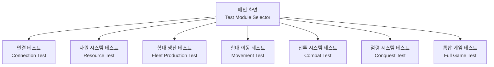
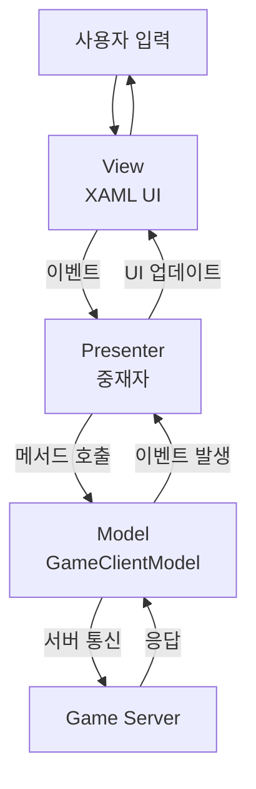

# Interplanetary - WPF 테스트 클라이언트 명세

이 문서는 Interplanetary 게임 서버의 기능 검증을 위한 WPF 테스트 클라이언트의 상세 명세 및 사용 예시를 다룹니다.

---

## 1. WPF 테스트 클라이언트

### 1.1 개요

**목적**
- 서버의 각 기능을 독립적으로 테스트
- 게임 로직 검증 및 디버깅
- 네트워크 프로토콜 테스트
- 시각적 피드백을 통한 상태 확인

**기술 스택**
- **.NET 8.0**
- **WPF (Windows Presentation Foundation)**
- **MVP 패턴 (Model-View-Presenter)** - ChatClientWPF와 동일
- **CommonLib** 공유 라이브러리
  - Protocol 클래스: 바이너리/JSON 직렬화
  - 게임 데이터 모델 (Planet, Fleet, Player, GameState)
- **TCP 소켓 통신** (비동기 I/O)

**참고 프로젝트**: [ChatClientWPF](./Guides/ChatClientWPF%20-%20MVP%20패턴%20채팅%20클라이언트.md)

### 1.2 테스트 모듈 구조

WPF 클라이언트는 여러 독립적인 테스트 모듈로 구성:



#### 1.2.1 메인 화면 (Test Module Selector)

**UI 구성**
- 테스트 모듈 목록 (ListBox)
- 서버 연결 상태 표시
- 로그 출력 영역

#### 1.2.2 연결 테스트 (Connection Test)

**테스트 항목**
- TCP/WebSocket 연결 수립
- 하트비트 송수신
- 재연결 처리
- 타임아웃 시나리오

**UI 요소**
- 서버 주소/포트 입력
- Connect/Disconnect 버튼
- 연결 상태 표시
- 송수신 패킷 로그

#### 1.2.3 자원 시스템 테스트 (Resource Test)

**테스트 항목**
- 초기 자원 설정
- 자원 생산률 계산
- 행성 추가 시 자원 증가
- 보급품 관리

**UI 요소**
- 현재 자원 표시 (Minerals, Gas, Supply)
- 생산률 표시 (+N/s)
- 행성 추가/제거 버튼
- 시간 경과 시뮬레이션

#### 1.2.4 함대 생산 테스트 (Fleet Production Test)

**테스트 항목**
- 각 함대 타입 생산 (Scout, Fighter, Cruiser, Battleship)
- 자원 소비 및 부족 처리
- 생산 큐 관리
- 생산 완료 처리

**UI 요소**
- 함대 타입 선택 (ComboBox)
- Produce 버튼
- 생산 큐 목록
- 진행 상황 표시 (ProgressBar)
- 생산된 함대 목록

#### 1.2.5 함대 이동 테스트 (Movement Test)

**테스트 항목**
- 인접 행성으로 이동
- 비인접 행성 이동 거부
- 이동 진행도 계산
- 도착 처리

**UI 요소**
- 맵 시각화 (Canvas)
- 행성 노드 표시
- 함대 위치 표시
- 이동 경로 애니메이션
- 함대 선택 및 목적지 클릭

#### 1.2.6 전투 시스템 테스트 (Combat Test)

**테스트 항목**
- 함대 간 전투 시작
- 데미지 계산
- 전투 종료 조건
- 승패 판정

**UI 요소**
- 전투 시나리오 설정
- 양측 함대 정보 (체력, 공격력)
- 전투 진행 애니메이션
- 전투 로그
- 결과 표시

#### 1.2.7 점령 시스템 테스트 (Conquest Test)

**테스트 항목**
- 중립 행성 점령
- 적 행성 점령
- 점령도 계산
- 소유권 변경

**UI 요소**
- 행성 상태 표시 (소유자, 점령도)
- 함대 주둔 시뮬레이션
- 점령도 진행 바
- 소유권 변경 이벤트 로그

#### 1.2.8 통합 게임 테스트 (Full Game Test)

**테스트 항목**
- AI 대전 시뮬레이션
- 전체 게임 플레이
- 승패 조건 확인
- 게임 종료 처리

**UI 요소**
- 실시간 맵 뷰
- 자원 HUD
- 함대 목록
- 명령 입력 패널
- 게임 이벤트 로그
- Pause/Resume 기능

### 1.3 WPF 아키텍처

#### 1.3.1 MVP 패턴 적용 (ChatClientWPF 기반)

**프로젝트 구조**
```
InterplanetaryTestClient/
├── Models/                        # Model 계층
│   └── GameClientModel.cs         # 네트워크 로직, 게임 로직
├── Views/                         # View 계층
│   ├── ITestView.cs               # View 인터페이스 (계약)
│   ├── MainWindow.xaml            # 메인 UI
│   ├── MainWindow.xaml.cs         # View 구현
│   └── Modules/                   # 테스트 모듈별 View
│       ├── ResourceTestView.xaml
│       ├── FleetTestView.xaml
│       └── ...
└── Presenters/                    # Presenter 계층
    ├── MainPresenter.cs           # 메인 Presenter
    └── ModulePresenters/          # 모듈별 Presenter
        ├── ResourceTestPresenter.cs
        ├── FleetTestPresenter.cs
        └── ...
```

**MVP 패턴 흐름**


**역할 분리 (ChatClientWPF와 동일)**

**📦 Model (GameClientModel)**
- 비즈니스 로직과 데이터 관리
- TCP/WebSocket 네트워크 연결
- Protocol 직렬화/역직렬화 (CommonLib 사용)
- 서버 명령 전송 (생산, 이동, 전투 등)
- 이벤트 발생 (자원 업데이트, 함대 생성, 전투 결과 등)
- View에 대해 무지

**🎨 View (ITestView, MainWindow)**
- UI 표시 및 사용자 입력 수신
- XAML로 정의된 UI
- 사용자 입력 이벤트 발생
- Presenter 요청에 따른 UI 업데이트
- Model을 직접 참조하지 않음

**🎯 Presenter**
- View와 Model 사이의 중재자
- View 이벤트 → Model 메서드 호출 변환
- Model 이벤트 → View UI 업데이트 변환
- UI 로직 처리 (상태 관리, 검증)

#### 1.3.2 Model 구현 (GameClientModel)

**GameClientModel.cs 구조**
```csharp
public class GameClientModel
{
    private TcpClient? _client;
    private NetworkStream? _stream;

    // Model이 발생시키는 이벤트 (ChatClientWPF 패턴)
    public event Action<bool, string>? OnConnectionChanged;
    public event Action<ResourceUpdate>? OnResourcesUpdated;
    public event Action<Fleet>? OnFleetSpawned;
    public event Action<FleetMoveEvent>? OnFleetMoving;
    public event Action<CombatResult>? OnCombatEnded;
    public event Action<PlanetCaptured>? OnPlanetCaptured;
    public event Action<string>? OnErrorOccurred;

    // 연결 관리 (TCP)
    public async Task<bool> ConnectAsync(string host, int port);
    public void Disconnect();

    // 게임 명령 전송 (통합된 Command 방식)
    public async Task SubmitCommandAsync(Command command);

    // 프로토콜 수신 루프 (TCP 비동기 I/O)
    private async Task ReceiveLoopAsync();
    private void HandleProtocol(Protocol protocol);
}
```

**이벤트 데이터 모델**
```csharp
// ChatClientWPF의 ChatMessage와 유사한 구조
public struct ResourceUpdate
{
    public float Minerals { get; set; }
    public float Gas { get; set; }
    public int CurrentSupply { get; set; }
    public int MaxSupply { get; set; }
}

public struct FleetMoveEvent
{
    public int FleetId { get; set; }
    public int FromPlanetId { get; set; }
    public int ToPlanetId { get; set; }
    public float Progress { get; set; }
}
```

#### 1.3.3 View 인터페이스 (ITestView)

**ITestView.cs 계약 정의**
```csharp
// ChatClientWPF의 IChatView와 동일한 패턴
public interface ITestView
{
    // View가 발생시키는 이벤트 (사용자 입력)
    event Action<string, int>? OnConnectRequested;
    event Action? OnDisconnectRequested;
    event Action<Command>? OnCommandRequested; // 통합된 Command 요청 이벤트

    // Presenter가 호출하는 메서드 (UI 업데이트)
    void ShowConnectionStatus(bool isConnected, string message);
    void UpdateResources(ResourceUpdate resources);
    void AddFleetToList(Fleet fleet);
    void UpdateFleetPosition(FleetMoveEvent moveEvent);
    void ShowCombatResult(CombatResult result);
    void ShowError(string message);
}
```

#### 1.3.4 Presenter 구현

**ResourceTestPresenter.cs 예시**
```csharp
public class ResourceTestPresenter
{
    private readonly IResourceTestView _view;
    private readonly GameClientModel _model;

    public ResourceTestPresenter(IResourceTestView view, GameClientModel model)
    {
        _view = view;
        _model = model;

        // View 이벤트 구독 (사용자 입력 처리)
        _view.OnSetResourcesRequested += HandleSetResourcesRequested;
        _view.OnAddPlanetRequested += HandleAddPlanetRequested;

        // Model 이벤트 구독 (서버 응답 처리)
        _model.OnResourcesUpdated += HandleResourcesUpdated;
    }

    // View → Model
    private void HandleSetResourcesRequested(float minerals, float gas)
    {
        // 유효성 검증
        if (minerals < 0 || gas < 0)
        {
            _view.ShowError("Resources cannot be negative");
            return;
        }

        // Model 호출
        _model.SetResourcesAsync(minerals, gas);
    }

    // Model → View
    private void HandleResourcesUpdated(ResourceUpdate resources)
    {
        // UI 업데이트
        _view.UpdateResources(resources);
        _view.ShowMessage($"Resources updated: M={resources.Minerals}, G={resources.Gas}");
    }
}
```

**MVP 패턴의 장점 (ChatClientWPF 가이드 참조)**
1. **관심사의 분리**: Model, View, Presenter 각각 명확한 책임
2. **테스트 용이성**: View를 Mock으로 대체하여 Presenter 단위 테스트 가능
3. **유지보수성**: 각 계층 독립적으로 수정 가능
4. **재사용성**: Model은 다른 View(CLI, Unity 등)에서 재사용 가능

#### 1.3.5 테스트 자동화

**단위 테스트 지원**
- 각 테스트 모듈은 독립 실행 가능
- 예상 결과와 실제 결과 비교
- 자동화된 테스트 시나리오 실행

**테스트 스크립트 예시**
```json
{
  "testName": "Fleet Production Test",
  "steps": [
    {"action": "SetResources", "minerals": 1000, "gas": 500},
    {"action": "ProduceFleet", "type": "Scout"},
    {"action": "WaitSeconds", "duration": 5},
    {"action": "AssertFleetCount", "expected": 1},
    {"action": "AssertResources", "minerals": 950, "gas": 500}
  ]
}
```

### 1.4 디버그 기능

#### 1.4.1 로그 레벨
- **ERROR**: 치명적 오류
- **WARN**: 경고 (명령 실패 등)
- **INFO**: 주요 이벤트 (함대 생산, 행성 점령)
- **DEBUG**: 상세 정보 (틱마다 상태)

#### 1.4.2 저장/불러오기

**저장 형식**: JSON
```json
{
  "gameId": "game_12345",
  "gameTime": 332.5,
  "tickCount": 6650,
  "players": [...],
  "planets": [...],
  "fleets": [...]
}
```

**WPF UI**
- Save/Load 버튼
- 파일 선택 다이얼로그
- 저장 슬롯 관리

#### 1.4.3 개발자 도구

**치트 기능**
- 무한 자원 활성화
- 즉시 함대 생성
- 함대 순간이동
- 승리/패배 강제 설정

**디버그 패널**
- 현재 틱 번호 표시
- 네트워크 지연 시뮬레이션
- 패킷 로깅
- 상태 덤프 (JSON 출력)

### 1.5 테스트 시나리오

#### 1.5.1 기본 기능 테스트
1. **자원 생산**: 1분간 대기 후 자원 증가 확인
2. **함대 생산**: 각 타입별 생산 및 생성 확인
3. **함대 이동**: 인접/비인접 행성 이동 테스트
4. **전투**: 적 함대와 조우 시 전투 결과
5. **점령**: 중립/적 행성 점령 과정

#### 1.5.2 엣지 케이스 테스트
1. **자원 부족**: 생산 시도 → 거부
2. **동시 도착**: 두 함대가 같은 행성 도착
3. **중간 충돌**: 반대 방향 이동 함대
4. **모성 방어**: AI가 모성 공격 시
5. **생산 중 모성 점령**: 생산 큐 처리

#### 1.5.3 성능 테스트
- 100개 행성, 200개 함대 동시 시뮬레이션
- 1시간 실시간 게임 안정성
- 저장/불러오기 대용량 데이터

---

## 2. 부록: WPF 테스트 클라이언트 사용 예시

### 2.1 함대 생산 테스트 시나리오

**실행 순서**
1. WPF 클라이언트 실행
2. 메인 화면에서 "Fleet Production Test" 선택
3. 서버 주소 입력 (localhost:7777) 후 Connect 클릭
4. 초기 자원 설정: Minerals 1000, Gas 500
5. Fleet Type 드롭다운에서 "Scout" 선택
6. "Produce" 버튼 클릭

**예상 결과**
- 생산 큐에 Scout 추가됨
- 자원 차감: Minerals 950 (-50)
- Progress Bar 표시: 0% → 100% (5초)
- 생산 완료 후 함대 목록에 Scout #1 추가

**로그 출력**
```
[INFO] Connected to server at localhost:7777
[INFO] Initial resources set: M=1000, G=500
[DEBUG] Sending ProduceFleet command: Scout
[INFO] Fleet production started: Scout (ETA: 5s)
[DEBUG] Resource update: M=950, G=500
[INFO] Fleet spawned: Scout #1 at Alpha
[DEBUG] Current fleet count: 1
```

### 2.2 전투 시스템 테스트 시나리오

**실행 순서**
1. "Combat Test" 모듈 선택
2. Attacker Fleet 설정: Fighter (HP: 100, ATK: 20)
3. Defender Fleet 설정: Scout (HP: 50, ATK: 10)
4. "Start Combat" 버튼 클릭

**예상 결과**
- Tick 1: Fighter HP 90, Scout HP 30
- Tick 2: Fighter HP 80, Scout HP 10
- Tick 3: Fighter HP 70, Scout HP 0 (파괴)
- 전투 종료: Fighter 승리

**애니메이션**
- 체력 바가 실시간으로 감소
- 공격 이펙트 표시
- 파괴된 함대는 Fade-out

### 2.3 통합 게임 테스트 시나리오

**실행 순서**
1. "Full Game Test" 모듈 선택
2. 맵 선택: 3-Lane Map
3. AI 난이도: Normal
4. "Start Game" 버튼 클릭

**게임 진행**
- 00:00:05 - Scout 생산 명령
- 00:00:10 - Scout 생성, Alpha 주둔
- 00:00:12 - Scout을 Beta로 이동 명령
- 00:00:18 - Scout이 Beta 도착, 점령 시작
- 00:00:28 - Beta 점령 완료 (자원 증가)
- 00:01:00 - Fighter 생산
- ...
- 00:05:30 - AI 모성 점령 완료
- 게임 종료: 플레이어 승리

**UI 업데이트**
- 맵 뷰에서 함대 이동 애니메이션
- 자원 HUD 실시간 업데이트
- 이벤트 로그에 모든 액션 기록
- 점령도 프로그레스 바 표시
