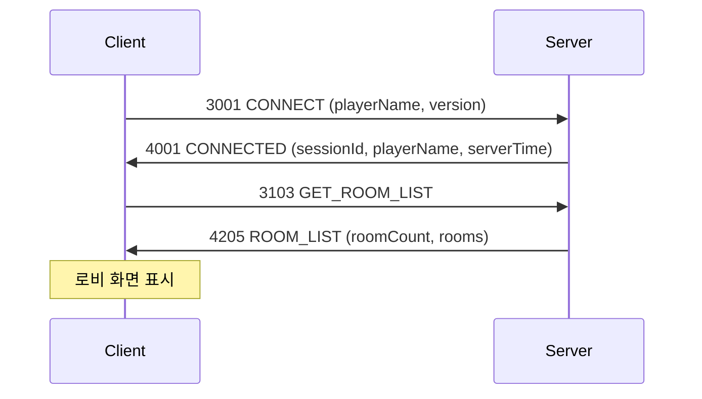
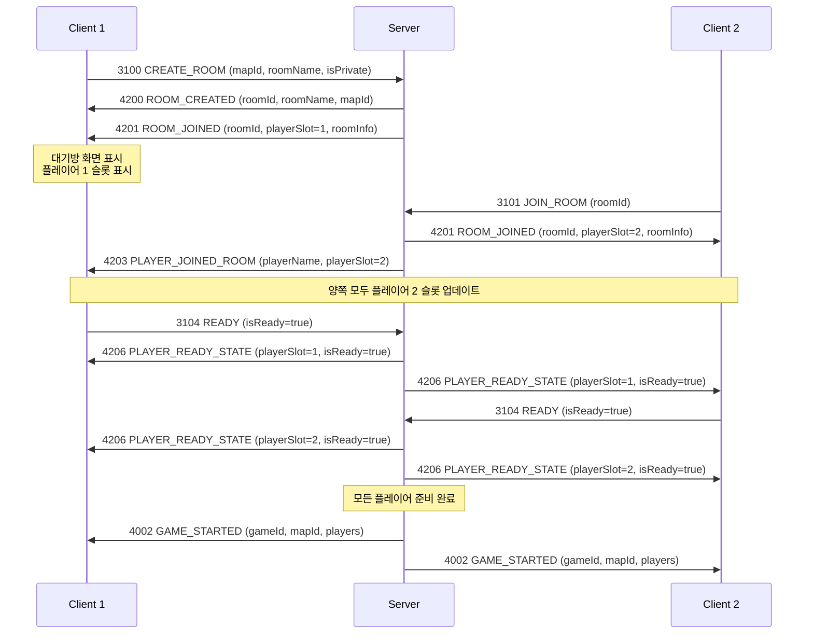
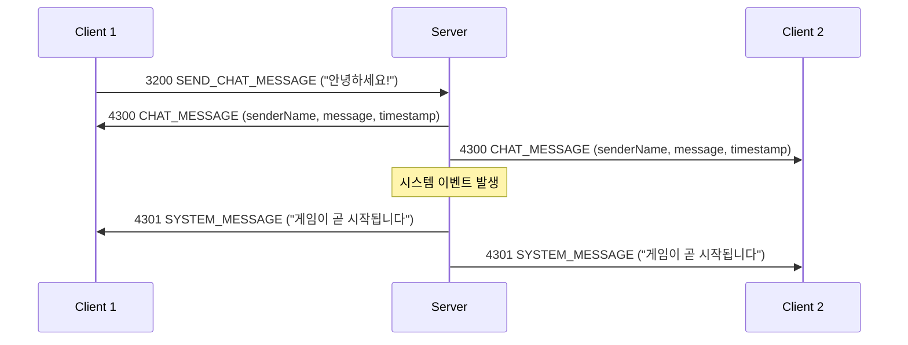

# UI 데이터 요구사항 명세

이 문서는 게임 로비 & 대기방 UI를 구현하기 위해 서버에서 받아야 할 데이터 구조를 정리합니다.

---

## 1. 로비 화면

### 1.1 사용자 정보 패널 (우측 하단)

**표시 요소:**
- 플레이어 이름
- 접속 상태

**필요한 데이터:**
```json
{
  "playerName": "플레이어_12345",
  "isOnline": true,
  "sessionId": "session_abc123"
}
```

**관련 프로토콜:**
- `4001 CONNECTED` - 서버 연결 성공 시 수신
  - `sessionId`: String
  - `playerName`: String
  - `serverTime`: long

---

### 1.2 게임 방 목록 (좌측)

**표시 요소:**
- 방 이름
- 플레이어 수 (현재/최대)
- 맵 이름
- 방 상태 (대기중/만원/게임중)

**필요한 데이터:**
```json
{
  "rooms": [
    {
      "roomId": "room_001",
      "roomName": "은하계 정복전",
      "currentPlayers": 1,
      "maxPlayers": 2,
      "mapId": 1,
      "mapName": "3레인 전투장",
      "status": "waiting",  // waiting, full, playing
      "isPrivate": false
    },
    {
      "roomId": "room_002",
      "roomName": "에픽 전투",
      "currentPlayers": 1,
      "maxPlayers": 2,
      "mapId": 2,
      "mapName": "쌍성계",
      "status": "waiting",
      "isPrivate": false
    }
  ]
}
```

**관련 프로토콜:**
- `3103 GET_ROOM_LIST` - 클라이언트 → 서버 (룸 목록 요청)
  - 파라미터 없음

- `4205 ROOM_LIST` - 서버 → 클라이언트 (룸 목록 응답)
  - `roomCount`: int
  - `rooms`: String (JSON 배열)

**rooms JSON 구조 예시:**
```json
[
  {
    "roomId": "ROOM_abc123",
    "roomName": "은하계 정복전",
    "currentPlayers": 1,
    "maxPlayers": 2,
    "mapId": 1,
    "mapName": "3레인 전투장",
    "status": "waiting",
    "isPrivate": false
  }
]
```

---

### 1.3 방 만들기 폼 (우측 상단)

**표시 요소:**
- 맵 목록 (드롭다운)

**필요한 데이터:**
```json
{
  "maps": [
    {
      "mapId": 1,
      "mapName": "3레인 전투장"
    },
    {
      "mapId": 2,
      "mapName": "쌍성계"
    },
    {
      "mapId": 3,
      "mapName": "거울 세계"
    },
    {
      "mapId": 4,
      "mapName": "교차로"
    },
    {
      "mapId": 5,
      "mapName": "단순 경로"
    }
  ]
}
```

**관련 프로토콜:**
- `3100 CREATE_ROOM` - 클라이언트 → 서버 (방 생성 요청)
  - `mapId`: int
  - `roomName`: String
  - `isPrivate`: bool

- `4200 ROOM_CREATED` - 서버 → 클라이언트 (방 생성 완료)
  - `roomId`: String
  - `roomName`: String
  - `mapId`: int

**참고:** 맵 목록은 서버 연결 시 또는 별도 프로토콜로 받을 수 있습니다. (현재 스펙에는 명시되지 않음)

---

## 2. 대기방 화면

### 2.1 방 정보 헤더 (상단)

**표시 요소:**
- 방 이름
- 맵 이름

**필요한 데이터:**
```json
{
  "roomId": "room_001",
  "roomName": "은하계 정복전",
  "mapId": 1,
  "mapName": "3레인 전투장"
}
```

**관련 프로토콜:**
- `4201 ROOM_JOINED` - 서버 → 클라이언트 (룸 참가 완료)
  - `roomId`: String
  - `playerSlot`: int
  - `roomInfo`: String (JSON)

**roomInfo JSON 구조 예시:**
```json
{
  "roomId": "ROOM_abc123",
  "roomName": "은하계 정복전",
  "mapId": 1,
  "mapName": "3레인 전투장",
  "maxPlayers": 2,
  "isPrivate": false,
  "hostPlayerId": 1
}
```

---

### 2.2 플레이어 슬롯 (좌측 상단)

**표시 요소:**
- 플레이어 이름
- 플레이어 역할 (방장/일반)
- 플레이어 번호 (1 또는 2)
- 준비 상태 (준비완료/대기중)
- 빈 슬롯 여부

**필요한 데이터:**
```json
{
  "players": [
    {
      "playerSlot": 1,
      "playerName": "플레이어_12345",
      "isHost": true,
      "isReady": false,
      "isEmpty": false
    },
    {
      "playerSlot": 2,
      "playerName": null,
      "isHost": false,
      "isReady": false,
      "isEmpty": true
    }
  ]
}
```

**관련 프로토콜:**

**플레이어 입장:**
- `4203 PLAYER_JOINED_ROOM` - 서버 → 클라이언트 (다른 플레이어 입장)
  - `playerName`: String
  - `playerSlot`: int

**플레이어 퇴장:**
- `4204 PLAYER_LEFT_ROOM` - 서버 → 클라이언트 (다른 플레이어 퇴장)
  - `playerSlot`: int
  - `reason`: String

**준비 상태 변경:**
- `3104 READY` - 클라이언트 → 서버 (준비 완료 요청)
  - `isReady`: bool

- `4206 PLAYER_READY_STATE` - 서버 → 클라이언트 (플레이어 준비 상태)
  - `playerSlot`: int
  - `isReady`: bool

---

### 2.3 게임 설정 (좌측 하단)

**표시 요소:**
- 맵
- 최대 플레이어
- 시작 자원
- 방 유형 (공개/비공개)

**필요한 데이터:**
```json
{
  "gameSettings": {
    "mapId": 1,
    "mapName": "3레인 전투장",
    "maxPlayers": 2,
    "startingResources": "표준",
    "roomType": "공개"
  }
}
```

**관련 프로토콜:**
- `4201 ROOM_JOINED`의 `roomInfo`에 포함

---

### 2.4 채팅 (우측)

**표시 요소:**
- 채팅 메시지
- 시스템 메시지
- 사용자 이름
- 타임스탬프

**필요한 데이터:**
```json
{
  "chatMessages": [
    {
      "senderId": "SYSTEM",
      "message": "플레이어_12345님이 방을 생성했습니다",
      "timestamp": 1234567890,
      "messageType": 0
    },
    {
      "senderId": "플레이어_12345",
      "message": "누구 같이 할 사람?",
      "timestamp": 1234567890,
      "messageType": 0
    }
  ]
}
```

**관련 프로토콜:**
- ✅ **BaseServer의 기존 채팅 프로토콜 사용**

**클라이언트 → 서버:**
- `1003 CHAT_MESSAGE` - 채팅 메시지 전송
  - `message`: String

**서버 → 클라이언트:**
- `2006 CHAT_BROADCAST` - 채팅 메시지 브로드캐스트
  - `chatMessage`: ChatMessage (struct)

**ChatMessage 구조체 (수정 필요):**
```csharp
public struct ChatMessage
{
    public string SenderId;      // "SYSTEM"이면 시스템 메시지
    public string Message;
    public long Timestamp;
    public int MessageType;      // 0: LOBBY(대기방), 1: INGAME(인게임)
}
```

**MessageType 열거형:**
- `0` (LOBBY): 대기방 채팅
- `1` (INGAME): 인게임 채팅

**시스템 메시지 판별:**
- `SenderId == "SYSTEM"` → 시스템 메시지로 처리

---

## 3. 초기 연결 시 필요한 데이터

### 3.1 연결 성공

**필요한 데이터:**
```json
{
  "sessionId": "session_abc123",
  "playerName": "플레이어_12345",
  "serverTime": 1234567890
}
```

**관련 프로토콜:**
- `3001 CONNECT` - 클라이언트 → 서버
  - `playerName`: String
  - `version`: String

- `4001 CONNECTED` - 서버 → 클라이언트
  - `sessionId`: String
  - `playerName`: String
  - `serverTime`: long

---

### 3.2 맵 목록 (선택 사항)

서버 연결 시 또는 로비 진입 시 맵 목록을 미리 받아둘 수 있습니다.

**필요한 프로토콜 (제안):**
- `3105 GET_MAP_LIST` - 클라이언트 → 서버
  - 파라미터 없음

- `4210 MAP_LIST` - 서버 → 클라이언트
  - `mapCount`: int
  - `maps`: String (JSON)

**maps JSON 구조:**
```json
[
  {
    "mapId": 1,
    "mapName": "3레인 전투장"
  },
  {
    "mapId": 2,
    "mapName": "쌍성계"
  }
]
```

---

## 4. 실시간 업데이트가 필요한 요소

### 4.1 로비 화면
- **방 목록**: 주기적 갱신 또는 변경 시 서버 푸시
  - 새로운 방 생성
  - 방 상태 변경 (대기중 → 만원, 대기중 → 게임중)
  - 방 삭제 (게임 종료)

### 4.2 대기방 화면
- **플레이어 슬롯**: 실시간 업데이트
  - 플레이어 입장 (`4203 PLAYER_JOINED_ROOM`)
  - 플레이어 퇴장 (`4204 PLAYER_LEFT_ROOM`)
  - 준비 상태 변경 (`4206 PLAYER_READY_STATE`)

- **채팅**: 실시간 수신
  - 새 메시지 수신

---

## 5. 클라이언트 → 서버 요청 정리

### 5.1 로비 화면

| 동작 | 프로토콜 | 파라미터 |
|------|----------|----------|
| 서버 연결 | 3001 CONNECT | playerName, version |
| 방 목록 요청 | 3103 GET_ROOM_LIST | - |
| 방 생성 | 3100 CREATE_ROOM | mapId, roomName, isPrivate |
| 방 참가 | 3101 JOIN_ROOM | roomId |
| 연결 종료 | - | - |

### 5.2 대기방 화면

| 동작 | 프로토콜 | 파라미터 |
|------|----------|----------|
| 준비 완료/취소 | 3104 READY | isReady |
| 방 나가기 | 3102 LEAVE_ROOM | - |
| 채팅 메시지 전송 | 1003 CHAT_MESSAGE | message |

---

## 6. 서버 → 클라이언트 응답 정리

### 6.1 로비 화면

| 이벤트 | 프로토콜 | 데이터 |
|--------|----------|--------|
| 연결 성공 | 4001 CONNECTED | sessionId, playerName, serverTime |
| 방 목록 | 4205 ROOM_LIST | roomCount, rooms (JSON) |
| 방 생성 완료 | 4200 ROOM_CREATED | roomId, roomName, mapId |
| 방 참가 완료 | 4201 ROOM_JOINED | roomId, playerSlot, roomInfo (JSON) |

### 6.2 대기방 화면

| 이벤트 | 프로토콜 | 데이터 |
|--------|----------|--------|
| 방 나가기 완료 | 4202 ROOM_LEFT | - |
| 다른 플레이어 입장 | 4203 PLAYER_JOINED_ROOM | playerName, playerSlot |
| 다른 플레이어 퇴장 | 4204 PLAYER_LEFT_ROOM | playerSlot, reason |
| 플레이어 준비 상태 | 4206 PLAYER_READY_STATE | playerSlot, isReady |
| 게임 시작 | 4002 GAME_STARTED | gameId, mapId, players (JSON) |
| 채팅 메시지 | 2006 CHAT_BROADCAST | chatMessage (ChatMessage struct) |
| 에러 | 4999 ERROR | errorCode, message |

---

## 7. 추가 필요 프로토콜 (현재 스펙에 없음)

### 7.1 맵 목록 조회
```
3105 GET_MAP_LIST (클라이언트 → 서버)
4210 MAP_LIST (서버 → 클라이언트)
```

### 7.2 ChatMessage 구조체 수정
BaseServer의 기존 `ChatMessage` 구조체에 `MessageType` 필드를 추가해야 합니다.

**현재:**
```csharp
public struct ChatMessage
{
    public string SenderId;
    public string Message;
    public long Timestamp;
}
```

**수정 필요:**
```csharp
public struct ChatMessage
{
    public string SenderId;      // "SYSTEM"이면 시스템 메시지
    public string Message;
    public long Timestamp;
    public int MessageType;      // 0: LOBBY(대기방), 1: INGAME(인게임)
}
```

### 7.3 방 목록 실시간 업데이트
```
4207 ROOM_UPDATED (서버 → 클라이언트, 브로드캐스트)
  - roomId, currentPlayers, status
```

---

## 8. 데이터 흐름 예시

### 8.1 로비 진입 플로우



### 8.2 방 생성 및 대기 플로우



### 8.3 채팅 플로우



---

## 9. 구현 우선순위

### Phase 1: 필수 기능
1. ✅ 서버 연결 (3001, 4001)
2. ✅ 방 목록 조회 (3103, 4205)
3. ✅ 방 생성 (3100, 4200)
4. ✅ 방 참가/퇴장 (3101, 3102, 4201, 4202)
5. ✅ 플레이어 입장/퇴장 알림 (4203, 4204)
6. ✅ 준비 상태 관리 (3104, 4206)
7. ✅ 게임 시작 (4002)

### Phase 2: 추가 기능
1. ⚠️ 채팅 시스템 (3200, 4300, 4301) - **프로토콜 추가 필요**
2. ⚠️ 맵 목록 조회 (3105, 4210) - **프로토콜 추가 필요**
3. ⚠️ 방 목록 실시간 업데이트 (4207) - **프로토콜 추가 필요**

---

## 10. 주의사항

1. **JSON 직렬화**: 복잡한 데이터는 JSON으로 직렬화하여 String 파라미터로 전송
2. **타임스탬프**: 서버 시간 기준으로 통일 (4001 CONNECTED의 serverTime 활용)
3. **에러 처리**: 모든 요청에 대해 4999 ERROR 응답 가능
4. **브로드캐스트**: 방 안의 모든 플레이어에게 동일한 상태 정보 전송 필요
5. **동기화**: 클라이언트는 서버에서 받은 데이터를 신뢰하고 UI 업데이트
