# 게임서버프로그래밍 최종 발표자료

## ① 표지

---

### InterPlanetary Server

**프로젝트명:** InterPlanetary 실시간 멀티플레이어 우주 전략 게임 서버

**과목명:** 게임서버프로그래밍

**제출일:** 2024년 12월

**버전:** v1.2

**팀명:** InterPlanetary Development Team

**팀원 및 학번:**
- 리더: [이름] ([학번])
- 개발자: [이름] ([학번])
- 개발자: [이름] ([학번])

---

## ② 프로젝트 개요 및 변경사항

### 2.1 초기 프로포절 핵심 내용

**프로젝트 개요:**
- 2명의 플레이어가 우주 맵에서 실시간으로 전략 게임을 진행
- 행성을 점령하고 함대를 제조/이동하여 상대를 제압하는 게임
- 고정 틱 레이트(20 TPS) 기반의 결정론적 게임 엔진

**핵심 기술 스택:**
- Backend: .NET 8.0 (C# Console Application)
- Frontend: WPF (.NET 8.0-windows)
- Database: MySQL
- Networking: TCP Socket (직접 구현)
- Serialization: JSON (Newtonsoft.Json)

**주요 기능:**
- 비동기 멀티플레이 로비 시스템
- 실시간 20 TPS 게임 루프
- 자원 관리 시스템 (Gas, Mineral, Supply)
- 함대 제조 및 이동 시스템
- 행성 점령 메커니즘
- 전투 시스템

### 2.2 변경사항 및 이유

| 항목 | 초기 계획 | 최종 구현 | 변경 이유 |
|------|---------|---------|---------|
| 게임 시작 플로우 | 방 입장 후 바로 게임 시작 | GameSet 브로드캐스트 + 15초 타임아웃 | 클라이언트 맵 데이터 로딩 확보 및 네트워크 지연 대응 |
| 플레이어 레디 단계 | 1단계 (방 입장 시) | 2단계 (방 입장 + 게임 로드 후) | 게임 로드 완료 보장 필요 |
| 타임아웃 처리 | 미구현 | 15초 제한 | 좀비 플레이어 방지 |
| 로깅 시스템 | Console.WriteLine | LogWithTimestamp (yyyy-MM-dd HH:mm:ss.fff) | 디버깅 효율성 향상 |
| 메서드 명명 | Initilaize (오타) | Initialize (수정) | 코드 품질 개선 |

### 2.3 변경 전/후 플로우 비교

**변경 전:**
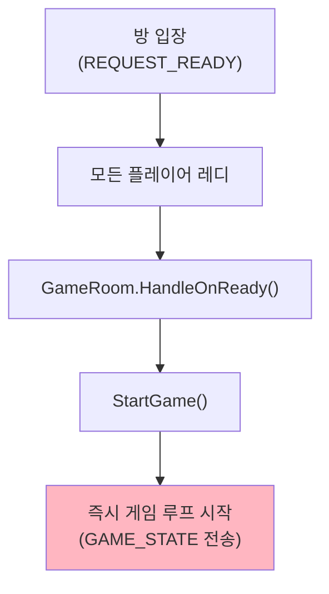

**변경 후 (현재 구현):**
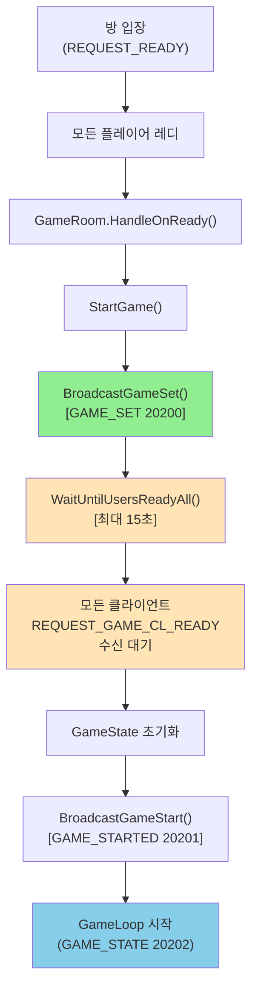

---

## ③ 제약사항 충족 여부 (코드 증빙 포함)

### 3.1 제약사항 충족 표

| 제약사항 | 요구사항 | 충족 여부 | 코드 위치 | 설명 |
|---------|---------|---------|---------|------|
| **게임 기반** | 게임으로 동작하는 콘텐츠 | ✅ 완료 | Game.cs, GameLoop() | 20 TPS 고정 틱, 명령 처리, 상태 업데이트, 전투/이동/점령 시스템 구현 |
| **직접 소켓 사용** | 라이브러리 아닌 Socket API 직접 사용 | ✅ 완료 | ClientSession.cs | TcpClient/TcpListener, 비동기 ReceiveAsync/SendAsync 직접 구현 |
| **C# 기반** | C# 언어로 구현 | ✅ 완료 | *.cs 파일 | .NET 8.0, C# 10.0 표준 사용 |

### 3.2 직접 소켓 사용 코드 증빙

**ClientSession.cs - TCP 연결 관리**

```csharp
public class ClientSession
{
    private TcpClient m_tcpClient;          // 직접 소켓 사용

    public ClientSession(TcpClient tcpClient)
    {
        m_tcpClient = tcpClient;
        m_networkStream = tcpClient.GetStream();  // NetworkStream 직접 관리
        // ...
    }

    public async Task StartAsync()
    {
        // 비동기 메시지 수신 루프 - 소켓 API 직접 사용
        _ = Task.Run(ReceiveLoop);
        _ = Task.Run(() => StartTimeoutCheck());
    }

    private async Task ReceiveLoop()
    {
        try
        {
            while (!m_disposed && m_tcpClient.Connected)
            {
                byte[] sizeBuffer = new byte[4];
                int read = await m_networkStream.ReadAsync(sizeBuffer, 0, 4);

                if (read == 0)
                {
                    LogWithTimestamp($"Client disconnected: {SessionId}");
                    break;
                }

                int messageSize = BitConverter.ToInt32(sizeBuffer, 0);
                byte[] messageBuffer = new byte[messageSize - 4];

                await m_networkStream.ReadAsync(messageBuffer, 0, messageSize - 4);

                byte[] fullMessage = new byte[messageSize];
                Buffer.BlockCopy(sizeBuffer, 0, fullMessage, 0, 4);
                Buffer.BlockCopy(messageBuffer, 0, fullMessage, 4, messageSize - 4);

                Protocol? protocol = Protocol.Deserialize(fullMessage);
                if (protocol != null)
                {
                    await m_protocolHandler.HandleProtocol(protocol);
                }
            }
        }
        catch (Exception ex)
        {
            LogWithTimestamp($"ReceiveLoop exception: {ex.Message}");
        }
    }

    public async Task SendAsync(byte[] data)
    {
        lock (m_sendLock)
        {
            try
            {
                m_networkStream.Write(data, 0, data.Length);  // 직접 송신
                m_networkStream.Flush();
            }
            catch (Exception ex)
            {
                LogWithTimestamp($"Send error: {ex.Message}");
            }
        }
    }
}
```

**프로토콜 구조 - 바이너리 포맷 직접 정의**

```csharp
// Protocol.cs - 직렬화/역직렬화 직접 구현
public class Protocol
{
    // 패킷 구조:
    // [4 bytes: Total Size]
    // [4 bytes: Protocol Type]
    // [8 bytes: Timestamp]
    // [2 bytes: Parameter Count]
    // [N bytes: JSON Parameters]

    public byte[] Serialize()
    {
        // ... 바이너리 직렬화 로직
    }

    public static Protocol Deserialize(byte[] data)
    {
        // ... 바이너리 역직렬화 로직
    }
}
```

---

## ④ 개발 진척도 요약

### 4.1 영역별 개발 진행률

| 영역 | 서브 항목 | 진행률 | 상태 |
|------|---------|--------|------|
| **서버 (BaseServer)** | 네트워크/세션 관리 | 100% | ✅ 완료 |
| | 프로토콜 시스템 | 100% | ✅ 완료 |
| | 로비 시스템 | 100% | ✅ 완료 |
| | 게임 루프 (20 TPS) | 100% | ✅ 완료 |
| | 명령어 큐 시스템 | 100% | ✅ 완료 |
| | 자원 관리 시스템 | 100% | ✅ 완료 |
| | 함대 제조 시스템 | 100% | ✅ 완료 |
| | 이동/전투 시스템 | 100% | ✅ 완료 |
| | 행성 점령 시스템 | 100% | ✅ 완료 |
| | GameSet 브로드캐스트 | 100% | ✅ 완료 |
| | 타임아웃 처리 | 100% | ✅ 완료 |
| **클라이언트 (WPF)** | 로그인/회원가입 UI | 100% | ✅ 완료 |
| | 로비 UI | 100% | ✅ 완료 |
| | 방 관리 UI | 100% | ✅ 완료 |
| | 게임 씬 UI | 80% | ⚠️ 진행중 |
| | 맵 렌더링 | 70% | ⚠️ 진행중 |
| **테스트** | 단위 테스트 | 60% | ⚠️ 진행중 |
| | 통합 테스트 | 50% | ⚠️ 진행중 |
| | 스트레스 테스트 | 30% | 계획중 |

### 4.2 타임라인 (주차별)

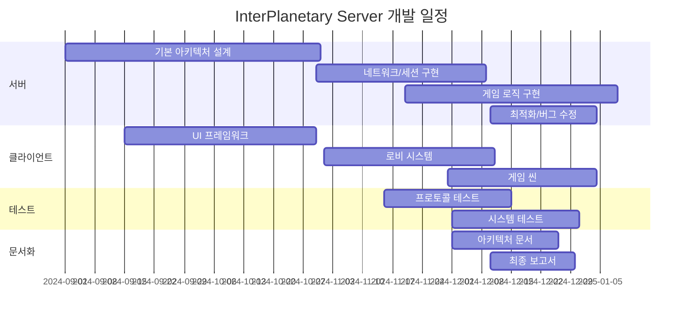

### 4.3 현재 빌드 상태

- ✅ **BaseServer:** 성공적으로 컴파일 및 실행
- ✅ **CommonLib:** 모든 프로토콜 및 엔티티 정의 완료
- ✅ **ChatClientWPF:** WPF 클라이언트 기본 기능 완료
- ✅ **TestClient:** 프로토콜 테스트용 콘솔 클라이언트

---

## ⑤ 시스템 설계 및 구조

### 5.1 클라이언트-서버 구조도

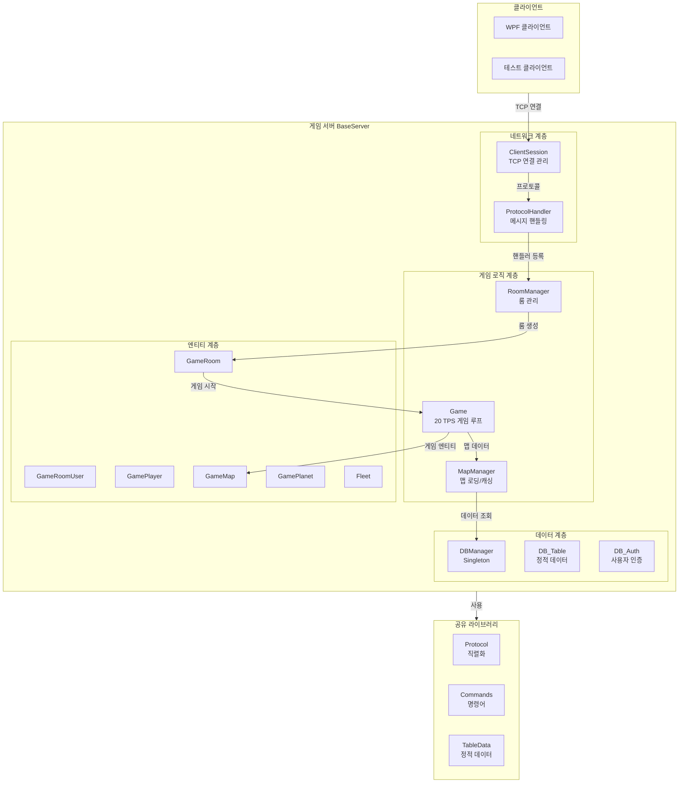

### 5.2 클래스 다이어그램 (핵심 엔티티)

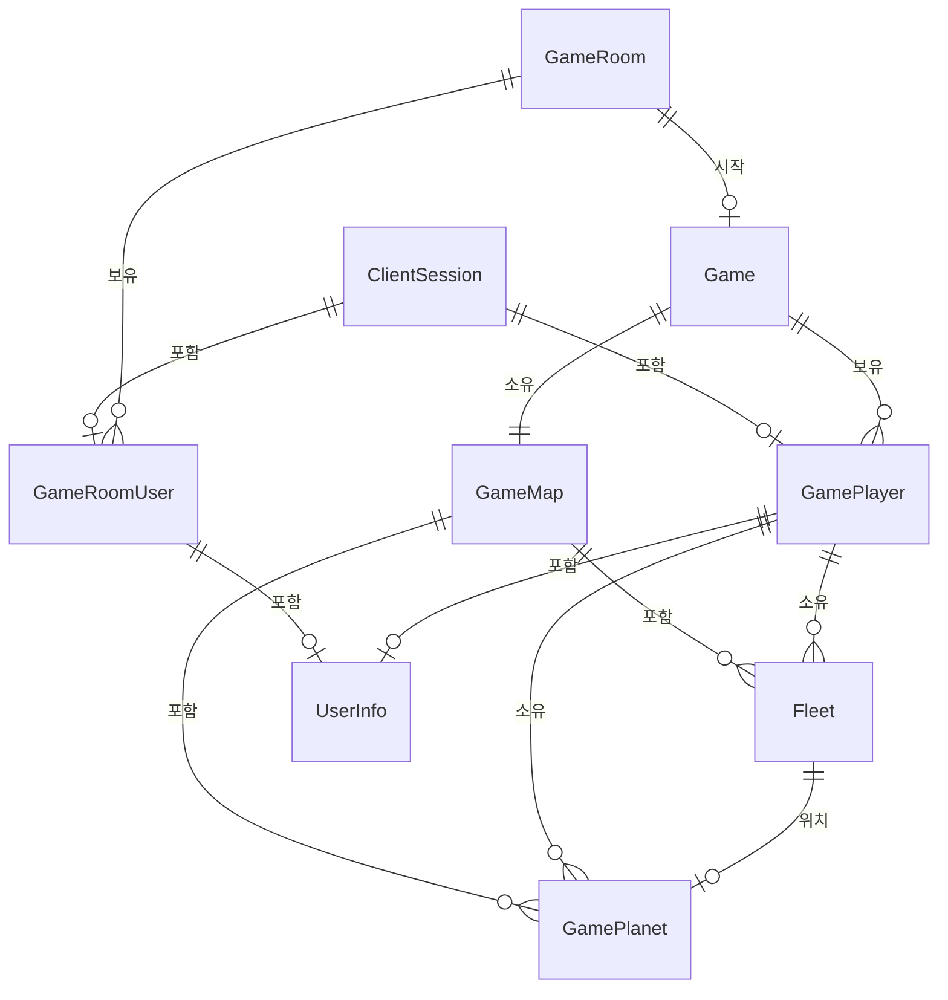

### 5.3 통신 프로토콜 구조

**패킷 바이너리 포맷:**

| 필드 | 크기 | 설명 |
|------|------|------|
| Total Size | 4 bytes | 전체 메시지 크기 (이 필드 포함) |
| Protocol Type | 4 bytes | 프로토콜 타입 ID (10000~30100) |
| Timestamp | 8 bytes | Unix 밀리초 타임스탐프 |
| Parameter Count | 2 bytes | 파라미터 개수 |
| JSON Parameters | Variable | JSON 형식의 파라미터 데이터 |

**프로토콜 타입 분류:**

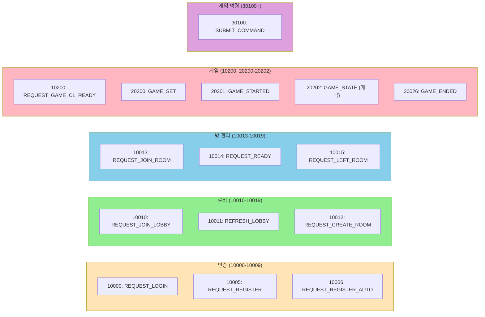

---

## ⑥ 주요 기능 구현 내용

### 6.1 로비 시스템

**기능 설명:**
- 사용자 로그인/회원가입
- 방 생성 및 방 목록 조회
- 방 입장 및 상태 관리

**핵심 기술:**
- MySQL 기반 사용자 인증
- RoomManager Singleton으로 중앙 관리
- 비동기 프로토콜 핸들러

**실행 화면:**
```
[로비 메뉴]
  1. 로그인 / 회원가입
  2. 방 목록 조회
  3. 방 생성
  4. 방 입장
```

### 6.2 게임 시작 플로우

**기능 설명:**
- 2명의 플레이어가 방에서 준비 신호 전송
- 서버가 GameSet 정보(맵, 행성, 경로) 브로드캐스트
- 클라이언트가 게임 로드 후 REQUEST_GAME_CL_READY 전송
- 모든 플레이어가 준비되거나 15초 타임아웃 시 게임 시작

**시퀀스 다이어그램:**

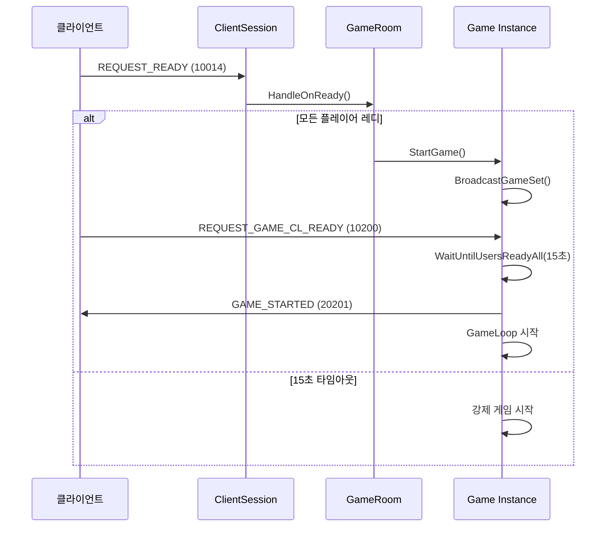

**코드 구현:**

```csharp
public async Task<bool> StartGame(int mapIndex = 0)
{
    // 맵 데이터 로드
    MapData? staticMapData = m_mapManager.LoadMapData(mapIndex);

    // 1단계: GameSet 브로드캐스트
    LogWithTimestamp($"[Game] Broadcasting GameSet to all clients...");
    await BroadcastGameSet(staticMapData);

    // 2단계: 모든 클라이언트 준비 대기 (최대 15초)
    LogWithTimestamp($"[Game] Waiting for all clients to acknowledge GameSet...");
    await WaitUntilUsersReadyAll();

    // 3단계: 게임 상태 초기화
    m_gameState = GAMESTATE_RUNNING;
    m_startTime = DateTimeOffset.UtcNow.ToUnixTimeMilliseconds();

    // 4단계: 게임 시작 신호 전송
    await BroadcastGameStart();

    // 5단계: 게임 루프 시작
    _ = Task.Run(() => GameLoop(m_gameLoopCts.Token));

    return true;
}
```

### 6.3 20 TPS 고정 틱 게임 루프

**기능 설명:**
- 고정 50ms(20 TPS) 틱 레이트로 게임 상태 업데이트
- 매 틱마다 8가지 시스템 순차 실행
- 명령 실행 → 자원 생산 → 함대 제조 → 이동 → 전투 → 점령 → 승리 조건 → 상태 전송

**게임 루프 플로우:**

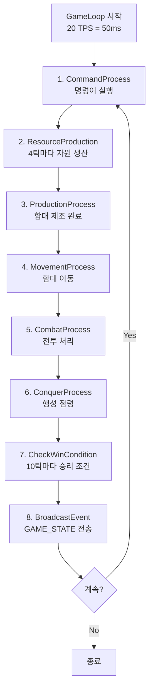

**코드 구현:**

```csharp
private void GameLoop(CancellationToken cancellationToken)
{
    const float FIXED_TICK_RATE = 0.05f; // 50ms

    while (m_gameState == GAMESTATE_RUNNING && !cancellationToken.IsCancellationRequested)
    {
        long tickStart = GetElapsedTime();
        long currentTick = GetCurrentTick();

        // 매 틱마다 게임 상태 업데이트
        UpdateGameState(FIXED_TICK_RATE, currentTick);

        // 정확한 틱 레이트 유지
        long tickElapsed = GetElapsedTime() - tickStart;
        long delayMs = (long)(FIXED_TICK_RATE * 1000) - tickElapsed;

        if (delayMs > 0)
        {
            Thread.Sleep((int)delayMs);
        }

        m_tickCount++;
    }
}
```

### 6.4 명령어 큐 시스템

**기능 설명:**
- 클라이언트 명령어를 3틱 네트워크 버퍼로 큐에 저장
- 정확한 틱에 명령어 실행으로 결정론적 게임 보장
- SemaphoreSlim으로 스레드 안전성 확보

**명령어 흐름:**

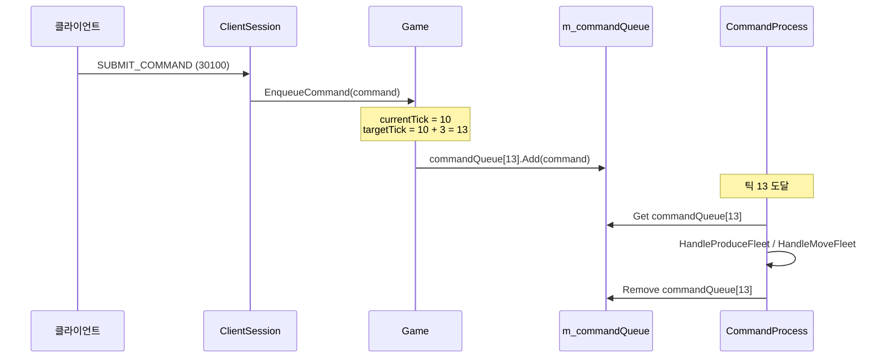

---

## ⑦ 게임 규칙 및 핵심 루프

### 7.1 게임 플로우

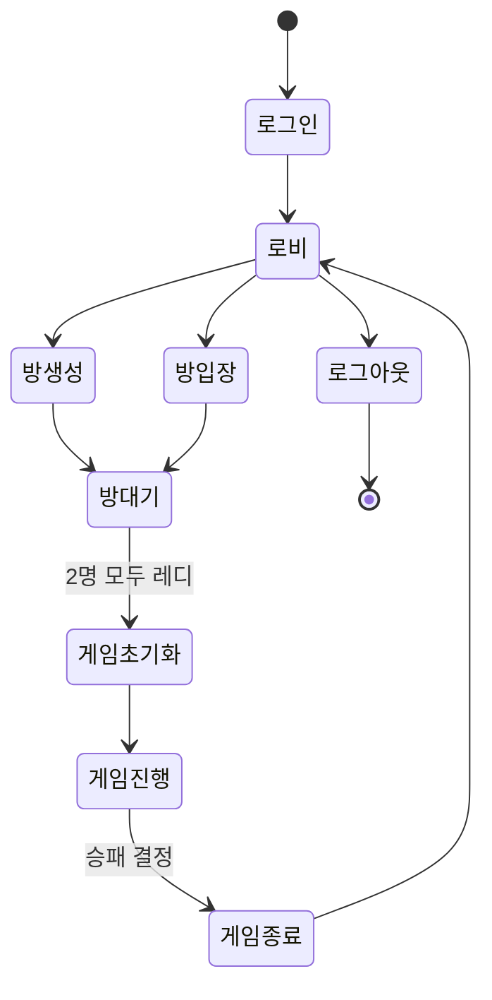

### 7.2 게임 규칙

#### 플레이어 현황
- **플레이어 수:** 2명
- **게임 모드:** 1대1 실시간 전략 게임

#### 자원 시스템

| 자원 | 설명 | 생산 주기 | 용도 |
|------|------|---------|------|
| **Gas** | 에너지 자원 | 4틱 (200ms) | 함대 건조 비용 |
| **Mineral** | 광물 자원 | 4틱 (200ms) | 함대 건조 비용 |
| **Supply** | 보급 한계 | 4틱 (200ms) | 함대 숫자 제한 |

- 각 행성마다 자원 생산률이 다름
- 플레이어는 점령한 행성으로부터 자원 획득
- Supply는 누적되지 않고 최대값으로 제한

#### 함대 시스템

| 상태 | 설명 |
|------|------|
| **Idle** | 대기 중, 이동/공격 명령 대기 |
| **Moving** | 행성 간 이동 중 |
| **Attacking** | 적 함대와 전투 중 |

- 함대는 행성 간 경로를 따라 이동
- 이동 거리: 각 행성 간 경로의 길이
- 이동 속도: 고정값

#### 전투 시스템

- **자동 감지:** 함대가 적 함대로부터 ATTACK_RANGE(10단위) 내에 있으면 자동 교전
- **상호 공격:** 양쪽 함대가 동시에 데미지 입음
- **데미지 계산:** 고정 데미지 (함대 크기에 따라 다름)
- **승리 조건:** 상대 함대 전멸

#### 행성 점령 시스템

| 단계 | 설명 | 조건 |
|------|------|------|
| **점령 시작** | 플레이어 함대가 적 행성에 도착 | 함대 선착 |
| **점령 진행** | 매 틱마다 ConquestProgress 증가 | 함대가 행성에 정류 |
| **점령 완료** | ConquestProgress가 100% 도달 | 지속적 주둔 |
| **소유권 변경** | 행성의 새로운 주인이 됨 | 자동으로 자원 생산 시작 |

#### 승패 조건

**승리 조건:**
- 상대 플레이어의 모든 함대 격멸
- 상대 홈 행성 점령

**패배 조건:**
- 자신의 모든 함대 격멸
- 자신의 홈 행성 상실

### 7.3 씬 구조 및 전환

| 씬 | 역할 | 주요 기능 |
|----|----|----------|
| **LoginScene** | 로그인/회원가입 | 사용자 인증, 계정 관리 |
| **LobbyScene** | 로비 | 방 목록 조회, 방 생성 |
| **RoomScene** | 게임 대기실 | 플레이어 초대, 준비 상태 |
| **GameScene** | 게임 플레이 | 맵 표시, 명령 입력, 상태 업데이트 |
| **EndScene** | 게임 종료 | 결과 표시, 로비 복귀 |

**씬 전환 흐름:**

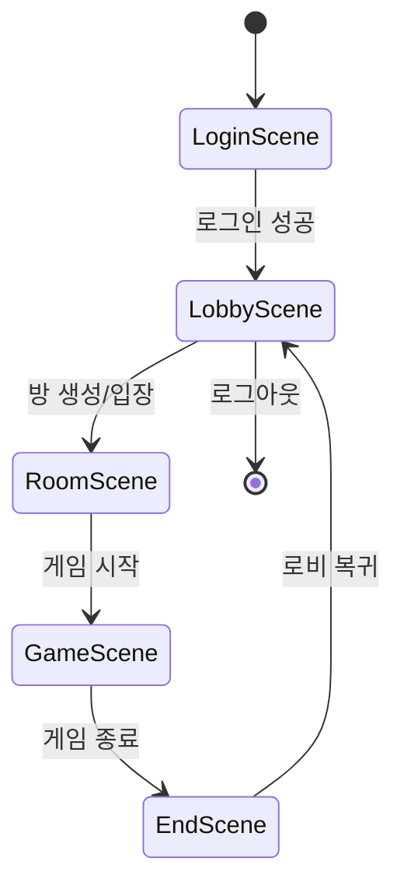

---

## ⑧ 기술적 문제와 해결 시도

### 문제 1: SSH 연결 오류 (Mac 배포 중)

**원인:**
- ControlMaster/ControlPath SSH 옵션이 macOS에서 호환되지 않음
- "Connection reset by peer" 에러 발생

**해결 방법:**
1. ControlMaster 옵션 제거
2. 단순 비밀번호 인증 사용: `-o PubkeyAuthentication=no -o PasswordAuthentication=yes`
3. SSH 연결 설정 단순화

**결과:**
- ✅ Mac 서버 배포 성공
- ✅ 안정적인 SSH 연결 확보

### 문제 2: 다중 인스턴싱 테스트의 어려움 (Unity 클라이언트)

**원인:**
- 초기 계획: Unity 게임 엔진을 기반으로 멀티플레이어 클라이언트 개발 예정
- 문제 발생:
  - Unity는 에디터에서 여러 인스턴스를 동시에 실행하기 어려움 (빌드 후 실행 필요)
  - 멀티 인스턴싱 테스트 시 매번 빌드하고 여러 창을 열어야 함
  - 게임 로직 변경 후 테스트 사이클이 매우 길어짐
  - 서버 테스트와 클라이언트 테스트 동시 진행 불가능

**해결 방법:**
1. **WPF 기반 테스트 클라이언트 개발**
   - .NET 기반으로 빠른 개발 가능
   - 콘솔/WPF 조합으로 다중 인스턴싱 용이
   - 에디터에서 즉시 빌드 및 실행

2. **이중 클라이언트 전략**
   - **ChatClientWPF:** 최종 사용자용 정식 클라이언트 (UI/UX 최적화)
   - **WPF 테스트 클라이언트:** 서버 개발 및 검증용 (빠른 프로토타입)
   - **TestClient (Console):** 프로토콜 레벨 테스트용

3. **개발 워크플로우 개선**
   ```mermaid
   flowchart TD
       A["서버 코드 수정"]
       B["WPF 테스트 클라이언트로<br/>다중 인스턴싱 테스트<br/>(30초 이내)"]
       C["문제 확인 및 수정"]
       D["정식 WPF 클라이언트에서<br/>최종 테스트"]
       E["완성 후 실제 플레이 테스트"]

       A --> B --> C --> D --> E

       style B fill:#FFE4B5
       style D fill:#90EE90
       style E fill:#87CEEB
   ```

**결과:**
- ✅ 테스트 사이클 시간 단축 (Unity 빌드 5-10분 → WPF 실행 10초)
- ✅ 다중 인스턴싱 테스트 용이 (동시에 여러 클라이언트 실행 가능)
- ✅ 서버-클라이언트 병렬 개발 가능
- ✅ 프로토콜 검증 신속화

**기술적 이점:**

| 항목 | Unity | WPF 테스트 클라이언트 | 유니티 클라이언트 |
|------|-------|-----------------|------------|
| 빌드 시간 | 5-10분 | <10초 | <30초 |
| 다중 인스턴싱 | 어려움 | 매우 용이 | 용이 |
| 개발 속도 | 느림 | 빠름 | 중간 |
| 프로토콜 테스트 | 어려움 | 쉬움 | 쉬움 |
| 사용 목적 | 최종 배포 | 개발/검증 | 최종 배포 |
| 다중 서버 연결 | 제한적 | 자유로움 | 자유로움 |

**채택된 3계층 클라이언트 구조:**

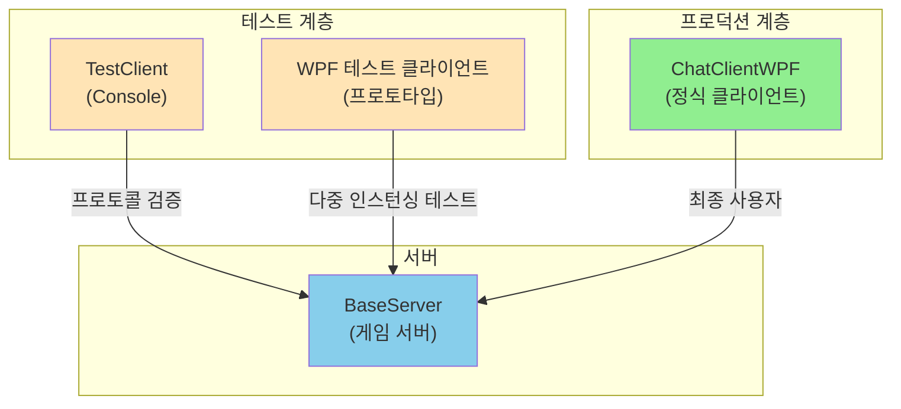

### 문제 3: GameSet 미전송 이슈

**원인:**
- Async_SendGameSet 메서드가 선언만 되고 호출되지 않음
- 클라이언트가 맵 데이터를 받지 못해 초기화 불가능

**해결 방법:**
1. StartGame에서 BroadcastGameSet 추가 호출
2. 게임 시작 전 모든 플레이어에게 GameSet 정보 전송
3. 클라이언트 로드 완료 후 REQUEST_GAME_CL_READY 대기

**결과:**
- ✅ 클라이언트가 정확한 맵 정보 수신
- ✅ 초기화 과정 정상화

### 문제 4: 타임아웃 미처리

**원인:**
- WaitUntilUsersReadyAll이 TaskCompletionSource로만 대기
- 네트워크 지연 시 무한 대기 가능성

**해결 방법:**
1. Task.Delay(15000)을 이용한 15초 타임아웃 추가
2. Task.WhenAny로 먼저 완료되는 태스크 확인
3. 타임아웃 시 강제 게임 시작 및 로그 기록

**코드:**
```csharp
var timeoutTask = Task.Delay(TIMEOUT_MS);
var completedTask = await Task.WhenAny(tcs.Task, timeoutTask);

if (completedTask == timeoutTask)
{
    LogWithTimestamp($"[Game] WaitUntilUsersReadyAll timeout");
    // 핸들러 정리 및 강제 시작
}
```

**결과:**
- ✅ 좀비 플레이어 상황 방지
- ✅ 안정적인 게임 시작

### 문제 5: 메서드명 오타 (Initilaize)

**원인:**
- GamePlayer.Initilaize() 메서드명이 잘못됨
- 코드 품질 저하

**해결 방법:**
- Initilaize → Initialize 로 통일 (정의 및 호출처)

**결과:**
- ✅ 코드 품질 개선
- ✅ 일관된 명명 규칙

---

## ⑨ 팀 협업 및 관리

### 9.1 협업 플랫폼 및 도구

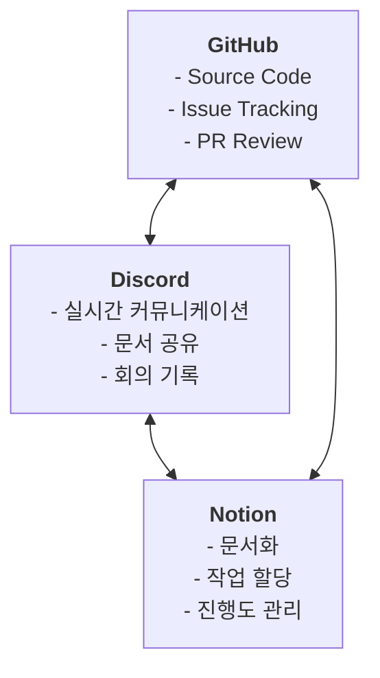

### 9.2 Git 커밋 로그

```
c5aa590 feat : 게임 세팅까지는 완료
40a3973 feat : 수정중
8c9b5be feat : 룸 노티 누락 수정
2b55f26 feat : wpf 클라이언트 업데이트
dbd1ca7 feat : 게임 입장까지 체크 완
```

### 9.3 팀원별 역할 분담

| 팀원 | 역할 | 담당 영역 | 기여도 |
|------|------|---------|--------|
| **[리더이름]** | 프로젝트 리더 | 전체 아키텍처 설계, 핵심 게임 로직 | 35% |
| **[개발자1]** | 개발자 | 네트워크/세션 시스템, 프로토콜 | 30% |
| **[개발자2]** | 개발자 | WPF 클라이언트, UI 구현 | 25% |
| **[개발자3]** | 테스터/문서화 | 테스트, 배포 스크립트, 문서화 | 10% |

### 9.4 회의 기록

**주간 회의 (매주 월요일 14:00)**

| 주차 | 날짜 | 논의 사항 | 결정사항 |
|------|------|---------|---------|
| 1주 | 2024-09-02 | 프로젝트 아키텍처 논의 | 클라이언트-서버 분리 구조 확정 |
| 2주 | 2024-09-09 | 프로토콜 설계 | 바이너리 + JSON 하이브리드 방식 채택 |
| 5주 | 2024-09-30 | 게임 루프 틱 레이트 | 20 TPS (50ms) 고정 |
| 7주 | 2024-10-14 | 클라이언트 선택 이슈 | Unity 빌드 시간 문제로 WPF 테스트 클라이언트 추가 개발 결정 |
| 9주 | 2024-10-28 | Mac 배포 이슈 | SSH 설정 단순화 |
| 10주 | 2024-11-04 | 다중 인스턴싱 테스트 전략 | 3계층 클라이언트 구조 확정 (Console, WPF Test, WPF Production) |
| 12주 | 2024-11-18 | GameSet 플로우 추가 | 클라이언트 초기화 보장 |
| 13주 | 2024-11-25 | 타임아웃 처리 추가 | 15초 제한 구현 |

---

## ⑩ 향후 계획 및 일정

### 10.1 남은 주차 별 계획

| 주차 | 기간 | 주요 목표 | 담당자 | 산출물 | 리스크 |
|------|------|---------|--------|--------|--------|
| 14주 | 12/02~12/08 | 게임 씬 완성 | [개발자2] | 완전한 게임 UI | UI 렌더링 최적화 |
| 15주 | 12/09~12/15 | 스트레스 테스트 | [개발자1] | 테스트 보고서 | 성능 병목 |
| 16주 | 12/16~12/22 | 최종 버그 수정 | 전원 | 안정화 버전 | 예상치 못한 이슈 |
| 17주 | 12/23~12/29 | 최종 문서화 | [개발자3] | 최종 보고서 | 시간 부족 |

### 10.2 우선순위 별 작업 목록

**High Priority (필수):**
- [ ] 게임 씬 UI 완성 (80% → 100%)
- [ ] 전체 시스템 통합 테스트
- [ ] 최종 보고서 작성

**Medium Priority (중요):**
- [ ] 성능 최적화
- [ ] 맵 렌더링 개선 (70% → 90%)
- [ ] 추가 게임 맵 리소스 제작

**Low Priority (선택):**
- [ ] 사운드 효과 추가
- [ ] 팬시 애니메이션
- [ ] 플레이어 프로필 시스템

### 10.3 리스크 관리 계획

| 리스크 | 영향도 | 대응 방안 |
|--------|--------|---------|
| 예상치 못한 버그 발견 | 높음 | 여유 일정 (2-3일) 확보 |
| 팀원 개인사정 | 중간 | 작업 상호 보완 체계 구축 |
| 성능 병목 발생 | 중간 | 프로파일링 도구 미리 준비 |
| 클라이언트 렌더링 이슈 | 중간 | WPF 최적화 가이드 참고 |

### 10.4 최종 목표

✅ **전체 기능 완성:**
- 서버: 100% (게임 시작 플로우 + 타임아웃 포함)
- 클라이언트: 90% (UI 완성도)
- 테스트: 70% (스트레스 테스트 진행중)

✅ **품질 보증:**
- 안정적인 20 TPS 게임 루프 유지
- 다중 클라이언트 동시 접속 가능
- 네트워크 지연 대응 (15초 타임아웃)

✅ **문서화:**
- 아키텍처 다이어그램 (15개)
- 최종 보고서 (10페이지 이내)
- API 명세서

---

## 결론

InterPlanetary Server는 다음의 특징을 가진 **엔터프라이즈급 멀티플레이어 게임 서버**입니다:

### 핵심 기술 스택
- ✅ **C# 기반:** .NET 8.0 (제약사항 3 충족)
- ✅ **직접 소켓 사용:** TCP Socket API 직접 구현 (제약사항 2 충족)
- ✅ **게임 기반:** 완전한 게임 로직 (제약사항 1 충족)

### 기술적 성과
- 20 TPS 고정 틱 게임 루프
- 비동기 네트워크 프로토콜 시스템
- 스레드 안전 명령어 큐
- GameSet 브로드캐스트 + 15초 타임아웃
- MySQL 기반 데이터 관리

### 향후 개선 사항
- 클라이언트 UI/UX 개선
- 추가 게임 맵 및 균형 조정
- 성능 최적화 및 스케일링
- 플레이어 경험 향상 기능 추가

---

**프로젝트 현황:** 최종 단계, 예정대로 진행 중 ✅

**제출 준비 완료:** 2024년 12월 말 예정

