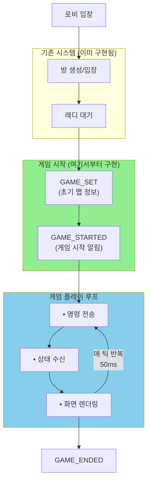
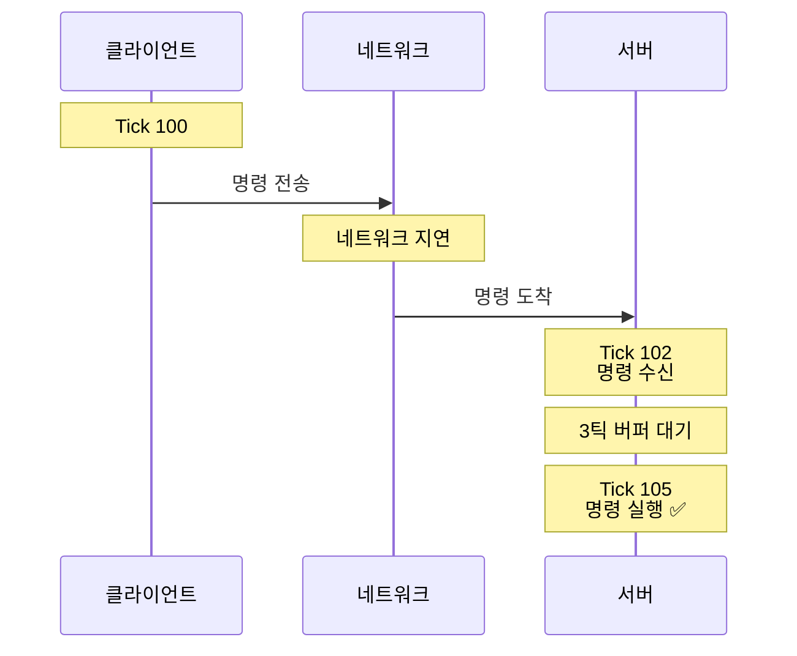

# 인터플래너터리 게임 클라이언트 구현 가이드

> **작성일**: 2025-12-08
> **서버 버전**: Game.cs 최종 수정본 기준
> **대상**: 게임 클라이언트 개발자

---

## 📋 목차

1. [개요](#개요)
2. [게임 흐름](#게임-흐름)
3. [프로토콜 명세](#프로토콜-명세)
4. [데이터 구조](#데이터-구조)
5. [명령 시스템](#명령-시스템)
6. [게임 상태 동기화](#게임-상태-동기화)
7. [구현 예시](#구현-예시)
8. [주의사항](#주의사항)

---

## 개요

### 게임 특징
- **장르**: 실시간 전략 게임 (RTS)
- **플레이어**: 1 vs 1 (최대 2명)
- **틱 레이트**: 20 TPS (Tick Per Second) = 50ms/틱
- **동기화 방식**: 서버 권위형 (Server-Authoritative)
- **명령 큐 시스템**: 3틱 버퍼 (150ms 지연 보상)

### 핵심 개념
- **결정론적 시뮬레이션**: 서버가 모든 게임 로직 처리
- **명령 기반**: 클라이언트는 명령만 전송, 실행은 서버
- **스냅샷 동기화**: 매 틱마다 전체 게임 상태 수신

---

## 게임 흐름



---

## 프로토콜 명세

### 📥 서버 → 클라이언트

#### 1. GAME_SET (20200)
**용도**: 게임 초기화 정보 전송 (맵 데이터)

**전송 시점**: 모든 플레이어가 레디한 직후 (1회)

**데이터 구조**:
```csharp
Protocol {
    type: GAME_SET (20200),
    params: {
        "map": MapData  // 직렬화된 맵 정보
    }
}
```

**MapData 구조**:
```csharp
class MapData {
    int mapId;               // 맵 ID
    string mapName;          // 맵 이름
    PlanetInfoData[] planets; // 행성 정보 배열

    // PlanetInfoData 구조:
    class PlanetInfoData {
        int id;              // 행성 ID
        string name;         // 행성 이름
        Vector2 position;    // 위치 (x, y)
        int gasProduction;   // Gas 생산량/틱
        int mineralProduction; // Mineral 생산량/틱
        int supplyProduction;  // Supply 생산량/틱
    }
}
```

**클라이언트 처리**:
1. MapData 역직렬화
2. 맵 UI 초기화
3. 행성 오브젝트 생성 및 배치
4. 자원 생산 정보 저장

---

#### 2. GAME_STARTED (20201)
**용도**: 게임 시작 알림

**전송 시점**: GAME_SET 직후 (1회)

**데이터 구조**:
```csharp
Protocol {
    type: GAME_STARTED (20201),
    params: {} // 파라미터 없음
}
```

**클라이언트 처리**:
1. 게임 화면으로 전환
2. 게임 타이머 시작
3. 명령 입력 활성화

---

#### 3. GAME_STATE (20202) ⭐ **가장 중요**
**용도**: 매 틱마다 전체 게임 상태 전송

**전송 시점**: 매 틱 (50ms마다, 초당 20회)

**데이터 구조**:
```csharp
Protocol {
    type: GAME_STATE (20202),
    params: {
        "gameState": GameState,  // 직렬화된 게임 상태
        "serverTick": long       // 서버 틱 번호
    }
}
```

**GameState 구조** (⭐ 핵심):
```csharp
class GameState {
    int state;           // 게임 상태 (0=준비, 2=진행중, 3=종료, 1/-1=승리)
    Player[] players;    // 플레이어 정보 배열 (최대 2명)
    Planet[] planets;    // 행성 상태 배열

    class Player {
        int id;              // 플레이어 ID
        int Gas;             // Gas 자원
        int Mineral;         // Mineral 자원
        int Supply;          // Supply (인구수/용량)
        FleetInfo[] fleets;  // 함대 정보 배열

        class FleetInfo {
            long fleetId;        // 함대 고유 ID
            int fleetType;       // 함대 타입 (DB fleet_info.id)
            int ownerId;         // 소유자 ID
            Vector2 position;    // 현재 위치 (x, y)
            int state;           // 함대 상태 (0=Idle, 1=Attacking, 2=Moving)
            float HP;            // 현재 체력
            float maxHP;         // 최대 체력
            Vector2 target;      // 목표 위치 (이동/공격 중일 때)
        }
    }

    class Planet {
        int planetId;            // 행성 ID
        int owner;               // 소유자 ID (-1=중립)
        float conquestProgress;  // 점령 진행도 (0~100)
    }
}
```

**FleetState 열거형**:
```csharp
enum FleetState {
    Idle = 0,       // 대기 중
    Attacking = 1,  // 공격 중
    Moving = 2      // 이동 중
    // Removed = 3  // (서버에서 필터링, 클라이언트에 미전송)
}
```

**클라이언트 처리**:
1. GameState 역직렬화
2. 플레이어 자원 UI 업데이트
3. 함대 위치/상태 업데이트
4. 행성 소유권/점령도 업데이트
5. 화면 렌더링

**성능 최적화 팁**:
- GameState는 **매 50ms마다** 도착 (초당 20회)
- 이전 상태와 비교하여 **변경된 부분만** 업데이트 권장
- 함대 ID 기반 Dictionary로 관리하면 효율적

---

#### 4. GAME_ENDED (20026)
**용도**: 게임 종료 알림

**전송 시점**: 승리 조건 달성 시

**데이터 구조**:
```csharp
Protocol {
    type: GAME_ENDED (20026),
    params: {} // 파라미터 없음
}
```

**클라이언트 처리**:
1. 최종 GameState에서 state 값으로 승자 판별
   - `state == 1`: Faction 1 승리
   - `state == -1`: Faction 2 승리
2. 승리/패배 화면 표시
3. 로비로 복귀 UI 제공

---

### 📤 클라이언트 → 서버

#### 1. REQUEST_GAME_CL_READY (10200) ⭐ **게임 준비 완료**
**용도**: 클라이언트가 게임 시작 준비 완료를 서버에 알림

**전송 시점**: GAME_SET 수신 후, 맵 로딩 완료 시

**데이터 구조**:
```csharp
Protocol {
    type: REQUEST_GAME_CL_READY (10200),
    params: {} // 파라미터 없음
}
```

**클라이언트 처리 순서**:
```csharp
// 1. GAME_SET 수신
async Task HandleGameSet(Protocol protocol) {
    MapData map = protocol.GetObject<MapData>("map");

    // 2. 맵 로딩
    await LoadMapAsync(map);

    // 3. 준비 완료 알림 ⭐
    Protocol readyProtocol = new Protocol(ProtocolType.REQUEST_GAME_CL_READY);
    await SendAsync(readyProtocol);
}

// 4. 모든 클라이언트가 준비되면 GAME_STARTED 수신
```

**중요**:
- 이 프로토콜을 **반드시 전송**해야 게임이 시작됩니다
- 모든 플레이어가 전송할 때까지 서버는 대기합니다
- 전송하지 않으면 다른 플레이어도 대기하게 됩니다

---

#### 2. SUBMIT_COMMAND (30100) ⭐ **명령 전송**
**용도**: 게임 명령 전송 (함대 이동, 함대 생산)

**전송 시점**: 플레이어 입력 시 (클릭, 키 입력 등)

**데이터 구조**:
```csharp
Protocol {
    type: SUBMIT_COMMAND (30100),
    params: {
        "command": Command  // 직렬화된 명령 객체
    }
}
```

**Command 종류**:

##### (1) MoveFleetCommand - 함대 이동
```csharp
class MoveFleetCommand : Command {
    int PlayerId;         // 플레이어 ID
    long tick;            // 클라이언트 틱 번호 (선택, 0 가능)
    int target_fleet;     // 이동할 함대 ID
    int target_planet;    // 목표 행성 ID
}
```

**전송 예시**:
```csharp
Protocol protocol = new Protocol(ProtocolType.SUBMIT_COMMAND);
protocol.AddParam("tick", 0L);  // 서버가 자동 계산하므로 0 가능
protocol.AddParam("target_fleet", fleetId);
protocol.AddParam("target_planet", planetId);
// command 객체는 서버에서 생성되므로 파라미터만 전송
await SendAsync(protocol);
```

##### (2) ProduceFleetCommand - 함대 생산
```csharp
class ProduceFleetCommand : Command {
    int PlayerId;      // 플레이어 ID
    long tick;         // 클라이언트 틱 번호 (선택, 0 가능)
    int target;        // 생산할 함대 타입 (production_info.id)
}
```

**전송 예시**:
```csharp
Protocol protocol = new Protocol(ProtocolType.SUBMIT_COMMAND);
protocol.AddParam("tick", 0L);
protocol.AddParam("target", fleetTypeId);  // DB에서 조회한 함대 타입 ID
await SendAsync(protocol);
```

---

## 데이터 구조

### Vector2
```csharp
struct Vector2 {
    float x;
    float y;
}
```

---

## 명령 시스템

### 명령 큐 버퍼 (3틱 = 150ms)

서버는 **명령을 즉시 실행하지 않고**, 3틱 후에 실행합니다.

**이유**: 네트워크 지연 보상

**예시**:


**클라이언트 고려사항**:
- 명령 전송 후 **약 150ms~250ms 후** 실제 실행됨
- 즉시 피드백 원하면: **예측 렌더링** 구현 (선택)
  - 명령 전송 시 로컬에서 미리 표시
  - GameState 수신 시 서버 상태로 보정

---

## 게임 상태 동기화

### 렌더링 전략

#### ✅ 권장: 스냅샷 보간 (Snapshot Interpolation)

```csharp
class ClientGameState {
    GameState previousState;  // 이전 틱 상태
    GameState currentState;   // 현재 틱 상태
    float interpolationTime;  // 보간 시간 (0~1)

    void Update(float deltaTime) {
        interpolationTime += deltaTime / 0.05f; // 50ms 기준

        // 함대 위치 보간
        foreach (var fleet in fleets) {
            Vector2 prevPos = previousState.GetFleet(fleet.id).position;
            Vector2 currPos = currentState.GetFleet(fleet.id).position;

            fleet.renderPosition = Vector2.Lerp(prevPos, currPos, interpolationTime);
        }

        // 다음 GameState 도착 시
        if (interpolationTime >= 1.0f) {
            previousState = currentState;
            interpolationTime = 0;
        }
    }
}
```

**장점**: 부드러운 움직임, 네트워크 지터 흡수

---

## 구현 예시

### 1. 게임 초기화

```csharp
// GAME_SET 수신 핸들러
async Task HandleGameSet(Protocol protocol) {
    MapData map = protocol.GetObject<MapData>("map");

    // 맵 UI 초기화
    foreach (var planetData in map.planets) {
        CreatePlanetUI(planetData);
    }

    // 테이블 데이터 로드
    LoadFleetInfoTable();      // DB: fleet_info
    LoadProductionInfoTable(); // DB: production_info

    // ⭐ 중요: 준비 완료 알림 전송
    Protocol readyProtocol = new Protocol(ProtocolType.REQUEST_GAME_CL_READY);
    await SendAsync(readyProtocol);

    // 이제 GAME_STARTED를 기다림
}

// GAME_STARTED 수신 핸들러
async Task HandleGameStarted(Protocol protocol) {
    SwitchToGameScene();
    StartGameLoop();
}
```

---

### 2. 게임 루프

```csharp
void GameLoop() {
    while (isGameRunning) {
        // 1. 입력 처리
        ProcessUserInput();

        // 2. 화면 렌더링 (보간된 상태)
        RenderGame();

        // 3. 60 FPS 유지
        await Task.Delay(16); // ~60 FPS
    }
}
```

---

### 3. GameState 수신 및 처리

```csharp
async Task HandleGameState(Protocol protocol) {
    GameState state = protocol.GetObject<GameState>("gameState");
    long serverTick = protocol.GetParam<long>("serverTick");

    // 상태 업데이트
    previousState = currentState;
    currentState = state;
    interpolationTime = 0;

    // UI 업데이트
    UpdateResourceUI(state.players);
    UpdatePlanetOwnership(state.planets);

    // 함대 업데이트
    foreach (var player in state.players) {
        foreach (var fleetInfo in player.fleets) {
            UpdateOrCreateFleet(fleetInfo);
        }
    }

    // 승리 조건 체크
    if (state.state == 1 || state.state == -1) {
        ShowVictoryScreen(state.state);
    }
}

void UpdateOrCreateFleet(FleetInfo info) {
    if (!fleets.ContainsKey(info.fleetId)) {
        // 새 함대 생성
        Fleet fleet = CreateFleet(info.fleetType);
        fleet.id = info.fleetId;
        fleet.ownerId = info.ownerId;
        fleets.Add(info.fleetId, fleet);
    }

    // 상태 업데이트
    Fleet fleet = fleets[info.fleetId];
    fleet.position = info.position;
    fleet.state = (FleetState)info.state;
    fleet.HP = info.HP;
    fleet.maxHP = info.maxHP;
    fleet.target = info.target;
}
```

---

### 4. 명령 전송

```csharp
// 함대 이동 명령
async Task SendMoveCommand(long fleetId, int planetId) {
    Protocol protocol = new Protocol(ProtocolType.SUBMIT_COMMAND);
    protocol.AddParam("tick", 0L);
    protocol.AddParam("target_fleet", (int)fleetId);
    protocol.AddParam("target_planet", planetId);

    await networkClient.SendAsync(protocol);

    // 선택: 예측 렌더링
    PredictFleetMovement(fleetId, planetId);
}

// 함대 생산 명령
async Task SendProduceCommand(int fleetTypeId) {
    // 자원 체크 (로컬)
    if (!CanAfford(fleetTypeId)) {
        ShowError("자원 부족!");
        return;
    }

    Protocol protocol = new Protocol(ProtocolType.SUBMIT_COMMAND);
    protocol.AddParam("tick", 0L);
    protocol.AddParam("target", fleetTypeId);

    await networkClient.SendAsync(protocol);

    // 선택: 예측 UI (생산 중 표시)
    ShowProductionProgress(fleetTypeId);
}

bool CanAfford(int fleetTypeId) {
    var productionInfo = productionInfoTable[fleetTypeId];
    var myPlayer = currentState.players.First(p => p.id == myPlayerId);

    return myPlayer.Gas >= productionInfo.gasCost &&
           myPlayer.Mineral >= productionInfo.mineralCost &&
           myPlayer.Supply >= productionInfo.supplyCost;
}
```

---

## 주의사항

### ⚠️ 필수 준수 사항

#### 1. **서버 권위 존중**
- ❌ 클라이언트에서 게임 로직 실행 금지
- ✅ 모든 상태는 GameState 기준
- ✅ 명령 전송 후 **반드시 GameState로 확인**

**잘못된 예시**:
```csharp
// ❌ 나쁜 예: 클라이언트에서 자원 차감
SendProduceCommand(fleetTypeId);
myResources.Gas -= cost.Gas;  // 서버와 불일치 발생!
```

**올바른 예시**:
```csharp
// ✅ 좋은 예: 서버 응답 대기
SendProduceCommand(fleetTypeId);
// GameState 수신 시 자동으로 자원 업데이트됨
```

---

#### 2. **틱 동기화**
- 서버 틱(serverTick)을 기준으로 동작
- 클라이언트 로컬 타이머는 **렌더링 보간용**으로만 사용

---

#### 3. **네트워크 지연 처리**

**문제**: 명령 전송 후 150~250ms 지연

**해결책**:
1. **방법 A (권장)**: 그대로 두기
   - 장점: 구현 간단, 버그 없음
   - 단점: 약간의 지연 느껴짐

2. **방법 B**: 예측 렌더링
   - 장점: 즉각적인 피드백
   - 단점: 구현 복잡, 보정 필요
   ```csharp
   // 명령 전송 시: 로컬에서 미리 표시
   PredictFleetMovement(fleetId, targetPos);

   // GameState 수신 시: 서버 상태로 보정
   if (serverFleet.position != predictedPosition) {
       CorrectFleetPosition(fleetId, serverFleet.position);
   }
   ```

---

#### 4. **함대 삭제 처리**

**중요**: GameState에는 **파괴된 함대가 포함되지 않음**

**구현**:
```csharp
void HandleGameState(GameState state) {
    // 1. 서버에서 온 함대 ID 목록
    HashSet<long> serverFleetIds = new HashSet<long>();
    foreach (var player in state.players) {
        foreach (var fleet in player.fleets) {
            serverFleetIds.Add(fleet.fleetId);
        }
    }

    // 2. 클라이언트에만 있는 함대 = 파괴된 함대
    List<long> destroyedFleets = new List<long>();
    foreach (var fleetId in localFleets.Keys) {
        if (!serverFleetIds.Contains(fleetId)) {
            destroyedFleets.Add(fleetId);
        }
    }

    // 3. 파괴 애니메이션 후 제거
    foreach (var fleetId in destroyedFleets) {
        PlayDestroyAnimation(localFleets[fleetId]);
        localFleets.Remove(fleetId);
    }
}
```

---

#### 5. **생산 시간 계산**

**DB 데이터**: `production_info.production_time`은 **틱 단위**

**예시**:
```
production_time = 200 → 200틱 = 10초 (20 TPS 기준)
production_time = 400 → 400틱 = 20초
```

**UI 표시**:
```csharp
int productionTicks = productionInfo.production_time;
float productionSeconds = productionTicks / 20.0f;
ShowUI($"생산 시간: {productionSeconds}초");
```

---

#### 6. **점령 진행도 표시**

**Planet.conquestProgress**:
- 범위: 0 ~ 100
- 100 = 완전 점령
- 0 = 중립 또는 적 점령 직전

**UI 예시**:
```csharp
void UpdatePlanetUI(Planet planet) {
    if (planet.owner == -1) {
        // 중립 행성
        ShowNeutralColor();
    } else {
        // 플레이어 소유
        ShowOwnerColor(planet.owner);
        ShowConquestBar(planet.conquestProgress / 100.0f);
    }
}
```

---

## 📊 성능 가이드

### 예상 트래픽

**GameState 크기** (추정):
- 2명 플레이어
- 각 10개 함대
- 10개 행성
- 약 **2~5 KB/틱**

**초당 트래픽**:
- 다운로드: 2~5 KB × 20 = **40~100 KB/s**
- 업로드: 명령당 ~0.5 KB × 가변 = **평균 5~10 KB/s**

**총 대역폭**: 약 **100 KB/s = 0.8 Mbps** (여유롭게 동작)

---

### 최적화 팁

1. **GameState 파싱 최적화**
   - JSON 대신 Binary 직렬화 고려
   - 필요한 필드만 파싱

2. **렌더링 최적화**
   - 변경된 오브젝트만 업데이트
   - 화면 밖 오브젝트 컬링

3. **메모리 최적화**
   - GameState 객체 풀링
   - 불필요한 복사 방지

---

## 🎮 UI/UX 권장사항

### 필수 UI 요소

1. **자원 표시**
   - Gas, Mineral, Supply (실시간 업데이트)

2. **함대 정보**
   - HP 바
   - 상태 표시 (Idle/Moving/Attacking)
   - 이동 경로 표시

3. **행성 정보**
   - 소유자 색상
   - 점령 진행도 바
   - 자원 생산량

4. **생산 큐**
   - 진행 중인 생산 목록
   - 남은 시간 표시

5. **명령 피드백**
   - 클릭 효과
   - 이동 경로 미리보기
   - 명령 큐잉 표시

---

## 📚 참고 자료

### DB 테이블

#### fleet_info
```sql
CREATE TABLE `fleet_info` (
  `id` int NOT NULL,
  `name` varchar(45) NOT NULL,
  `max_health` float NOT NULL,
  `move_speed` float NOT NULL,
  `attack_power` float NOT NULL,
  `attack_range` float NOT NULL,
  `attack_delay` int NOT NULL,
  PRIMARY KEY (`id`)
)
```

#### production_info
```sql
CREATE TABLE `production_info` (
  `id` int NOT NULL AUTO_INCREMENT,
  `target_id` int NOT NULL,           -- fleet_info.id
  `production_time` int NOT NULL,     -- 틱 단위! (초 아님)
  `mineral_cost` int NOT NULL,
  `gas_cost` int NOT NULL,
  `supply_cost` int NOT NULL,
  PRIMARY KEY (`id`)
)
```

---

## ✅ 체크리스트

### 구현 완료 확인

- [ ] GAME_SET 수신 및 맵 초기화
- [ ] **REQUEST_GAME_CL_READY 전송** ⭐ (중요!)
- [ ] GAME_STARTED 수신 및 게임 시작
- [ ] GAME_STATE 수신 및 상태 동기화 (매 틱)
- [ ] GAME_ENDED 수신 및 종료 처리
- [ ] MoveFleetCommand 전송
- [ ] ProduceFleetCommand 전송
- [ ] 함대 렌더링 (위치, 상태, HP)
- [ ] 행성 렌더링 (소유권, 점령도)
- [ ] 자원 UI 업데이트
- [ ] 파괴된 함대 제거
- [ ] 생산 진행도 표시
- [ ] 승리/패배 화면
- [ ] 네트워크 끊김 처리

---

## 🐛 디버깅 팁

### 로그 출력 권장

```csharp
// GameState 수신 시
Debug.Log($"[Tick {serverTick}] Players: {state.players.Length}, " +
          $"Fleets: {state.players.Sum(p => p.fleets.Length)}, " +
          $"Planets: {state.planets.Length}");

// 명령 전송 시
Debug.Log($"[Command] MoveFleet: {fleetId} -> Planet {planetId}");

// 함대 업데이트 시
Debug.Log($"[Fleet {fleet.id}] State: {fleet.state}, " +
          $"Pos: ({fleet.position.x}, {fleet.position.y}), " +
          $"HP: {fleet.HP}/{fleet.maxHP}");
```

### 자주 발생하는 문제

**문제**: 함대가 움직이지 않음
**원인**: 명령이 서버에 도달하지 않음
**해결**: 네트워크 로그 확인, SUBMIT_COMMAND 전송 확인

**문제**: 자원이 업데이트되지 않음
**원인**: GameState.players[].Gas 파싱 오류
**해결**: 역직렬화 로직 확인

**문제**: 함대가 순간이동함
**원인**: 보간 미구현
**해결**: Lerp 적용 또는 그대로 사용

**문제**: GAME_STARTED가 오지 않음
**원인**: REQUEST_GAME_CL_READY를 전송하지 않음
**해결**: GAME_SET 수신 후 반드시 REQUEST_GAME_CL_READY 전송 확인

---

## 📞 문의

구현 중 문제 발생 시:
1. 서버 로그 확인 (`[Game]` 태그)
2. 클라이언트 로그 확인
3. 네트워크 패킷 덤프 분석

---

**끝. 성공적인 클라이언트 구현을 기원합니다!** 🚀
