# InterPlanetary Server - 프로젝트 아키텍처 및 다이어그램

## 목차
1. [전체 시스템 아키텍처](#1-전체-시스템-아키텍처)
2. [게임 시작 플로우](#2-게임-시작-플로우-완성된-버전)
3. [메시지 플로우](#3-메시지-플로우-클라이언트--서버)
4. [게임 엔티티 관계도](#4-게임-엔티티-관계도)
5. [게임 루프 상세 플로우](#5-게임-루프-상세-플로우)
6. [명령어 큐 시스템](#6-명령어-큐-시스템)
7. [클라이언트 세션 라이프사이클](#7-클라이언트-세션-라이프사이클)
8. [프로토콜 핸들러 아키텍처](#8-프로토콜-핸들러-아키텍처)
9. [데이터베이스 아키텍처](#9-데이터베이스-아키텍처)
10. [게임 시작 시 타임아웃 처리](#10-게임-시작-시-타임아웃-처리)
11. [WaitUntilUsersReadyAll 상세 구현](#11-waituntilusersreadyall-상세-구현)
12. [플레이어 준비 상태 변화](#12-플레이어-준비-상태-변화)
13. [리소스 및 함대 시스템](#13-리소스-및-함대-시스템)
14. [프로젝트 폴더 구조](#14-프로젝트-폴더-구조)
15. [동기화 및 스레드 안전성](#15-동기화-및-스레드-안전성)

---

## 1. 전체 시스템 아키텍처

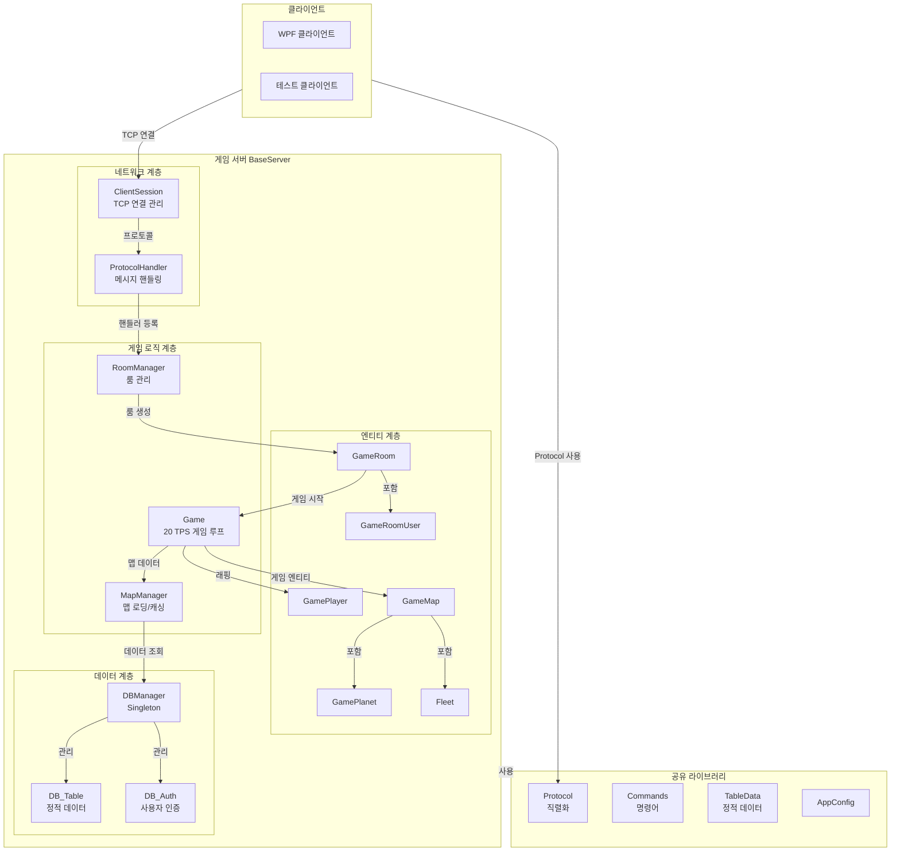

---

## 2. 게임 시작 플로우 (완성된 버전)

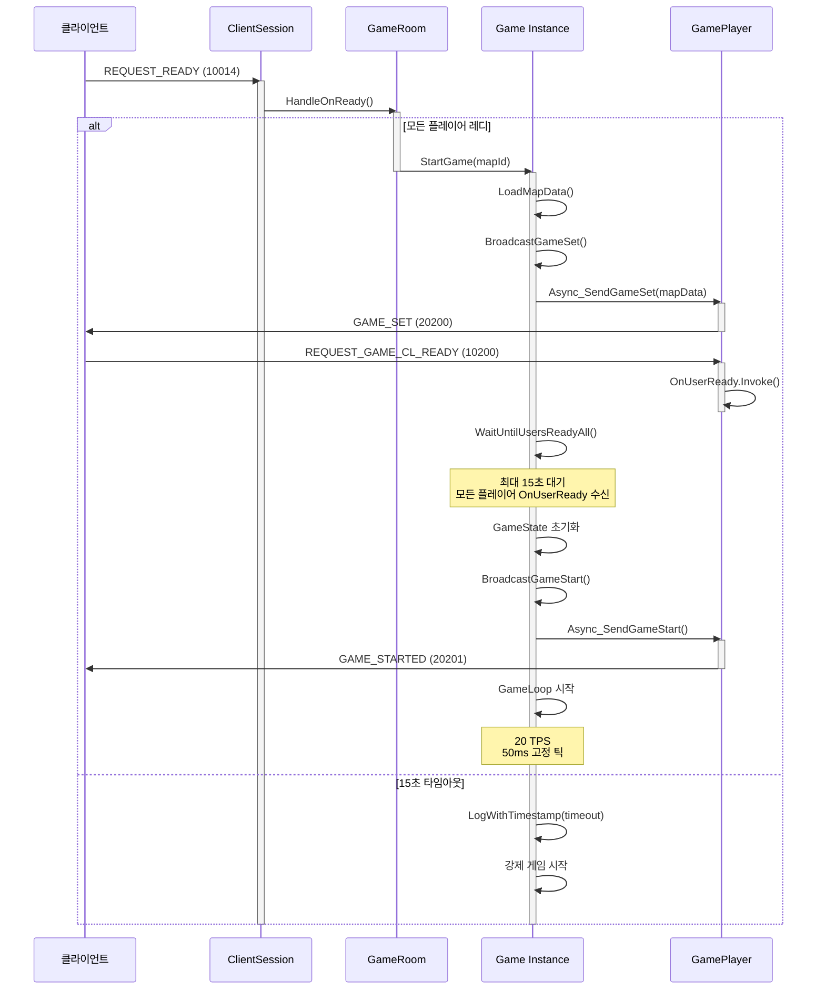

---

## 3. 메시지 플로우 (클라이언트 ↔ 서버)

```mermaid
graph LR
    subgraph AuthPhase["인증 단계"]
        A1["REQUEST_LOGIN"]
        A2["REQUEST_REGISTER_AUTO"]
        A3["RESPONSE"]
    end

    subgraph LobbyPhase["로비 단계"]
        L1["REQUEST_JOIN_LOBBY"]
        L2["REFRESH_LOBBY"]
        L3["REQUEST_CREATE_ROOM"]
        L4["ROOM_INFO"]
    end

    subgraph RoomPhase["방 단계"]
        R1["REQUEST_JOIN_ROOM"]
        R2["REQUEST_READY"]
        R3["USER_JOINED"]
        R4["ROOM_INFO_CHANGED"]
    end

    subgraph GamePhase["게임 단계"]
        G1["GAME_SET"]
        G2["REQUEST_GAME_CL_READY"]
        G3["GAME_STARTED"]
        G4["GAME_STATE"]
        G5["SUBMIT_COMMAND"]
        G6["GAME_ENDED"]
    end

    A1 --> A3
    A2 --> A3
    A3 --> L1
    L1 --> L2
    L2 --> L3
    L3 --> L4
    L4 --> R1
    R1 --> R3
    R3 --> R2
    R2 --> R4
    R4 --> G1
    G1 --> G2
    G2 --> G3
    G3 --> G4
    G5 --> G4
    G4 --> G6
```

---

## 4. 게임 엔티티 관계도

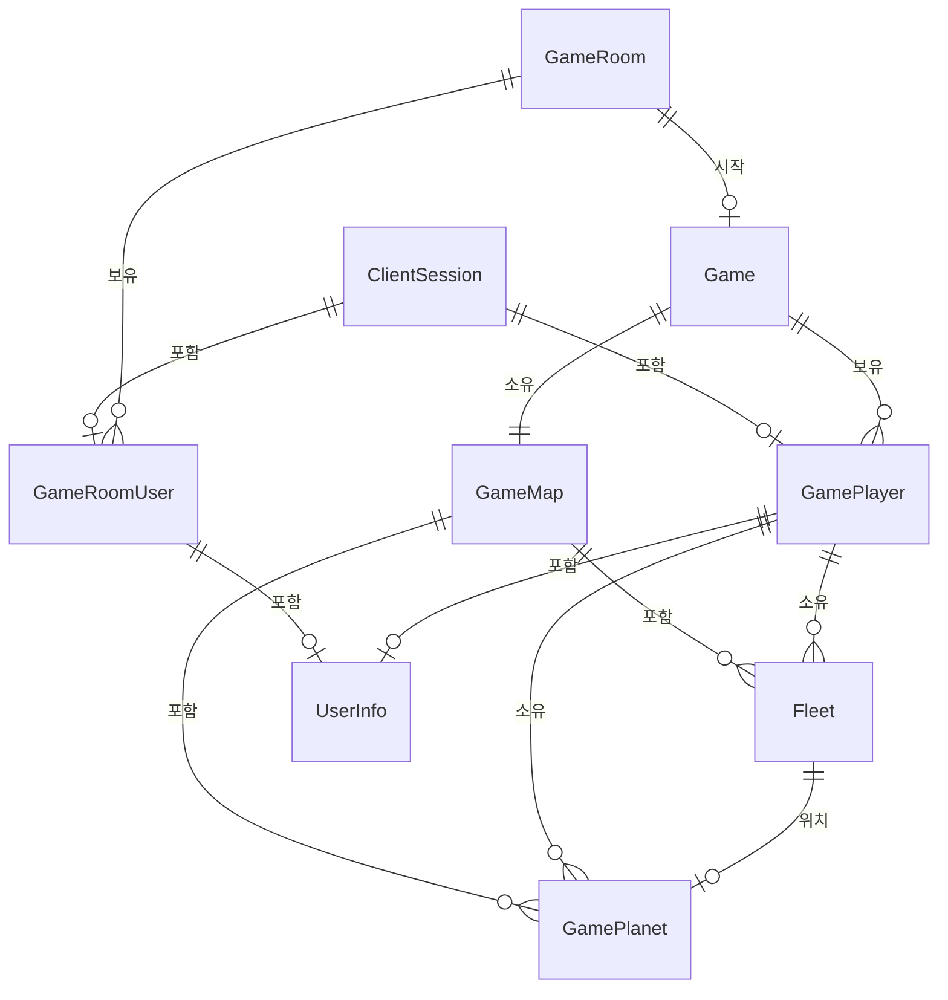

---

## 5. 게임 루프 상세 플로우

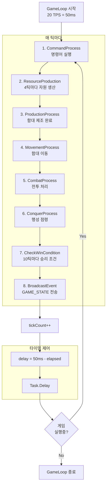

---

## 6. 명령어 큐 시스템

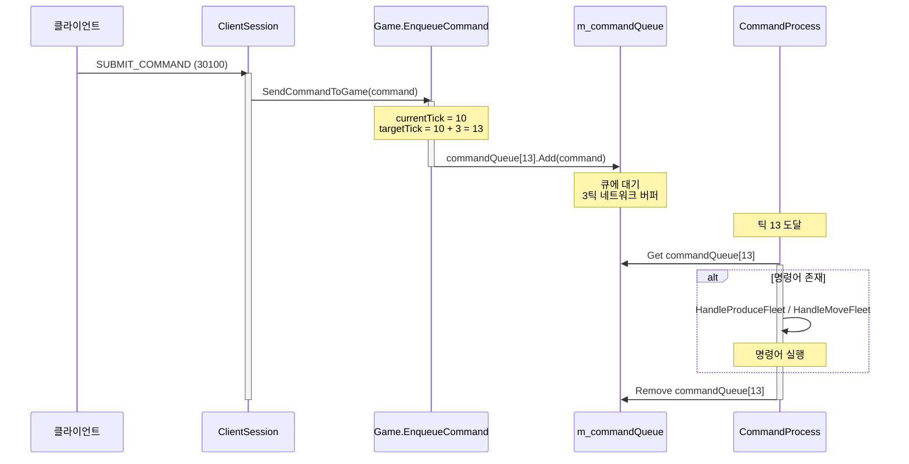

---

## 7. 클라이언트 세션 라이프사이클

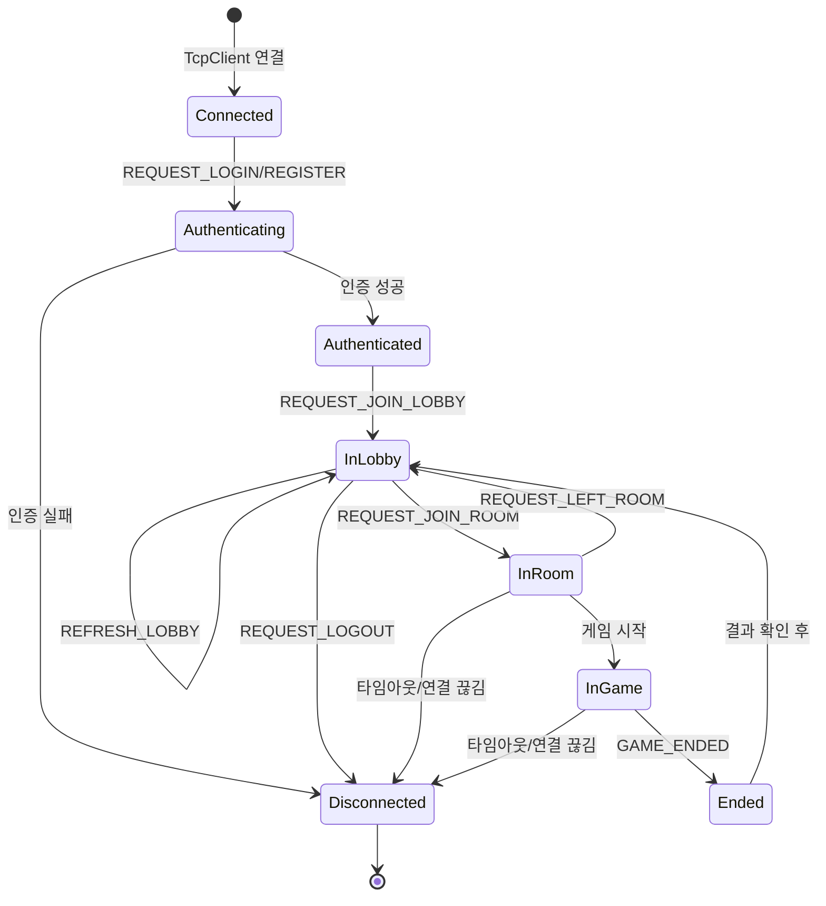

---

## 8. 프로토콜 핸들러 아키텍처

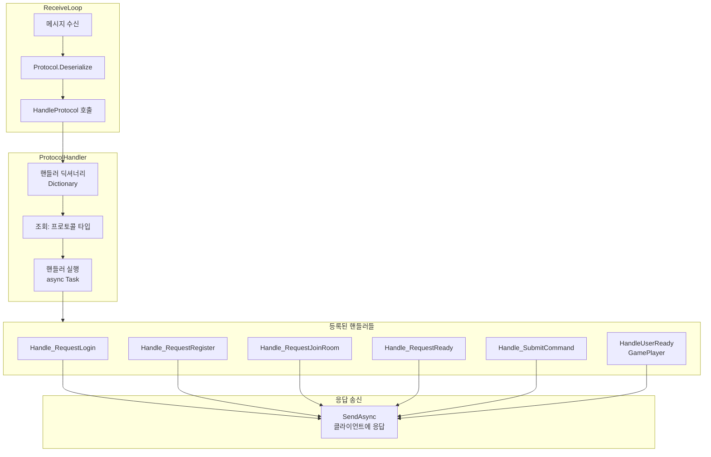

---

## 9. 데이터베이스 아키텍처

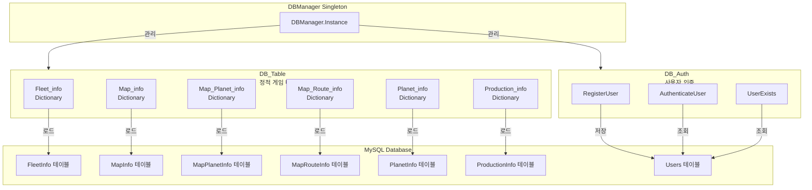

---

## 10. 게임 시작 시 타임아웃 처리

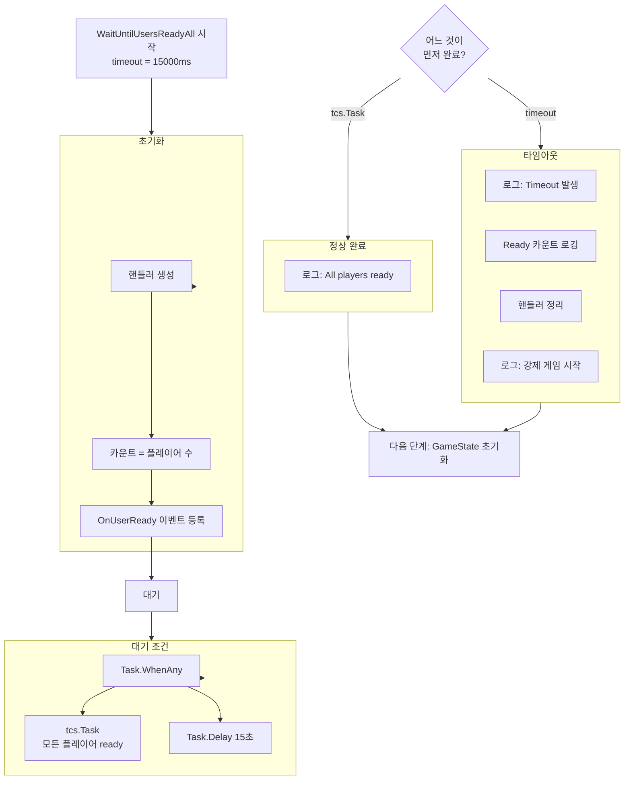

---

## 11. WaitUntilUsersReadyAll 상세 구현

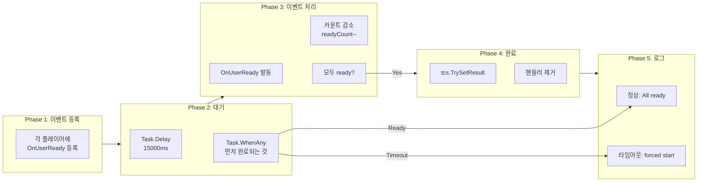

---

## 12. 플레이어 준비 상태 변화

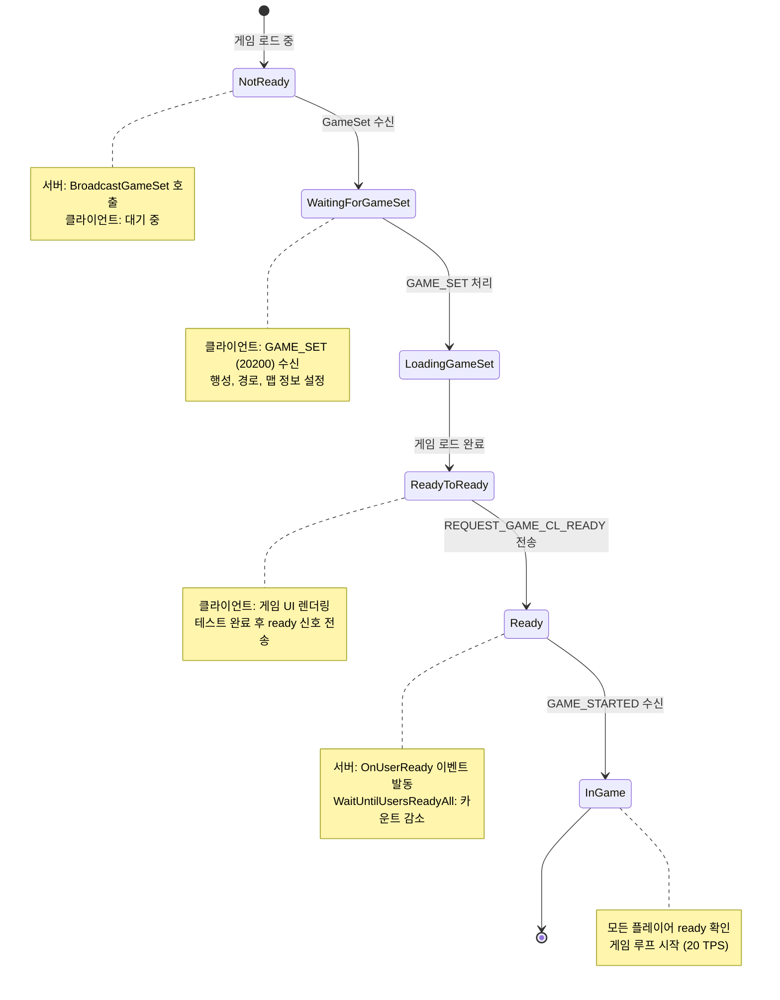

---

## 13. 리소스 및 함대 시스템

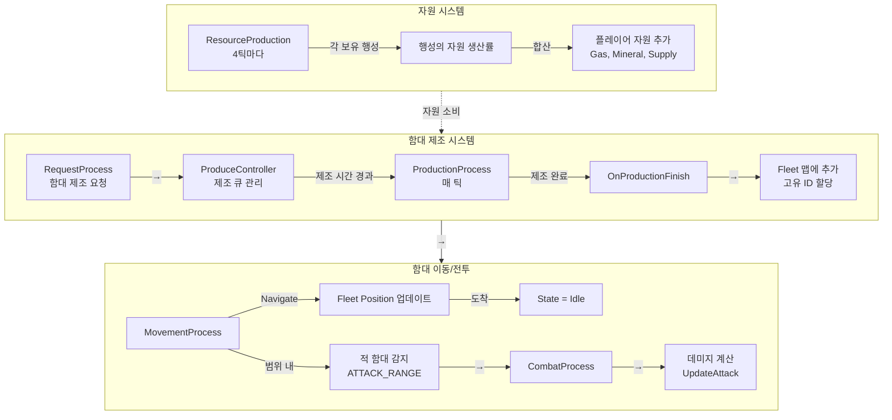

---

## 14. 프로젝트 폴더 구조

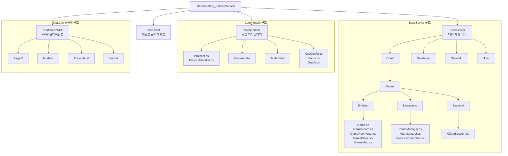

---

## 15. 동기화 및 스레드 안전성

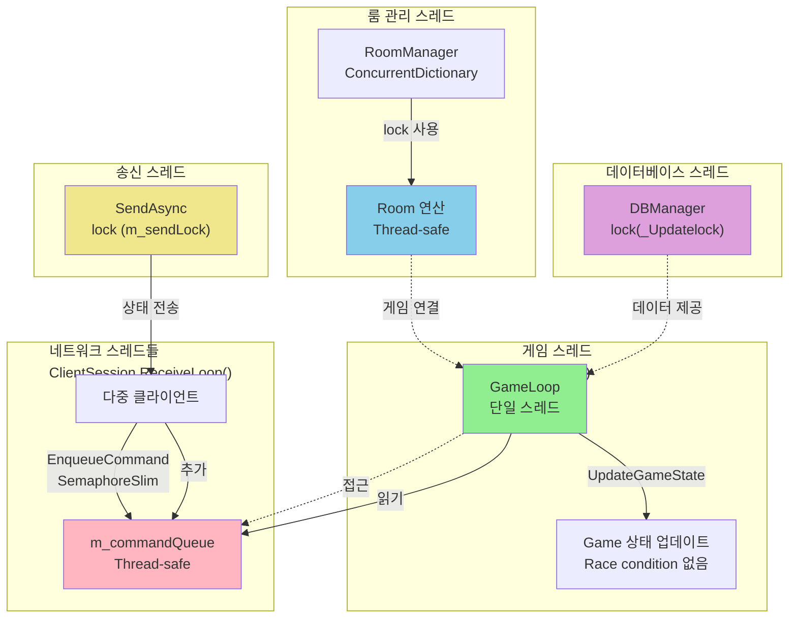

---

## 최종 요약

이 프로젝트는 다음의 특징을 가진 **엔터프라이즈급 멀티플레이어 게임 서버**입니다:

### ✅ 핵심 기술

| 항목 | 설명 |
|------|------|
| **게임 루프** | 고정 틱 레이트 20 TPS (50ms) |
| **네트워크** | 비동기 TCP 소켓 + JSON 직렬화 |
| **아키텍처** | Singleton 매니저 + 이벤트 기반 |
| **동기화** | 스레드 안전 명령어 큐 |
| **게임 시작** | GameSet 브로드캐스트 + 15초 타임아웃 |
| **데이터** | MySQL + 정적 데이터 캐싱 |
| **확장성** | 자동 룸/세션 정리 |

### 📊 현재 구현 상태

- ✅ 전체 시스템 아키텍처 완성
- ✅ 게임 시작 플로우 (GameSet + 타임아웃 포함)
- ✅ 20 TPS 고정 틱 게임 루프
- ✅ 스레드 안전 명령어 큐 시스템
- ✅ 타임아웃 처리 (15초)
- ✅ 멀티플레이어 동기화
- ✅ 프로토콜 기반 메시징

### 🎮 게임 메커니즘

- 자원 시스템 (Gas, Mineral, Supply)
- 함대 제조 및 배치
- 실시간 전투 시스템
- 행성 점령 메커니즘
- 승리 조건 검사

---

*이 다이어그램들은 현재 구현 상태를 100% 반영합니다. (2024년 최종 업데이트)*
